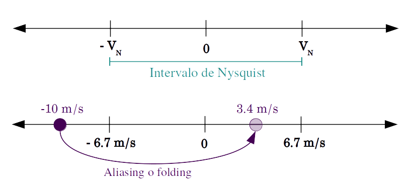

```{r setup, include=FALSE, cache = FALSE}
knitr::opts_chunk$set(echo = FALSE,
                      cache = TRUE,
                      warning = FALSE,
                      message = FALSE)

knitr::write_bib(c("base", "data.table", "ggplot2", "metR"),
                 file = "Bibliografia/packages.bib")
# librerías
library(metR)
library(ggplot2)
library(ggforce)
library(ggrepel)
library(lubridate)
library(magrittr)
library(dplyr)
library(dtplyr)
library(viridis)
library(directlabels)
library(data.table)
library(patchwork)
library(ncdf4)
library(knitr)
library(kableExtra)
library(circular)
source("helpfun.R")

# Variables útiles
mapa.ar <- setDT(fortify(rnaturalearth::ne_states(country = c("Argentina"))))
map2 <- setDT(fortify(rnaturalearth::ne_countries(country = c("Brazil", "Uruguay"))))
mapa.ar <- rbind(mapa.ar, map2) %>%
   .[, .(long = approx(.I, long, n = .N*5)$y,
         lat = approx(.I, lat, n = .N*5)$y),
     by = .(group)] %>%
   .[, rango := rrange(long, lat)] %>%
   .[, azimut := azimuth(long, lat)] %>%
   .[, group2 := cuad_split(azimut), by = group]

setnames(mapa.ar, "long", "lon")

mapa.sa <- setDT(fortify(rnaturalearth::ne_countries(continent = c("South America", "North America"))))
setnames(mapa.sa, "long", "lon")

mapa.rios <- setDT(fortify(rnaturalearth::ne_load(scale = 10, type = 'rivers_lake_centerlines', category = 'physical', destdir = "seudocache/")))
setnames(mapa.rios, "long", "lon")


text.height <- (297 - 50)/25.4
text.width <- (210 - 50)/25.4

color_manual <- c("#231151", "#d3436e", "#feba80")

path <- "~/Radar/WRF/"

remove(map2)
```
\begin{titlepage}
	\centering
	\includegraphics[width=0.2\textwidth]{logoUBA}  \hfill \includegraphics[width=0.2\textwidth]{logoDCAO} \par
	\vspace{1cm}
	{\scshape\LARGE Universidad de Buenos Aires  \\
	\large Facultad de Ciencias Exactas y Naturales \\
Departamento de Ciencias de la Atmósfera y los Océanos	\par}
	\vspace{0.5cm}
	{\scshape\Large Tesis de Licenciatura en Ciencias de la Atmósfera\par}
	\vspace{1.5cm}
	{\huge\bfseries Validación de parametrizaciones de capa límite utilizando datos de radar\par}
	\vspace{4.5cm}
	{\Large Tesista: Paola \textsc{Corrales} \\
		Directores:	Dr. Juan \textsc{Ruiz} y Dra. Marisa \textsc{Gassmann}
	\par}
	\vfill

% Bottom of the page
	{\large --2018--\par}
\end{titlepage}


\renewcommand{\listtablename}{Índice de tablas}
\renewcommand{\tablename}{Tabla}

\chapter*{Agradecimientos}
En primer lugar quiero agradecer a las personas que desarrollaron y pusieron a disposición librerías, códigos e información libre para que esta tesis llegara a buen puerto. A J. Helmus y S. Collis sin los cuales seguiría lidiando con el aliasing, a M. Dixon por hacer que lo datos de radar sean entendibles por humanos, a Rosanna van Hespen cuyo blog salvó a esta tesis de ser escrita en word, a la comunidad de R-Ladies por el apoyo y los concejos, hacen que el camino sea menos empinado. Y a la decena de personas que desarrollaron las incontables librerías de R que dieron forma y color a esto, en especial a Elio Campitelli que viene allanando el camino a todo meteorólogo que se anime a incursionar en el mundo de R.

Al Dr. Ramón de Elía por su tiempo y concejos cuando recién comenzaba a dar los primeros pasos y al Dr. Lluis Fita Borrell por ayudarme a desentrañar los misterios del WRF y fortran.

A la comunidad del DCAO y CIMA por abrirme sus puertas y acompañarme todos estos años de horas y días interminables en la facu. En especial a los docentes por su dedicación y amabilidad, espero haber estado a la altura de todo el esfuerzo que hacen día a día.

A Juan y Marisa por guiarme en este sinuoso camino que es hacer una tesis de licenciatura. Por la paciencia y confianza aún cuando el trabajo y las materias me desbordaban y la tesis quedaba en otro plano. Me enseñaron muchísimas cosas y me contagiaron su entusiasmo y ganas de ir más allá, gracias!

A Expedición Ciencia por invitarme a la aventura de ponerme en los zapatos de un científico, preguntarme y descubrir el mundo. Me ayudan a crecer y desafiarme con cada proyecto. Gracias por permitirme aprender y crecer todos los días, por las oportunidades y el apoyo. Son el sueño hecho realidad de una (falsa) cordobesa que ahora va por el mundo intentando contagiar la curiosidad por descubrir.

A mi gran familia por todo. Por acompañarme en cada momento, y apoyarme en cada locura. Por estar ahí, lejos pero siempre presentes. Por todo el amor y la paciencia que me tienen. Porque lo que soy es gracias a ustedes.

Y finalmente a mi pequeña familia, a Elio. Un compañero de clases que se convirtió en el compañero de mi vida. Gracias por acompañarme en el camino, por el amor y las risas, por apoyarme y ayudarme a ser mejor cada día.

\newpage


\chapter*{Resumen}
\begin{center}\begin{minipage}{\dimexpr\paperwidth-7cm}
Para analizar procesos asociados a la capa límite planetaria (CLP) se utilizaron datos del radar Doppler INTA Paraná y se desarrolló un algoritmo basado en la Visualización Azimutal de la Velocidad (VAD) que permitió obtener perfiles verticales de la velocidad del viento horizontal a partir de la velocidad radial. La validación de la técnica de VAD mostró un buen desempeño aunque más datos faltantes generaron un aumento en los errores. Se analizaron 3 casos, de 24 horas de duracion cada uno, correspondientes a días de verano con condiciones de cielo despejado. En los tres casos se observó el desarrollo del LLJ durante las horas nocturnas con el máximo viento entre 15 y 16 m/s y entre 200 y 400 m de altura que coincidió cualitativamente con el modelo de oscilación inercial propuesto por Van de Wiel et al. (2010). Además se observó el desarrollo de la capa mezclada posterior a la salida del sol con perfiles de viento constantes con la altura. Las distintas estimaciones de la altura de la capa límite fueron consistentes con lo esperado teóricamente. Posteriormente se realizaron simulaciones numéricas de uno de los casos caso con el modelo regional WRF utilizando tres parametrizaciones de CLP: YSU, MYJ y ACM2. Todas las simulaciones lograron representar el LLJ aunque se observó más intenso y abarcando una capa menos profunda respecto a lo observado. El perfil homogneo típico de la capa mezclada fue bien simulado. En términos generales las tres simulaciones tuvieron un mejor desempeño en los primeros 600 a 1000 m de altura. La estimación de la altura de la CLP coincidió con lo observado principalmente durante la noche. Los perfiles verticales de los coeficientes de difusividad turbulenta más intensos durante la noche se asociaron a LLJ más débiles mientras que la mayor extensión de estos perfiles se asociaron a una CLP más profunda.
\end{minipage}
\end{center}
\newpage

\setcounter{tocdepth}{4}
\tableofcontents

\listoffigures
\newpage

\listoftables
\newpage

# Introducción

La capa límite planetaria (CLP) corresponde a la porción de atmósfera que se encuentra directamente influenciada por la superficie terrestre y que responde a sus forzantes en una escala de tiempo de una hora o menos [@Stull1988]. Dentro de esta capa el flujo se encuentra en estado turbulento y por lo tanto los movimientos del aire son aleatorios. Debido a que la capa límite es forzada por las características de la superficie terrestre (por su rugosidad, temperatura, humedad y otros) su evolución presenta una variabilidad diaria importante .

Los procesos que ocurren dentro de esta capa son de suma importancia para entender y pronosticar la evolución de la tropósfera en distintas escalas espaciales y temporales. En particular estos procesos controlan el intercambio de energía entre la superficie y la atmósfera afectando, entre otras cosas, las condiciones para la ocurrencia de convección húmeda profunda y la intensidad de las circulaciones de mesoescala, originando eventos meteorológicos que pueden tener un alto impacto sobre las actividades humanas.

La estructura de la capa límite puede ser descripta a partir de su evolución. Luego del amanecer la capa límite comienza a crecer debido al calentamiento radiativo de la superficie que produce turbulencia dando lugar a la capa mezclada. En esta capa la intensidad del viento, la temperatura potencial y otras variables se mantienen aproximadamente constantes con la altura debido a la intensa mezcla vertical, persistiendo a lo largo del día hasta el momento del atardecer cuando la turbulencia comienza a decaer. Durante la noche se forma la capa límite nocturna estable forzada por el enfriamiento radiativo desde superficie y caracterizada generalmente por una inversión en el perfil de temperatura. En esta capa la turbulencia puede decaer o producirse intermitentemente. Por encima de esta capa persisten las características de la capa mezclada por lo que toma el nombre de capa residual y no forma parte de la capa límite. Al amanecer se forma una nueva capa mezclada que orada la capa estable hasta hacerla desaparecer.

En nuestra región existen estudios que buscan caracterizar la evolución y los procesos que ocurren en la capa límite de forma tal de poder avanzar en su entendimiento y su dependencia por ejemplo con las propiedades de la superficie o el estado de la atmósfera [@Mazzeo1990; @Ulke2000; @Gassmann2001; @Acevedo2014; @Tonti2015].
Otros estudios buscan ver la influencia de la capa límite en distintas escalas, por ejemplo  @Marengo2004 sugiere que existe una relación entre las condiciones de la CLP y el SALLJ (South American low-level jet) durante el verano, uno de los principales mecanismos responsables de desarrollo de sistemas convectivos de mesoescala en nuestra región [@Salio2007].

Dado que la ocurrencia de turbulencia en la capa límite planetaria se da en múltiples escalas espaciales y temporales, la representación de los procesos que ocurren dentro de ella es un desafío para los modelos numéricos. Actualmente los modelos de simulación regional y global no cuentan con la resolución necesaria para representar los procesos de la CLP de forma explícita, debiendo recurrir a una representación simplificada. De esta manera se simula numéricamente una parte del espectro turbulento, mientras que los procesos en la escala de subgrilla se resuelven a través de parametrizaciones con cierres de distinto orden [@Stull1988], es decir, con diferentes niveles de aproximaciones.

La validación de las diferentes parametrizaciones de CLP en distintas situaciones sinópticas es un tema de gran interés debido a la necesidad de modelar los procesos de subgrilla presentes que afectan procesos en el resto de las escalas de variabilidad atmosférica [@Zhang2004; @Hu2010; @Xie2012; @Banks2016].

A nivel regional, la representación de la capa límite en los modelos numéricos ha recibido mucha atención en las zonas oceánicas (particularmente en los océanos tropicales, @Wang2004). Sin embargo, existen pocos estudios acerca del desempeño de las parametrizaciones de capa límite en las regiones continentales. @Ulke2001 utilizan un modelo de calidad del aire euleriano para estudiar el transporte de contaminantes en una ciudad e incorporan a este una parametrización para calcular la difusión vertical de los contaminantes. El modelo permite representar la evolución turbulenta de la CLP pero requiere de mediciones confiables para inicializar el modelo y mejorar su desempeño. @Berri2012 utilizan un modelo hidrostático de capa límite de mesoescala para simular el viento medio utilizando el método de ensables. Encuentran que la metodología es buena para determinar los vientos en niveles bajos sobre regiones con un importante ciclo diurno de la temperatura de superficie. @Ruiz2010 analizan la sensibilidad de distintas parametrizaciones de procesos de subgrilla para representar algunas variables de  superficie en Sudamérica y encuentra que ninguna parametrización tiene un buen desempeño al simular todas las variables. Los mejores resultados se encuentran al calcular la media de un ensamble con simulaciones realizadas con distintas parametrizaciones. Finalmente @Rizza2013 estudiaron la evolución diaria de la CLP con una simulación de grandes torbellinos (LES por sus siglas en inglés) a partir de condiciones iniciales y forzantes provistos por modelo WRF. Encontraron que la incorporación de perfiles de cortante de viento geostrófico en el modelo mejora la capacidad del LES al pronosticar el campo de viento de la CLP.

Uno de los principales desafíos a la hora de estudiar los procesos que ocurren en la capa límite o para validar cómo los modelos representan dichos procesos, es la disponibilidad de observaciones. Las redes de radiosondeos que permiten obtener perfiles de viento, temperatura y humedad en la capa límite están disponibles con frecuencias temporales de entre 12 y 24 horas (sólo eventualmente cada 6 horas) lo que dificulta la posibilidad de analizar la evolución de las características de la CLP a lo largo del día. Sumado a esto, las mediciones se realizan en puntos geográficos muy dispersos entre sí.

Una alternativa al uso de mediciones in situ, es la utilización de sensores remotos que permiten obtener en forma indirecta información sobre el comportamiento de las variables dentro de la CLP. Distintos estudios utilizaron datos medidos con Lidar, Sodar, Ras, Radares, entre otros. En particular los radares Doppler permiten estimar la componente radial del viento en un radio horizontal de hasta 240 km y a partir de esa información reconstruir perfiles verticales de viento utilizando la técnica Velocity Azimuth Display (VAD, por ejemplo @Lhermitte1962 y posteriores). Otra ventaja de las observaciones de radar es que están disponibles con una frecuencia temporal de hasta 5 minutos permitiendo obtener perfiles de viento con una resolución temporal mucho mayor que la de los radiosondeos.

En días en los que no existen ecos producidos por hidrometeoros, los radares pueden detectar el viento dentro de la capa límite a partir de blancos como los insectos. De acuerdo a @Rennie2010 estos datos podrían ser utilizados para reconstruir el perfil vertical del viento si se elimina el efecto de los ecos de terreno y otras observaciones erróneas.

La calidad de estos perfiles ha sido comparada con los perfiles obtenidos a partir de radiosondeos, encontrándose en general que los datos obtenidos resultan adecuados para su uso en el estudio de los procesos de capa límite y en la verificación de modelos numéricos [@Bousquet2008; @Salonen2008] y en la generación de condiciones iniciales para pronósticos a muy corto plazo [@Rennie2011].

Uno de los aspectos importantes a tener en cuenta en el uso de radares para el estudio de los perfiles de viento, es la necesidad de aplicar un riguroso control de calidad a los datos  que permita solucionar diversos aspectos que pueden afectar la confiabilidad de los mismos. Entre los problemas más comunes se cuentan: contaminación por ecos de terreno, efecto de aliasing, y contaminación por blancos móviles. Estos aspectos deben ser abordados antes de poder utilizar los datos para estimar el perfil de velocidad del aire [@Holleman2008; @Rennie2011] aplicando algoritmos de control de calidad [@Ruiz2015; @Rennie2011].

La disponibilidad de la información de radar Doppler en Argentina comienza en 1999 con la instalación del radar Ezeiza [@DeElia2017], actualmente el proyecto SINARAME (SIstema Nacional de Radares Meteorológicos) contempla la construcción de más de 10 radares Doppler de los cuales 3 radares se encuentran instalados (Bariloche, Córdoba y Ezeiza) y 3 que serán admitidos a la red operacional (Resistencia, Las Lomitas y Bernardo de Irigoyen). Estos se suman a los ya existentes en Pergamino, Anguil, y Paraná del INTA y Ezeiza del SMN. Esta disponibilidad de datos de radar en nuestra región ofrece un gran recurso de información para estudiar las propiedades de la capa límite planetaria en nuestra región y para validar la calidad de los modelos numéricos a la hora de representar dichas propiedades.

El objetivo general de esta Tesis de Licenciatura es contribuir a la validación de los modelos numéricos de previsión del tiempo con especial énfasis en la forma en la que los mismos representan los procesos de capa límite. Por otra parte se propone avanzar en el aprovechamiento de los datos de radar que se colectan a nivel regional mediante el desarrollo de metodologías tendientes a la utilización de dicha información en diferentes contextos que van desde la previsión a muy corto plazo, hasta el modelado en diferentes escalas espaciales y temporales.
Como objetivos particulares se propone desarrollar una metodología para el estudio de los procesos de capa límite a partir de los datos de radar Doppler y analizar el comportamiento de tres parametrizaciones de CLP disponibles en el modelo Weather Research and Forecasting (WRF - @Skamarock2008) al representar algunos de los procesos presentes en uno de los casos de estudio seleccionados. Se eligió este modelo debido su continuo desarrollo tanto en términos de investigación como de su implementación operativa.

Se plantea como hipótesis que los datos de viento radial obtenidos de información de radar permiten realizar buenas estimaciones de los perfiles verticales de viento con una frecuencia temporal de hasta 5 minutos, en un espesor que abarca desde los 100 metros sobre el nivel del suelo y hasta 2000 o 3000 m dependiendo de la altura de la capa límite, la presencia de nubes y otras condiciones. La alta frecuencia temporal de las observaciones ofrece la posibilidad de caracterizar la evolución temporal de dichos perfiles dentro de la capa límite atmosférica así como también  validar las parametrizaciones de la capa límite que utilizan los modelos numéricos con una mayor resolución temporal y espacial a la utilizada en trabajos previos sobre nuestra región.

# Metodología

En esta sección se describen los datos utilizados en el trabajo y la metodología desarrollada para alcanzar el objetivo propuesto. En primer lugar se determinaron las características necesarias para identificar posibles casos de estudio que permitan analizar los procesos de CLP asociados al ciclo diario. Luego se procesaron los datos de radar para el caso de estudio seleccionados y se aplicaron los controles de calidad necesarios antes de realizar el cálculo del VAD desarrollado y validado como parte de este trabajo. Se analizó la consistencia de los resultados obtenidos y las características principales de la variación del viento a lo largo del día haciendo especial hincapié en los procesos que ocurren en el período nocturno. Para las simulaciones numéricas con el modelo regional WRF se definió un dominio y las condiciones iniciales adecuadas para modelar un caso de estudio utilizando tres parametrizaciones disponibles en el modelo. Se compararon las simulaciones con las observaciones previamente obtenidas y se analizaron algunas variables asociadas a la turbulencia.

## Región y casos de estudio

El análisis se centró en la región de la ciudad de Paraná (provincia de Entre Ríos, Argentina) donde se encuentran el Radar Doppler del INTA (Instituto Nacional de Tecnología Agropecuaria) y una estación meteorológica de superficie perteneciente al SMN (Servicio Meteorológico Nacional) separados por aproximadamente 9 kilómetros de distancia.

```{r topografia, fig.cap="Topografía de la región en estudio en metros sobre el nivel del mar. El punto azul indica la ubicación del Radar INTA Paraná, el punto rojo indica la ubicación de la estación Paraná Aero y La línea celeste indica la posición del río Paraná. Datos ETOPO1 1 Arc-Minute Global Relief Model NOAA (Amante y Eakins, 2009). \\label{topografia}", fig.width=0.75*text.width, fig.align='center'}

topo <- GetTopography(298.96, 299.95, -31.44, -32.25, resolution = 1/60, file.dir = "seudocache") %>%
  .[, lon := ConvertLongitude(lon, from = 360)]

ggplot(topo, aes(lon, lat)) +
  geom_contour_fill(aes(z = h)) +
  #geom_contour(aes(z = h), color = "black") +
  scale_fill_gradient(high = "#ffffff", low = "#252525",
                       name = "",
                       guide = guide_colorbar(title.position = "top",
                                              title.hjust = 0.5)) +
  scale_x_continuous(name = "Longitud", limits = c(-61.04, -60.05), expand = c(0,0)) +
  scale_y_continuous(name = "Latitud", limits = c(-32.25, -31.44), expand = c(0,0)) +
  annotate(geom = "point", x = -60.537289, y = -31.848438, size = 2, color = "blue") +
  annotate(geom = "point", x = -60.483333, y = -31.783333, size = 2, color = "red") +
  geom_path(data = mapa.rios, aes(group = group), color = "lightblue") +
  coord_quickmap() +
  theme_minimal() + theme(panel.ontop = T)
remove(topo)
```

La elevación de la región elegida muestra un mínimo de 5 metros sobre el nivel del mar (msnm) en el lecho del río Paraná y un máximo de aproximadamente 110 msnm sobre el margen sudeste de río donde se ubican tanto la estación meteorológica como el radar (Figura \ref{topografia}). La región está dominada por la presencia del río y las regiones costeras donde predominan los campos de pastizales o pasto con excepción la ciudad de Paraná (al norte), la ciudad de Santa Fé (al noreste) y pequeños conglomerados de casas.

### Criterios utilizados para la selección de los casos de estudio \label{sec-criterios}

Se determinaron distintos criterios para poder identificar casos de estudio donde se pudiera observar el desarrollo de la CLP en condiciones de buen tiempo, como las descriptas en @Stull1988. Al mismo tiempo se buscaron situaciones donde los datos de radar resultaran confiables. Los criterios utilizados para la selección de los casos fueron los siguientes:

* **Viento leve a moderado.** En estas situaciones los datos de radar son más confiables y permiten el desarrollo de la capa límite estable nocturna [@Gassmann2001]. Se determinó como umbral máximo 7 m/s para el viento medido a 10 m en la estación meteorológica.
* **Cielos despejados.** Para garantizar el calentamiento desde la superficie y el desarrollo de una capa límite mezclada. En los casos donde hubo nubosidad presente, se analizó el tipo de nubosidad, el porcentaje de cobertura del cielo y el impacto que tuvo en la temperatura. Los días donde la nubosidad afectó significativamente el ciclo diurno de la temperatura (descenso continuo por la noche y ascenso durante el día) fueron descartados.
* **Verano.** Donde el calentamiento es más intenso. Esta condición es necesaria, al igual que el cielo despejado, ya que el calentamiento intenso favorece el desarrollo de la capa mezclada durante el día y genera un mayor enfriamiento de la superficie durante la noche, permitiendo el desarrollo de la capa estable.

Las características previas se buscaron a partir del análisis de los datos de la estación meteorológica de superficie Paraná Aero provistos por el SMN y de reflectividad (dBZ) del radar de Paraná para el mes de enero de 2016.

En el primer tipo de datos se analizó la velocidad de viento, la cobertura nubosa y la precipitación observada a cada hora. En el caso de los datos de radar se observó la presencia de ecos meteorológicos en las inmediaciones del radar (a una distancia menor a 150 km del radar) en cada tiempo disponible (aproximadamente cada 10 minutos). Un caso de estudio posible será aquel que cumpla con las características mencionadas durante las 24 horas del día. Aunque es deseable que las condiciones se mantengan durante las 12 horas previas al día en estudio ya que las características de la capa estable nocturna puede ser influenciada por las características de la capa mezclada del día anterior, esto no se consideró para la selección de los casos.

## Descripción de los datos de radar

El radar ubicado en Paraná (Provincia de Entre Ríos) es de doble polarización y emite energía electromagnética en la banda C (4 a 8 GHz). La estrategia de escaneo está programada para que la antena dé giros en sentido horizontal de 360º y cambie de elevación sucesivamente 12 veces. El ángulo vertical varía entre 0.5° y 15.1°. El rango del radar (distancia a la que llega la señal desde la ubicación del radar) puede ser de 120, 240 y 480 km con una resolución espacial en la dirección del rango de 500 m de acuerdo a la estrategia de escaneo [@Saibene2014].

El escaneo completo del volumen de atmósfera que rodea al radar se realiza cada 5 minutos en el rango de 120 km y de 240 km de manera intercalada, dando como resultado 144 volúmenes de datos diarios para cada estrategia de escaneo.
Las variables disponibles en cada tiempo incluyen la reflectividad (dBZ) y velocidad radial ($V_r$).

Los datos de reflectividad permitieron evaluar la presencia de nubosidad en cada momento mientras que la velocidad radial se utilizó para calcular el perfil de viento. La velocidad radial medida por el radar corresponde a la velocidad de los objetos que dispersan la energía del haz. En situaciones de aire claro (sin nubosidad) es posible tener una medida del campo de viento dentro de la capa límite usando insectos como obstáculos.

En este trabajo se usaron datos de radar provistos por el Servicio Meteorológico Nacional correspondientes a la estrategia de 240 km y 12 ángulos de elevación para los períodos comprendidos por cada caso de estudio. Si bien los datos correspondientes a la estrategia de 120 km tienen menor probabilidad de estar contaminados por aliasing (Ver Sección \ref{sec-aliasing}), no fueron utilizados debido a la cantidad de ángulos de elevación disponibles fue distinta para cada día y en todos los casos menor a 12. La menor cantidad de datos disponibles en este último caso afecta la calidad del resultado final generando perfiles de viento con mucho ruido y con poca extensión vertical.

Cada volumen de dato correspondiente a un tiempo de escaneo completo en el formato original de Gematronik (*.vol*) fue convertido al formato CfRadial con el paquete Radx C++ [@Dixon2010 NCAR - National Center for Atmospheric Research] para el posterior procesamiento y análisis.

## Tratamiento de aliasing \label{sec-aliasing}

Un problema importante al momento de utilizar los datos de velocidad radial es la contaminación por aliasing ya que afecta significativamente la calidad de los perfiles de viento finales. De acuerdo a @Gao2004 un 3% de contaminación por aliasing puede generar un error cuadrático medio del 50% en el perfil de viento medio a partir de la técnica VAD. El aliasing ocurre cuando la señal que se mide tiene una frecuencia mayor a la frecuencia que puede detectar el instrumento denominada frecuencia de Nyquist y que está directamente relacionada con la frecuencia de repetición de los pulsos de radar (o PRF por sus siglas en inglés). En esos casos la señal es interpretada por el instrumento como una señal de menor frecuencia que la real. Dicho fenómeno se conoce como "aliasing" o "folding". A partir de lo anterior es posible determinar la velocidad máxima que puede ser medida por un radar sin ambigüedades o aliasing, es decir la Velocidad de Nyquist ($V_N$). Cualquier velocidad que se encuentre fuera del intervalo de Nysquist ($-V_N,+V_N$) será interpretada como una velocidad menor (Figura \ref{nysquist}). La $V_N$ es intrínseca a las características del radar ya que depende de la longitud de onda de la señal y de la frecuencia de repetición del pulso que emite, lo que a vez determina el rango máximo del radar.

En el caso del radar de Paraná con la estrategia de escaneo de 240 km de rango, tiene una $V_N =$ 6.7 m/s por lo que cualquier velocidad mayor se verá afectada por el aliasing. Esto puede verse en la Figura \ref{aliasing} donde las regiones afectadas por aliasing son aquellas donde el valor de la velocidad radial salta al extremo opuesto de la escala de velocidad.

```{r nysquist, fig.cap="Ejemplo de Aliasing o folding para una $V_N =$ 6.7 m/s y velocidad medida de 10 m/s. \\label{nysquist}", fig.align='center'}


```

Existen muchos algoritmos que buscan solucionar el problema del aliasing [por ejemplo @Haase2004; @Lim2010] con distinto grado de éxito. Una opción válida es el algoritmo de corrección de aliasing basado en regiones similares [@Helmus2016] y disponible como parte de la librería PyART [@Collis2016]. Este algoritmo busca regiones con velocidad radial similar y transforma el rango de la variable hasta que todas las regiones fueron corregidas de tal manera de obtener un campo continuo. La Figura \ref{no-aliasing}, muestra un ejemplo de aplicación del algoritmo de regiones similares a un campo de velocidad Doppler obtenido por el radar de Paraná en la elevación $1.3^{\circ}$.

A partir de la exploración visual puede observarse que el algoritmo resuelve el problema de manera satisfactoria en la mayor parte del dominio. Sin embargo se observa una zona en el borde inferior donde la magnitud de la variable es anómalamente alta. Algunas discontinuidades se observaron también en otros casos. Por tal motivo se decidió utilizar este algoritmo para corregir las velocidades afectadas por aliasing, pero se desarrollaron e implementaron además controles de calidad adicionales (Ver Sección \ref{sec-vad}) para reducir el impacto de aquellos píxeles que no fueron exitosamente corregidos por el algoritmo de corrección del aliasing. Esto puede ser o bien por una falla de dicho algoritmo, o bien porque dichos píxeles fueron afectados por otras fuentes de error.

```{r aliasing, fig.cap="Velocidad radial (m/s) observada a las 06 UTC por el radar de Paraná en la elevación $1.3^{\\circ}$ y $V_N =$ 6.7 m/s con aliasing (a) y sin aliasing (b). Notar las escalas diferentes.", fig.subcap=c("Con aliasing \\label{aliasing}", "Sin aliasing \\label{no-aliasing}"), out.extra=" ", fig.width=0.48*text.width, fig.align='center'}

radar <- nc_open("seudocache/cfrad.20160114_060005.000_to_20160114_060431.001_INTA_Parana_SUR.nc")
azimut <- ncvar_get(radar, 'azimuth')   
elevacion <- ncvar_get(radar, 'elevation')
rango <- ncvar_get(radar, 'range')      
V <- ncvar_get(radar, 'V')            
Vda <- ncvar_get(radar, 'Vda')
Vda[Vda > 99999] <- NA
elev <- unique(elevacion)


dimnames(V) <- list(rango = rango, azimut = azimut)
radar <- setDT(melt(V, value.name = "V"))
radar[, elevacion := elevacion, by = rango]
radar[, Vda := c(Vda)]

radar[elevacion == elev[3] & !is.na(V), ] %>%
  RepeatLon(., colname = "azimut") %>%
  ggplot(aes(azimut, rango/1000)) +
  geom_path(data = mapa.ar,
            aes(group = interaction(group, group2)), color = "darkgray") +
  geom_point(aes(color = V, size = rango)) +
  scale_color_divergent() +
  scale_size_area(max_size = 0.1) +
  scale_x_continuous(name = NULL, labels = NULL, breaks = seq(0, 359, 90)) +
  scale_y_continuous(name = "Distancia al centro (km)",
                     breaks = c(40, 80, 120, 160, 200, 240),
                     limits = c(0, 300), expand = c(0, 0)) +
  guides(size = "none") +
  coord_polar() +
  theme_minimal() + theme(legend.position = "bottom")

radar[elevacion == elev[3] & !is.na(Vda), ] %>%
  RepeatLon(., colname = "azimut") %>%
  ggplot(aes(azimut, rango/1000)) +
  geom_path(data = mapa.ar,
            aes(group = interaction(group, group2)), color = "darkgray") +
  geom_point(aes(color = Vda, size = rango)) +
  scale_color_divergent(name = expression(V[da])) +
  scale_size_area(max_size = 0.1) +
  scale_x_continuous(name = NULL, labels = NULL, breaks = seq(0, 359, 90)) +
  scale_y_continuous(name = "Distancia al centro (km)",
                     breaks = c(40, 80, 120, 160, 200, 240),
                     limits = c(0, 300), expand = c(0, 0)) +
  guides(size = "none") +
  coord_polar() +
  theme_minimal() + theme(legend.position = "bottom")
```

## Visualización Azimutal de la Velocidad \label{sec-vad}

La velocidad radial o Doppler corresponde a la componente radial del viento, es decir, la proyección del viento en la dirección de la propagación del haz de radar. Los valores negativos corresponden a movimientos hacia el radar y valores positivos a movimientos desde el radar, mientras que el valor nulo ocurre en las regiones donde el viento es perpendicular a la trayectoria del haz y por lo tanto su proyección es cero.

La técnica de Velocity Azimuth Display (VAD) utiliza la velocidad radial para reconstruir el perfil vertical del viento (intensidad y dirección en el entorno del radar), permitiendo también obtener información sobre la convergencia de gran escala. Esta técnica se basa en la idea de que si el campo de viento es horizontalmente uniforme en un un determinado radio alrededor del radar, entonces la velocidad radial como función del azimut dentro de ese radio tendrá un comportamiento sinusoidal [@Lhermitte1962]. Esta dependencia puede observarse en la Figura \ref{vad} donde los datos de $V_r$ son ajustados a una función sinusoidal.

```{r vad, fig.cap="Velocidad radial (m/s) en función del azimut (grados) para un rango y ańgulo de elevación fijos. En color se  ajusta una función sinusoidal a los datos. \\label{vad}", fig.width=0.75*text.width, fig.align='center', fig.height=0.4*text.height}
ggplot(radar[rango %~% 4000 & elevacion == elev[3], ], aes(azimut, Vda)) +
  geom_line() +
  geom_smooth(method = "lm", formula = y ~ I(sin(x*pi/180)) + I(cos(x*pi/180)), se = F, color = "#20968b") +
  scale_y_continuous(name = "Velocidad radial (m/s)") +
  scale_x_continuous(name = "Azimut (grados)") +
  geom_hline(yintercept = 0) +
  theme_minimal()

remove(list = c("radar", "V", "Vda", "azimut", "elev", "elevacion", "rango"))
```


En días de buen tiempo y aire claro la señal que recibe el radar corresponden a los insectos que se encuentran en la capa límite. Diferentes autores han analizado la validez de la estimación del viento a partir de estos blancos. Si bien en algunos casos los insectos pueden ser considerados blancos pasivos, en otros casos, dependiendo del tamaño y características del insecto, pueden moverse con velocidad y dirección propias [@Rennie2014]. De acuerdo a @Hannesen2014, una posible solución a este problema podría ser el uso de variables polarimétricas que permitan determinar la orientación y dirección de desplazamiento de los insectos para luego corregir la variable $V_r$ observada. En este trabajo si bien no se analizó la calidad de los datos desde este punto de vista individualmente, si se tuvieron en cuenta controles de calidad para disminuir posibles errores.

Usando el concepto de la Visualización Azimutal de la Velocidad distintos autores han desarrollado técnicas para obtener el perfil vertical de viento a partir del viento radial o su gradiente con diferentes grados de complejidad. Estas técnicas también son llamadas VAD (o sus derivaciones). Algunos de estos algoritmos permiten estimar variaciones horizontales del viento dentro del dominio siempre que éstas sean lineales. @Browning1968, unos de los primeros autores en aplicar este concepto, desarrollaron una técnica utilizando series de Fourier para obtener variables del campo del viento descompuesto en una parte divergente, una parte rotacional y una componente de deformación válida para casos donde la velocidad terminal de la precipitación es horizontalmente homogénea y la cortante vertical no es intensa.

Una variación del VAD, el EVAD (por las siglas en inglés de Visualización Azimutal de la Velocidad Extendida) fue desarrollado por @Matejka1991. En esta técnica se incorpora el uso de pesos al estimar las variables para tener en cuenta los errores en los datos originales y el análisis de los residuos obtenidos a partir de las regresiones calculadas. De acuerdo a los autores, esto mejora el desempeño del algoritmo en situaciones donde la cortante vertical del viento es fuerte, cuando hay inhomogeneidades en el campo horizontal o insuficientes datos de radar. Posteriormente @Gao2004a desarrolló el GVAD (por las siglas en inglés de Visualización Azimutal del Gradiente de la Velocidad) que permite obtener el perfil vertical del viento aún en casos donde los datos están contaminados por aliasing reemplazando el campo de la velocidad radial por su derivada respecto del azimuth. Si bien esta técnica es una mejora sustancial, es muy sensible a errores aleatorios y sistemáticos. @Xu2010 también buscaron solucionar el problema de la contaminación por aliasing utilizando un algoritmo que ajusta los datos con aliasing a un modelo de viento uniforme. Posteriormente el mismo autor modifica este algoritmo a partir de un un método variacional que permite eliminar la condición de homogeneidad del campo de viento para aplicar el mismo a campos de viento horizontalmente no homogeneos [@Xu2013].

Para esta tesis se implementó la técnica VAD para la estimación de la velocidad media en un área circular centrada alrededor del radar en combinación con el algoritmo de corrección por aliasing mencionado en la Sección \ref{sec-aliasing} y con un control de calidad que permite reducir la sensibilidad de la estimación a los errores presentes en el campo de velocidad Doppler.


### Desarrollo matemático

El viento radial medido por el radar para un ángulo de elevación $\theta$ y rango $r$ determinado puede expresarse en función del azimut $\phi$:

\begin{equation}
\label{eq-vr1}
V_r =  v \cos(\theta) \cos(\phi) + u \cos(\theta) \sin(\phi) - w \sin(\theta)
\end{equation}

Donde $u$, $v$ y $w$ son las componentes del viento en coordenadas cartesianas.

La Ecuación \ref{eq-vr1} puede ser expresada como una serie de Fourier de la forma:

\begin{equation}
\label{eq-vr2}
V_r =  \frac{1}{2}a_0 + \sum_{n = 1}^{\infty} (a_n \cos(n\phi) + b_n \sin(n \phi))
\end{equation}

Los coeficientes de la serie de Fourier hasta $n=2$ (Ecuaciones \ref{eq-vr3}) están asociados al viento en el centro del dominio de escaneo (con subíndice 0) como:

\begin{equation} \label{eq-vr3}
\begin{aligned}
a_0 = r \cos(\theta)\left ( \frac{\overline{\partial u}}{\partial x} + \frac{\overline{\partial v}}{\partial y} \right) + 2 w \sin(\theta) \\
a_1 = u_0 \cos(\theta) \\
b_1 = v_0 \cos(\theta) \\
a_2 = \frac{1}{2} r \cos(\theta)\left ( \frac{\overline{\partial u}}{\partial x} - \frac{\overline{\partial v}}{\partial y} \right) \\
b_2 = \frac{1}{2} r \cos(\theta)\left ( \frac{\overline{\partial u}}{\partial y} + \frac{\overline{\partial v}}{\partial x} \right)
\end{aligned}
\end{equation}

Los coeficientes de la serie se obtienen mediante el ajuste de cada anillo de datos de radar, es decir los datos para cada $\theta$ y $r$ y realizando una regresión lineal de la forma:

\begin{equation}
\label{eq-vr4}
V_r \sim a_1\cos \phi + b_1 \sin \phi
\end{equation}

Los coeficientes $a_0$, $a_2$ y $b_2$ dan información sobre la divergencia horizontal,  la vorticidad y la deformación del viento. Estos no fueron estimados por el algoritmo pero es posible su implementación en futuros trabajos.

Finalmente la velocidad y dirección del viento pueden ser calculadas a partir de los coeficientes (Ecuaciones \ref{eq-vr3}).

Velocidad:

\begin{equation}
\label{eq-vr5}
V = \frac{(a_{1}^{2} + b_{1}^{2})^{1/2}}{\cos(\theta)}
\end{equation}

Dirección:

\begin{equation}\label{eq-vr6}
\alpha = \frac{\pi}{2}-\tan^{-1}(\frac{a_1}{b_1}) \; \; si \; b_1 < 0
\end{equation}
\begin{equation}\label{eq-vr7}
\alpha = \frac{3\pi}{2}-\tan^{-1}(\frac{a_1}{b_1}) \; \; si \; b_1 > 0
\end{equation}

Las Ecuaciones \ref{eq-vr5} a \ref{eq-vr7} permiten estimar la dirección e intensidad del viento a partir de los datos de velocidad radial observados sobre un anillo correspondiente a un cierto ángulo de elevación y rango. Para calcular la altura de cada anillo es necesario conocer la manera en que se propaga el haz del radar en la atmósfera. Ésta propagación depende del índice de refracción de la atmósfera (N) y este a su vez de la densidad del aire y por lo tanto del perfil vertical de temperatura y humedad. Existen distintas metodologías para calcular el camino que realiza el haz del radar al propagarse [@Zeng2014] y que varían en complejidad y precisión.

Debido a la falta de datos de temperatura y humedad necesarios para calcular el índice de refracción, en el algoritmo de VAD se aplica el modelo 4/3 del radio de la Tierra. Este modelo es utilizado por la mayoría de los programas de procesamiento de datos de radar ya que pese a su simpleza (no toma en cuenta las condiciones de la atmósfera) es aceptable para cualquier ángulo de elevación usado, alturas máximas de entre 10 y 20 km, siempre que el gradiente de N sea cercano a  $-1/a$, donde $a$ es el radio de la Tierra [@Doviak1993].

Para determinar la bondad de la regresión lineal realizada para cada anillo se calcula la raíz del error cuadrático medio asociada ($rmse_a$) y así estimar la diferencia entre las observaciones y el modelo propuesto:

\begin{equation}\label{eq-vr8}
rmse_a = \sqrt {\sum \frac {(V_r - V_{rmod} )^2} {n-3}}
\end{equation}

donde $n$ es el número de observaciones presentes en un anillo particular.

```{r evad, fig.cap="Velocidad del viento (m/s) en función de la altura para cada anillo individual calculada con VAD (puntos) y el perfil vertical obtenido luego del promedio pesado (línea). En colores se muestra el $rmse_a$ (m/s) de cada anillo. \\label{perfil-rmse}", fig.width=0.75*text.width, fig.align='center'}
vad <- read.csv("seudocache/elev_vda-2016-01-14T06:00:05Z_INTA_Parana.csv", sep = ";", na.strings = -9999)
perfil <- read.csv("seudocache/vda-2016-01-14T06:00:05Z_INTA_Parana.csv", sep = ";", na.strings = -9999)

ggplot(vad, aes(ht, spd)) +
  geom_point(aes(color = rmse), alpha = 0.8) +
  scale_color_viridis(name = expression(rmse[a])) +
  scale_x_continuous(limits = c(0, 1.5), name = "Altura (km)") +
  scale_y_continuous(name = "V (m/s)") +
  geom_line(data = perfil, aes(ht, spd), color = "#20968b", size = 1) +
  coord_flip() +
  theme_minimal()

#remove(vad, perfil)
```

En la Figura \ref{perfil-rmse} se muestra el valor de la magnitud del viento calculado a partir de cada anillo válido y en color el rango del valor de $rmse_a$ asociado para un caso de ejemplo. La dispersión de los datos varía con la altura pero se mantiene la forma del perfil con un $rmse_a$ medio de `r round(mean(vad$rmse, na.rm = T), 2)` m/s.

A partir de la intensidad y dirección del viento obtenidos con cada anillo a distintas alturas, es posible obtener un único perfil vertical calculando un promedio pesado del resultado de cada anillo. Para esto se establece una retícula vertical equiespaciada y se calcula el valor del viento en cada punto como el promedio de los valores de los anillos dentro de cada capa de atmósfera. El algoritmo identifica los datos de $V$ para cualquier rango y ángulo de elevación que se encuentran en $z(k) \pm d/2$, donde $z$ es el k-ésimo punto de retícula vertical y $d$ la resolución espacial. Para obtener el valor promedio de $V$ correspondiente a la altura $z$, se calcula un promedio pesando la variable por el $rmse_a$ y la distancia de cada anillo al radar (Ecuación \ref{eq-vr9}). De esta manera los anillos con mayor error y más alejados a la ubicación del radar tienen menor influencia en el resultado final.  Si bien el $rmse_a$ y $r$ tienen magnitud distinta se observó que el primero tiene mayor influencia en el promedio pesado y que la incorporación del $r$ disminuye el ruido en el perfil final.

\begin{equation}\label{eq-vr9}
\bar{V} = \frac {\sum w_i V_i} {\sum w_i}
\end{equation}

Donde $w_i = \frac {1}{rmse_{ai} + r_i}$ y el subíndice $i$ cuenta la cantidad de datos para cada intervalo $z \pm d/2$. De manera análoga se calcula las componentes $u$ y $v$, y a partir de estas, la dirección del viento para cada punto de retícula vertical. Este cálculo no se realiza con la dirección del viento estimada con las Ecuaciones \ref{eq-vr6} y \ref{eq-vr7} ya que al ser una variable cíclica el promedio puede generar errores. El perfil final obtenido a partir de la Ecuación \ref{eq-vr9} se puede observar en la Figura \ref{perfil-rmse}.

Finalmente se calculan dos medidas del error de estimación asociado a cada punto:

* **dispersión**

\begin{equation}\label{eq-vr10}
dispersi\acute{o}n = \frac{\sigma}{\sqrt{n}}
\end{equation}

Donde $n$ es la cantidad de anillos en esa capa y  $\sigma^{2}= \frac{\sum (V_i - \bar{V})^2 /rmse_{ai}^2}{\sum 1/rmse_{ai}^2}$ con $\bar{V}$ el promedio pesado de la velocidad del viento para la capa.

Este error relativo da cuenta de la distancia entre la velocidad promedio calculada para ese nivel y el valor de cada anillo pesado por el error del anillo. De esta manera si el $rmse_{ai}$ del i-ésimo anillo es grande, la diferencia $(V_i - \bar{V})^2$ tiene menor peso en el error del nivel. Es importante notar que $V_i$ y $\bar{V}$ no están necesariamente a la misma altura ya que $\bar{V}$ es el promedio de muchos $V_i$ dentro de una capa.

* **rmse**

\begin{equation}\label{eq-vr11}
rmse = \sqrt{\frac{1}{\sum \frac{1}{rmse_{ai}^2}}}
\end{equation}

Este rmse no toma en cuenta la posible dispersión de los valores individuales de los anillos respecto del valor medio, pero retiene el error cuadrático medio de cada anillo y calcula la raíz del error cuadrático medio del nivel como la suma de la inversa de los errores individuales [@Bevington2002].

### Controles de calidad de los datos

El algoritmo de VAD desarrollado incluye algunos controles de calidad para evitar errores asociados a problemas intrínsecos a los datos de radar.

#### Antes del ajuste de los datos

Los siguientes controles y parámetros permiten determinar cuales son los anillos de datos válidos y eliminar posibles errores aleatorios antes del ajuste lineal.

* **Ángulos de elevación seleccionados:** La presencia de ecos de terreno pueden generar que los campos de velocidad radial para los primeros ángulos de elevación sean muy ruidosos y sin coherencia espacial. En el otro extremo, en caso de ser necesario, se pueden eliminar los ángulos superiores. Por lo tanto es posible seleccionar el rango de ángulos a ser analizados y utilizados en el cálculo del VAD con los parámetros *Ángulo mínimo* y *Ángulo máximo*.
* **Selección del dominio de cálculo:** Otra posibilidad para evitar los ecos de terreno es definir un *Radio interior* por debajo del cual no se incluyen los datos para el cálculo de VAD. En el otro extremo, es posible definir un *Radio exterior* para limitar el uso de datos muy lejanos al centro del volumen de escaneo. Esto es importante para evitar inhomogeneidades en el campo de viento horizontal.
* **Cantidad de datos por anillo:** el algoritmo cuenta la cantidad de datos válidos por anillo y se define un porcentaje de datos faltantes (NaN) límite respecto del total para descartar el anillo. Si se excede dicho umbral (*NaN máximo*) el anillo es descartado. De esta manera se evita la utilización de anillos donde la señal es muy débil.
* **Hueco continuo en un anillo:** Además de los datos faltantes ubicados de manera aleatoria a lo largo de un anillo, los huecos continuos pueden ocurrir debido a la falta de señal en una determinada región o debido al bloqueo del haz por la presencia de obstáculos. De acuerdo a @Matejka1991 esto puede generar importantes errores en el resultado final, por lo tanto cuando el hueco o *Gap máximo* es mayor a 30° de azimut, el anillo se descarta.
* **Errores aleatorios:** Los errores aleatorios, producto de ruido del instrumento, pueden ser eliminados utilizando un filtro pasa bajo [@Gao2004]. Este control no elimina anillos pero produce un suavizado de los datos de cada anillo de manera independiente. Es necesario definir la cantidad de datos o $Pesos$ que se utilizarán para calcular el filtro en cada punto.

#### Luego del ajuste de los datos

* **R cuadrado:** El $r^2$ del modelo ajustado (Ecuación \ref{eq-vr4}) permite obtener una medida de la calidad de ese modelo respecto de las observaciones. A partir de la exploración de resultados preliminares se observó que la definición de un umbral mínimo para el $r^2$ permite descartar anillos que pese a no tener datos faltantes eran erróneos.

* **Consistencia temporal de las observaciones:** Ya que uno de los objetivos de esta tesis es estudiar la evolución del viento a lo largo del día, es importante asegurar cierta consistencia temporal en los datos. La inconsistencia temporal puede deberse a que cada volumen de datos no es medido de manera instantánea si no que demora algunos minutos Si bien en periodos sin cambios sinópticos importantes no se espera variaciones bruscas del viento, es posible que variaciones menores a los 10 minutos (resolución temporal de los datos de radar) estén afectando la consistencia temporal. La inconsistencia temporal también puede deberse a cualquier error previamente descripto que no fuera detectado con los controles de calidad. Estos podrían detectarse si se produce un salto brusco en la dirección o intensidad del viento y principalmente si esa variación ocurre para un volumen determinado y para un conjunto de niveles determinados.    
Para solucionar este problema se aplicó un suavizado pesado localmente o LOWESS (LOcally WEighted Scatterplot Smoothing, @Cleveland1979). LOWESS es un método de regresión no paramétrica y por lo tanto no es necesario asumir que los datos tienen algún tipo de distribución particular. Esto lo hace un método flexible al representar el comportamiento de los datos. El suavizado para cada punto se realiza utilizando la información de datos vecinos.    
En la Figura \ref{lowess} se muestra la variación de la velocidad del viento con el tiempo a 500 m de altura donde se identifican dos momentos en donde se producen saltos en la velocidad del viento estimada por la técnica VAD, alrededor de las 03 y las 08 UTC. Al aplicar el LOWESS el resultado es un suavizado de la variable que elimina los saltos bruscos y mejora la coherencia.

```{r lowess, fig.cap="Velocidad del viento (m/s) a lo largo del tiempo para el 14 de enero de 2016 a 500 m de altura (negro) y la misma variable luego de la aplicación del filtro LOWESS (color). \\label{lowess}", fig.width=0.75*text.width, fig.height=0.4*text.height, fig.align='center'}
vad <- read.vad("../../20160114_240/vda*")

vad[ht == 0.5] %>%
  ggplot(aes(date_time)) +
  geom_line(aes(y = spd)) +
  geom_line(aes(y = spd_smooth), color = "#20968b") +
  scale_x_datetime(name = "Hora (UTC)", date_breaks = "3 hour", date_labels = "%H:%M", expand = c(0,0)) +
  scale_y_continuous(name = "V (m/s)") +
  theme_minimal()
```


### Validación del algoritmo

Para validar los resultados del VAD se realizaron dos tipos de evaluaciones, por un lado se comparó el perfil vertical de viento obtenido con datos reales de un radiosondeo cercano y por el otro se comparó el radiosondeo con perfiles verticales obtenidos a partir de campos de viento radial sintéticos.
Para la evaluación con datos reales se utilizaron datos del Radar INTA Anguil del 05 de enero de 2016 a las 12 UTC que se encuentra en la provincia de La Pampa y radiosondeos de la estación del SMN Santa Rosa Aero  debido a la inexistencia de sondeos en la región de Paraná. Si bien el radar Anguil y la estación meteorológica no están en la misma ubicación, se encuentran a unos 30 km de distancia y por lo tanto la estación está dentro del dominio de escaneo del radar (Figura \ref{topo-anguil}). Se encontró que la señal de $V_r$ en días de cielo claro es muy pobre y por lo tanto al realizar los controles de calidad impuestos en el algoritmo, el perfil de viento final no supera los 1000 m.

```{r topo-anguil, fig.cap="Topografía de la región del radar Anguil en metros sobre el nivel del mar. El punto azul indica la ubicación del Radar INTA Anguil, el punto rojo indica la ubicación de la estación Santa Rosa Aero. Datos ETOPO1 1 Arc-Minute Global Relief Model NOAA (Amante y Eakins, 2009). \\label{topo-anguil}", fig.width=0.75*text.width, fig.align='center'}

topo <- GetTopography(295.4, 296.3, -36.12, -36.97, resolution = 1/60, file.dir = "seudocache") %>%
  .[, lon := ConvertLongitude(lon, from = 360)]

ggplot(topo, aes(lon, lat)) +
  geom_contour_fill(aes(z = h)) +
  #geom_contour(aes(z = h), color = "black") +
  scale_fill_gradient(high = "#ffffff", low = "#252525",
                       name = "",
                       guide = guide_colorbar(title.position = "top",
                                              title.hjust = 0.5)) +
  scale_x_continuous(name = "Longitud", limits = c(-64.6, -63.7), expand = c(0,0)) +
  scale_y_continuous(name = "Latitud", limits = c(-36.9, -36.2), expand = c(0,0)) +
  annotate(geom = "point", x = -63.990067, y = -36.539684, size = 2,
           color = "blue") +
  annotate(geom = "point", x = -64.3333, y = -36.5666, size = 2, color = "red") +
  coord_quickmap() +
  theme_minimal() + theme(panel.ontop = T)
remove(topo)
```

Las evaluaciones con datos sintéticos se realizaron reconstruyendo el campo de velocidad radial interpolando la velocidad medida por la radiosonda a la retícula del radar utilizando la Ecuación \ref{eq-vr1}. En este proceso se asume que el campo de viento horizontal es homogéneo. Este campo de velocidad radial sintética $V_{rs}$ puede ser transformado nuevamente a un perfil vertical de viento utilizando el VAD y comparado con el sondeo original para determinar la validez del algoritmo.

Para este segundo método de validación se utilizaron los datos del radiosondeo de la estación del SMN Santa Rosa Aero para la misma hora.
Además, dado que el resultado de la interpolación del viento real da un campo homogéneo, sin errores o datos faltantes, se aplicaron distintas fuentes de errores para evaluar la sensibilidad de la técnica a diferentes tipos de errores. En la Sección \ref{sec-validacion} se presenta una descripción de las validaciones con los resultados obtenidos.

### Configuración del algoritmo elegida

En la Tabla \ref{parametros} se detallan los valores utilizados en los distintos parámetros necesarios para el algoritmo VAD que se mantuvieron para todos los casos de estudio. Los ángulos utilizados fueron elegidos de tal manera de evitar aquellas elevaciones con mayor ruido. Los radios interior y exterior, como así también el gap máximo fueron determinados a partir de las recomendaciones de @Matejka1991. De acuerdo a estos autores el espaciado de retícula vertical óptimo es de 300 m, sin embargo esto imposibilita estudiar la capa límite en detalle por lo que se eligió una retícula menor. La cantidad de NaNs permitida se determinó en un 20% por anillo, si bien la regresión lineal puede calcularse con menos datos se utilizó un máximo conservador para disminuir los errores de estimación. El valor de $R^2$ fue definido cualitativamente a partir de la exploración de resultados preliminares (no se muestra).

```{r parametros}
param <- read.csv("seudocache/parametros.csv", sep = ",", header = T)
kable(param,
      format = "latex",
      booktabs = T,
      caption = "Parámetros utilizados en el cálculo del VAD y la construcción de la retícula vertical para todos los casos. \\label{parametros}") %>%
  collapse_rows(1)
```


## Procesos asociados a la CLP

El estudio de los procesos que ocurren en la CLP es un desafío cuando no se cuenta con datos de la turbulencia. En esta tesis se abordan procesos que pueden ser estudiados a partir de los perfiles de viento y las variables de superficie.

### Determinación del estado de la turbulencia

El número de Richardson puede ser utilizado como un estimador de la estabilidad dinámica [@Stull1988] y por lo tanto de la turbulencia presente. Su definición surge como el cociente de los términos de producción mecánica y térmica de la turbulencia en la ecuación de energía cinética turbulenta para un fluido gaseoso [@Stull1988]. A partir de suponer válida la teoría K [@Pasquill1983] y que los coeficientes de intercambio turbulento de calor sensible y de cantidad de movimiento son iguales, es posible escribir el número de Richardson en función de los gradientes verticales de viento y temperatura potencial:

\begin{equation} \label{eq-ri1}
R_i = \frac{\frac{g}{\overline{\theta_v}} \frac{\partial \overline{\theta_v}}{\partial z}}
{\left [ \left (\frac{\partial \overline{u}}{\partial z} \right )^2 + \left (\frac{\partial \overline{v}}{\partial z} \right )^2  \right]}
\end{equation}

El signo de este número permite clasificar la evolución de la turbulencia en dos clases: estables ($R_i$ > 0) e inestables ($R_i$ < 0). El numerador de la Ecuación \ref{eq-ri1} da cuenta de la disponibilidad de energía asociada a procesos de empuje térmico que favorecen la destrucción o inhiben la turbulencia en condiciones estables y la producen  en condiciones inestables. El denominador corresponde a la producción mecánica o por cortante. De acuerdo a @Stull1988 la turbulencia puede mantenerse si $R_i$ es menor a un valor umbral ($R_T$), ya que por encima de este umbral (en general $R_T = 1$), la inhibición de la turbulencia se incrementa tendiendo a estabilizar el estado del flujo y volverlo laminar.

Debido a que la estimación de los gradientes suele ser difícil, estos tienden a ser expresados en términos de observaciones discretas. Surge así el número de Richardson Bulk:

\begin{equation} \label{eq-ri2}
R_b = \frac{g \, \Delta \overline{\theta_v} \, \Delta z}{\overline{\theta_v} \, [(\Delta \overline{u}^2) + [(\Delta \overline{v}^2)]}
\end{equation}

Para obtener el $R_b$ en cada tiempo y su variación con la altura es necesario contar con el perfil vertical de temperatura virtual ($\theta_v$) y de la velocidad del viento. Debido a que solo se cuenta con el valor de la temperatura en superficie, se utilizó la siguiente aproximación válida para estimar el número de Richardson en el periodo estable:

\begin{equation} \label{eq-ri3}
R_i \sim \frac{(g  \: (\theta_i - \theta_f)/z_{máx})}{(\overline{\theta} \: (u_{máx}/z_{máx})^2)}
\end{equation}

Donde $\theta_i$ corresponde al valor de la temperatura virtual en superficie en el momento de transición entre la capa mezclada y el comienzo de la capa estable nocturna, por lo tanto será la temperatura en el tope de la capa estable asumiendo que la capa residual no se modifica. El valor de $\theta_f$ será la temperatura en superficie observado. Por último $u_{máx}$ es el valor máximo de viento observada y $z_{máx}$, la altura a la que ocurre este máximo y que será considerada en este trabajo como una aproximación de la altura del tope de la capa límite estable nocturna (Ver Sección \ref{sec-pbh}).

### Altura de la capa límite \label{sec-pbh}

La altura de la capa límite se define como el nivel de la atmósfera a partir del cual los forzantes  de la superficie contigua a la atmósfera ya no la afectan en escalas temporales del orden de una hora o menos. Las estimaciones de esta variable son muy diversas en la literatura y también sus aplicaciones a los modelos numéricos.

Por ejemplo la altura de la capa estable nocturna puede definirse como la altura a la cual la intensidad de la turbulencia es una fracción del valor en superficie mientras que la altura de la capa mezclada puede determinarse como la altura a la que se observa el menor transporte vertical de calor sensible.

Teniendo en cuenta los datos disponibles se determinó la altura de la capa estable nocturna como la altura a la que ocurre el máximo relativo de viento más cercano a la superficie.

Otro enfoque posible es el uso de la reflectividad del aire medida por el radar. Por ejemplo @Kaufmann1997 buscaron determinar la altura a la que ocurre la inversión térmica en invierno a partir radares y otros instrumentos asociados, utilizando la variable SNR (Signal to Noise Ratio o relación entre la Señal y el Ruido de la reflectividad en la atmósfera). Por otro lado @Chandra2010 utilizan la variación de la reflectividad con la altura observada con un perfilador radar de viento en casos de aire claro y cielo nuboso. Esta técnica se basa en el concepto de que en el tope de la capa límite se observan importantes variaciones de la reflectividad debido a la presencia de turbulencia. En este trabajo se exploró de manera preliminar la posibilidad de determinar la altura de la capa límite a partir de las variaciones de la reflectividad con la altura observada por el radar.


### Descripción del LLJ

El Jet nocturno de capas bajas o LLJ (Low Level Jet) es un fenómeno de mesoescala caracterizado por por una corriente fuerte de viento con máximos de entre 10 y 20 m/s que se localiza en los primeros cientos de metros de altura [@Stull1988]. Su extensión vertical es poca pero horizontalmente puede extenderse por cientos de kilómetros.

Existen distintos criterios para identificar el LLJ. En algunos casos se determina un umbral mínimo para la velocidad del viento a partir del cual se considera la existencia del LLJ siempre que este ocurra por debajo de algún nivel o altura determinada. En otros casos, se busca que el viento sea supergeostrófico. En este trabajo se utilizará el criterio de @Bonner1968 que identifica el LLJ cuando el máximo del viento es superior a 12 m/s y decrece al menos 6 m/s hasta el próximo mínimo o hasta el nivel de 3 km.

El LLJ puede producirse por distintos mecanismos entre los que se pueden nombrar la topografía, baroclinicidad asociada a pendientes del terreno, frentes y oscilaciones inerciales. En algunas situaciones, varios mecanismos pueden contribuir a la formación del LLJ de manera conjunta y estos son los que determinan las características del fenómeno.

En este trabajo el análisis se centra en el LLJ generado por la oscilación inercial. De acuerdo a @Blackadar1957 luego del atardecer, cuando no hay producción de turbulencia de origen térmico se produce un desacople de la capa mezclada y el viento tiende a acelerarse hacia el equilibrio geostrófico ante la ausencia de la fricción. Sin embargo la fuerza de Coriolis genera una oscilación inercial del viento alrededor del viento geostrófico produciendo un LLJ supergeostrófico durante el periodo estable.

Posteriormente @VanDeWiel2010 generaliza el modelo de Blackadar para incluir el efecto de la fricción de superficie (efecto que no puede ser despreciado dentro de la capa límite) y como resultado la oscilación del viento ocurre alrededor de un perfil de equilibrio en vez del viento geostrófico.

De acuerdo con este modelo, físicamente la oscilación puede verse a través de la rotación del vector del viento a lo largo del tiempo generando una hodógrafa en forma de "herradura" [@Baas2012]. Para el hemisferio sur la rotación del viento será en sentido antihorario. El periodo de la oscilación inercial es de $P = 2\pi/f$, con $f$ el parámetro de Coriolis. A la latitud de Paraná $P = `r abs(round(24000/sin(-31.8)/3600, 2))`$ horas y por lo tanto se espera que el máximo viento ocurra unas 9 horas depués del atardecer [@Kallistratova2012].

## Modelo WRF

El modelo WRF (Weather Research and Forecasting) es un sistema de predicción y simulación numérica de la atmósfera desarrollado para investigación y aplicaciones operativas. Puede generar simulaciones basadas en las condiciones de la atmósfera o a partir de condiciones idealizadas. Es desarrollado y mantenido por el NCAR (National Center for Atmospheric Research), NCEP (National Centers for Environmental Prediction), ESRL (Earth System Research Laboratory), FSL (Forecast Systems Laboratory, AFWA (Air Force Weather Agency), NRL (Naval Research Laboratory), CAPS (Center for Analysis and Prediction of Storms), la Universidad de Oklahoma, y la FAA (Federal Aviation Administration).

En este trabajo se utilizó la versión 3.9.1 del modelo que posee un núcleo dinámico no hidrostático y compresible con coordenadas verticales sigma-p [@Skamarock2008]. Se realizaron simulaciones numéricas para comparar algunas de las parametrizaciones de CLP disponibles: YSU (Yonsei University Scheme), MYJ (Mellor–Yamada–Janjic) y ACM2 (Asymmetric Convection Model 2).

En las simulaciones se utilizaron 2 dominios con anidado en 2 direcciones. El dominio 1 se configuró con una resolución de 12 x 12 km y 105 x 105 puntos de retícula y el dominio 2 con una resolución de 4 x 4 km y 253 x 253 puntos de retícula, ambos centrados en la ubicación del radar de Paraná. Como se puede ver en la Figura \ref{dom-modelo} el dominio abarca todo el centro y norte del país. Se utilizaron datos geográficos con 10 minutos de resolución para el dominio 1 y 2 minutos para el dominio 2.

Ambos dominios tienen una retícula vertical de 42 niveles expresados en coordenadas sigma-p, con una distribución  hipérbolo-tangencial para que los primeros 20 niveles se ubiquen en los primeros 1800 m. La distribución de los niveles fue elegida para obtener mayor resolución vertical dentro del a capa límite y mejorar la representación de los procesos que ocurren en ella. La presión en el tope del modelo es de 100 hPa. De acuerdo a @Shin2012 se determinó que el nivel inferior se ubique a 40 m para evitar errores en algunas variables de superficie asociadas a la CLP.

```{r dominio, fig.cap="Dominios utilizados. (a) Dominio utilizado en el modelo con resolución de 12 km (dominio exterior) y 4 km (dominio interior). El punto representa la ubicación del radar y (b) Topografía sobre el nivel del terreno respecto de la ubicación del radar. El círculo negro corresponde al dominio de análisis centrado en el radar, de 40km de radio. \\label{dominio}", fig.subcap=c(" \\label{dom-modelo}", " \\label{dom-radar}"), fig.width=0.48*text.width, fig.align='center', fig.sep = "\\hfill"}

hgt <- ReadNetCDF(paste(path, "caso1_YSU/hgt_YSU.nc", sep = "")) %>%
  .[date == "2016-01-14 21:00:00 UTC" & lev == 0.05, ]

circle <- setDT(expand.grid(lon = seq(-61.04, -60.05, by = 0.001),
                            lat = seq(-32.25, -31.44, by = 0.001)))
circle <- circle[inside(lon, lat) == T, ]

ggplot(mapa.ar, aes(lon, lat)) +
  geom_path(aes(group = group), color = "darkgray") +
  scale_x_continuous(limits = c(-71, -50), breaks = MakeBreaks(5),
                     name = "Longitud", expand = c(0,0)) +
  scale_y_continuous(limits = c(-39.5, -24),
                     name = "Latitud", expand = c(0,0)) +
  annotate(geom = "rect", xmin = -66.3349, xmax = -54.8394,
           ymin = -36.5501, ymax = -27.0726, fill = NA, color = "black") +
  annotate(geom = "rect", xmin = -68.0717, xmax = -53.1528,
           ymin = -37.9493, ymax = -25.679, fill = NA, color = "black") +
  annotate(geom = "point", x = -60.537289, y = -31.848438, size = 1) +
  coord_map() +
  theme_minimal()


ggplot(hgt, aes(lon, lat)) +
  geom_contour_fill(aes(z = hgt - 73)) +
  geom_polygon(fill = NA, color = "black",
               data = circle[chull(lon, lat)]) +
  scale_fill_gradient(high = "#ffffff", low = "#252525",
                       name = "Altura sobre el\nnivel de terreno",
                       guide = guide_colorbar(title.hjust = 0.5)) +
  scale_x_continuous(name = "Longitud", limits = c(-61.04, -60.05), expand = c(0,0)) +
  scale_y_continuous(name = "Latitud", limits = c(-32.25, -31.44), expand = c(0,0)) +
  annotate(geom = "point", x = -60.537289, y = -31.848438, size = 2) +
  # geom_point(data = subset(distances, inside == "TRUE")) +
  # geom_circle(data = circle, aes(x0 = x0, y0 = y0, r = r), inherit.aes = F) +
  coord_quickmap() +
  theme_minimal() + theme(panel.ontop = T,
                          legend.position="bottom",
                          legend.box = "horizontal",
                          legend.box.spacing = unit(0, "mm"))

remove(circle, hgt)
```

Se realizaron simulaciones para el periodo comprendido en el Caso 1, es decir, entre las 06 UTC del 13 de enero a las 00 del 15 de enero de 2016. Las primeras 6 horas de simulación corresponden al "spin up" del modelo y las siguientes 36 horas al período de interés para el análisis. Si bien el estudio se centra en comparar las observaciones del 14 de enero con las simulaciones, es importante tener en cuenta que la capa estable nocturna puede ser muy influenciada por la capa mezclada del día anterior, por esta razón la simulación se inicia 12 horas antes.

Las condiciones iniciales y de borde fueron obtenidas a partir del Análisis Final (FNL) del National Centers for Environmental Prediction (NCEP) con resolución espacial de 0.25° X 0.25° y temporal de 6 horas.

Para los procesos de escala no resuelta se usaron las siguientes parametrizaciones: RRTMG (Rapid Radiative Transfer Model for GCMs, @Mlawer1997) para la radiación de onda larga, Dudhia [@Dudhia1989]  para la radiación de onda corta, WSM6 (WRF Single-Moment 6-Class Microphysics,  @Hong2006a) para los procesos microfísicos y el modelo Noah de superficie [@Tewari2004].

### Parametrizaciones de capa límite

Existen diferentes alternativas para parametrizar los procesos de capa límite pero pueden clasificarse en dos grandes grupos. De acuerdo a @Stull1988, las parametrizaciones con clausura local determinan el valor de cualquier variable desconocida en cada punto a partir del valor o el gradiente de una variable conocida en el mismo punto; suponiendo que la difusión turbulenta tiene un comportamiento análogo al de la difusión molecular. Por otro lado, las parametrizaciones con clausura no local asumen que la turbulencia está caracterizada por la superposición de torbellinos de distintas escalas que transportan las características del medio; y para lograr esto, el valor de la variable desconocida en un punto es aproximada a partir de una variable conocida en varios puntos en el espacio.

A continuación se presentan las características generales de cada parametrización utilizada y el esquema de capa de superficie asociado a cada una (ya que cada parametrización de CLP tiene una determinada parametrización de capa de superficie se los consideró como parte del mismo esquema: capa de superficie + PBL).

* **YSU**

El esquema YSU [@Hong2006] es un esquema no local y por lo tanto para la determinación de los coeficientes de difusividad turbulenta ($K(z)$) se asume una función que es aplicada a toda la CLP independientemente de las condiciones locales en cada punto. Está configurado con una clausura de primer orden y considera la mezcla no local debido a torbellinos grandes agregando un término de ajuste al gradiente local a cada variable de pronóstico. El esquema usa la parametrización de capa de superficie proveniente del modelo MM5 que esta basada en la teoría de la semejanza de Monin-Obukhov.

* **MYJ**

El esquema MYJ es un esquema local que usa una clausura de orden 1.5 y determina los coeficientes de difusión a partir del cálculo de la energía cinética de las perturbaciones pronosticada [@Janjic1994]. MYJ usa el esquema de capa de superficie Janjic Eta Monin–Obukhov.

* **ACM2**

Este esquema es similar a YSU en el sentido de que es no local y  tiene clausura de primer orden. Sin embargo considera un transporte no local hacia arriba y un transporte local hacia abajo "capa a capa" para las variables de pronóstico [@Pleim2007]. También utiliza el esquema de capa de superficie MM5 Monin-Obukhov Similarity.

### Post Procesamiento de los datos

Las simulaciones fueron post procesadas con el módulo ARWPost donde se eligió una resolución vertical de 100 metros en los primeros kilómetros de la atmósfera de tal manera que coincida con la retícula vertical de las observaciones de radar. El dominio inicial fue recortado para analizar el disco de 40 km de radio alrededor del radar como se muestra en la Figura \ref{dom-radar}.

El análisis del viento requiere un segundo procesamiento para transformar la variable a la retícula del radar y de esta manera obtener el perfil vertical de viento a partir de la técnica VAD y así, hacerlo más comparable a las observaciones. Este procesamiento se realiza con la librería LETKF-WRF [@Ruiz2017] a partir de las salidas no procesadas del modelo.

### Tratamiento de variables asociadas a la CLP

Fue posible configurar el modelo para obtener algunas variables específicas de los esquemas de CLP como la altura de la capa límite estimada por cada parametrización ($h$), la Longitud de Monin-Obukhov ($L$), la velocidad de fricción ($u_*$) y el coeficiente de difusividad turbulento de calor sensible ($K_h$).

#### Análisis de la homogeneidad espacial en las variables de estabilidad

El análisis de las variables asociadas a los procesos de capa límite pueden hacerse tomando el dato del punto más cercano al radar o a partir del promedio espacial en todo el dominio analizado. Para determinar la validez del promedio espacial es importante analizar la variación de la variable en el dominio y a lo largo del tiempo

Para esto se analizó la homogeneidad en el dominio de la Longitud de Monin-Obukhov ($L = \frac{-u_*^3 \;T}{k \, g \, (w'\theta ')_s}$) calculada por el modelo. En primer lugar se calculó la moda del signo de $L$ para cada tiempo. De acuerdo al comportamiento de la variable, es esperable que sea positiva durante el régimen estable (nocturno) y negativa en el régimen inestable (diurno). Luego se comparó la moda del signo de $L$ con el signo de $L$ en cada punto de retícula para cada tiempo. Se contó la cantidad de veces que los signos no coincidieron para cada punto del dominio y todo el período analizado. Eso permite obtener el porcentaje de veces que el signo de $L$ en un punto fue distinto a la moda del dominio y por lo tanto distinto al valor esperado para cada tiempo.

En la Figura \ref{L-esp} se muestra el porcentaje de veces que el valor de $L$ en cada punto de retícula tiene signo distinto a la moda calculada en todo el dominio separado para cada régimen. Se observa que que tanto en el régimen estable como en el inestable existen regiones donde el signo de $L$ es distinto a la moda del dominio más del 40% de las veces. Esto podría estar relacionado a la presencia del río y zonas con suelos saturados en la región con mayor porcentaje de variación del signo $L$. La presencia de suelos saturados podría generar que el flujo vertical de calor sensible en superficie ($F_{\theta} = (w'\theta ')_s$) tenga un comportamiento contrario al que se observa en suelos seco generando esta variabilidad en el dominio. Si bien este fenómeno es más importante durante el día se observa en la Figura \ref{L-esp} que las regiones donde el porcentaje de veces que el valor de $F_{\theta}$ tiene un signo distinto a la moda (y por lo tanto el flujo vertical de calor sensible está invertido) ocurren en los dos regímenes y coinciden con las regiones donde se encuentra el río y donde el signo de $L$ es anómalo. De acuerdo a estos resultados se decidió centrar el análisis de las variables asociadas a la CLP en el punto de retícula más cercano al radar, que además no presenta gran variabilidad respecto de la zona circundante.


```{r L-espacial, fig.cap="Porcentaje de veces que el valor local de L y el flujo vertical de calor sensible tiene signo distinto a la moda del dominio calculada para el régimen estable (nocturno) e inestable (diurno). Se muestran los valores mayores al 5\\% (colores) y topografía del dominio (contornos). Datos de la simulación YSU. \\label{L-esp}", fig.width=0.95*text.width, fig.height=8, fig.align='center'}

hgt <- ReadNetCDF(paste(path, "caso1_YSU/hgt_YSU.nc", sep = "")) %>%
  .[date == "2016-01-14 21:00:00 UTC" & lev == 0.05, ]

L.YSU <- ReadNetCDF(paste(path,"caso1_YSU/l_YSU.nc", sep = "")) %>%
  .[, param := "YSU"] %>%
  .[, lev := lev*1000 -75] %>%
  .[, L := l[1], by = .(date, lon, lat, param)] %>%
  .[date %between% as.POSIXct(c("2016-01-13 22:00:00", "2016-01-14 22:00:00"), tz = "UTC"), ] %>%
  .[inside(lon, lat) == T, ] %>%
  .[,regimen := ifelse(date %between% as.POSIXct(c("2016-01-13 22:00:00", "2016-01-14 10:00:00")), "Estable", "Inestable")]

L <- copy(L.YSU)[, La := L*mode(L), by = .(date, regimen)] %>%
  .[, .(mean = mean(La < 0)), by = .(lon, lat, regimen)] %>%
  .[mean > 0.05, ] %>%
  .[, var := "L"]

hfx.YSU <- ReadNetCDF(paste(path,"caso1_YSU/hfx_YSU.nc", sep = "")) %>%
  .[, param := "YSU"] %>%
  .[, lev := lev*1000 -75] %>%
  .[, hfx := hfx[1], by = .(date, lon, lat, param)] %>%
  .[date %between% as.POSIXct(c("2016-01-13 22:00:00", "2016-01-14 22:00:00"), tz = "UTC"), ] %>%
  .[inside(lon, lat) == T, ] %>%
  .[,regimen := ifelse(date %between% as.POSIXct(c("2016-01-13 22:00:00", "2016-01-14 10:00:00")), "Estable", "Inestable")]

hfx <- hfx.YSU[lev == -25, hfxa := hfx*mode(hfx), by = .(date, regimen)] %>%
  .[lev == -25, .(mean = mean(hfxa < 0)), by = .(lon, lat, regimen)] %>%
  .[mean > 0.05, ] %>%
  .[, var := "hfx"]

rbind(L, hfx) %>%
  .[, var := factor(var, levels = c("L", "hfx"), labels = c("L", "F[theta]"))] %>%
  ggplot(aes(lon, lat)) +
  geom_tile(aes(fill = mean*100)) +
  geom_contour(data = hgt, aes(z = hgt),
               color = "darkgrey") +
  scale_fill_viridis(name = "", guide = guide_colorbar(title.position = "top",
                                              title.hjust = 0.5),
                     direction = -1) +
  scale_x_continuous(name = "Longitud", expand = c(0,0)) +
  scale_y_continuous(name = "Latitud", expand = c(0,0)) +
  annotate(geom = "point", x = -60.537289, y = -31.848438, size = 2) +
  coord_quickmap() +
  facet_grid(var~regimen,
             labeller = label_parsed) +
  theme_minimal() + theme(legend.position = "bottom")

remove(hfx, hfx.YSU, L, L.YSU)

```

#### Estimación de la altura de la CLP

Si bien cada parametrización estima la altura de la CLP, esta estimación es distinta en cada esquema. YSU calcula el número de Richardson Bulk desde superficie y determina $h$ como la altura a la cual  $R_b$ alcanza un valor cŕitico: cero para el régimen inestable y 0.25 para el régimen estable [@Hong2006]. ACM2 utiliza el mismo valor crítico del $R_b$ pero en los casos inestables el cálculo del número de Richardson se realiza para la capa de entremezcla que separa la CLP y la atmósfera libre [@Pleim2007]. Por otro lado el esquema MYJ diagnostica la altura de la CLP como la altura a la cual la energía cinética turbulenta alcanza un valor prescripto en $0.1 m^2/s^2$ [@Janjic1994]. Esto hace que la comparación entre las distintas parametrizaciones no sea del todo válida. Por esta razón además de utilizar el valor de $h$ para cada parametrización, en el caso de la capa límite estable nocturna se estimará su altura como el nivel en el que ocurre el máximo de viento siguiendo la metodología utilizada para la observaciones (Sección \ref{sec-pbh}) y así poder realizar una mejor comparación.

#### Coeficientes de difusividad turbulenta

Si bien se obtuvo el valor de $K_h$ para cada punto de retícula y cada tiempo, no fue posible obtener el coeficiente de difusividad de cantidad de movimiento ($K_m$) directamente desde el modelo por lo que se estimó a partir de la relación $K_m = K_h \: P_r$ donde $P_r$ es el número de Prandtl. Este último se determinó calculando los perfiles de los coeficientes de difusividad turbulentos según el modelo propuesto por @Ulke2000:

* **Condiciones estables ($h/L > 0$)**

\begin{equation} \label{k-1}
K_m(z) =  ku_{*o}h\left (\frac{z}{h} \right )\left(1-\frac{z}{h} \right)\left (1 + 6.9\frac{h}{L}\frac{z}{h} \right)^{-1}
\end{equation}

\begin{equation} \label{k-2}
K_h(z) =  ku_{*o}h\left (\frac{z}{h} \right )\left(1-\frac{z}{h} \right)\left (1 + 9.2\frac{h}{L}\frac{z}{h} \right)^{-1}
\end{equation}

* **Condiciones inestables ($h/L < 0$)**

\begin{equation} \label{k-3}
K_m(z) =  ku_{*o}h\left (\frac{z}{h} \right )\left(1-\frac{z}{h} \right)\left (1 - 22\frac{h}{L}\frac{z}{h} \right)^{1/4}
\end{equation}

\begin{equation} \label{k-4}
K_h(z) =  ku_{*o}h\left (\frac{z}{h} \right )\left(1-\frac{z}{h} \right)\left (1 - 13\frac{h}{L}\frac{z}{h} \right)^{1/2}
\end{equation}

donde $u_*$ es la velocidad de fricción y $k$ la constante de Von Karman. A partir de estos coeficientes se estimó $P_r(z) = K_m/K_h$ para luego obtener el coeficiente de difusividad de cantidad de movimientos a partir del dato de $K_h$ calculado por el modelo.


# Resultados

## Pruebas de validación de VAD \label{sec-validacion}

Se presentan los resultados de las pruebas de validación de la técnica VAD para distintos errores y datos faltantes

* **Sin datos faltantes ni errores (SE)**

Se obtiene el $V_r$ interpolado a la retícula del radar de Anguil (con una estrategia de escaneo hasta 120 km de radio y 8 ángulos de elevación) a partir del sondeo realizado en la estación meteorológica Santa Rosa Aero.
Como los datos de sondeo llegan hasta los 30 km de altura, hay información disponible para interpolar los datos de $V_r$ para todos los ángulos de elevación y para cualquier rango. Sin embargo esto genera muchos más datos de los disponibles normalmente. Es de esperar que el VAD resultante sea muy similar al sondeo inicial pero esta primera validación también permite verificar que la transformación de $V$ a $V_r$ es correcta.

```{r validacion, fig.cap="Velocidad radial (m/s) observada a las 12 UTC por el radar de Anguil en la elevación $1.3^{\\circ}$ (a), la misma variable transformada a partir del sondeo de la estación Santa Rosa Aero para la misma hora (b), velocidad radial mostrada en (b) pero con errores aleatorios (c) y con los mismos datos faltantes observados por el radar (d). \\label{validacion}", fig.subcap=c("Datos de radar \\label{radar}", "Sin errores \\label{se}", "Con errores \\label{ce}", "Con errores + DF \\label{na}"), out.extra=" ", fig.width=0.48*text.width, fig.ncol = 2, fig.show="h", fig.align='center'}

radar <- nc_open("seudocache/cfrad.20160105_120423.000_to_20160105_120716.001_INTA_Anguil_SUR.nc")
azimut <- ncvar_get(radar, 'azimuth')   
elevacion <- ncvar_get(radar, 'elevation')
rango <- ncvar_get(radar, 'range')      
Vr <- ncvar_get(radar, 'V')   
elev <- unique(elevacion)

Vrs <- read.csv("seudocache/Vr_ref_se.csv", sep = ";")
Vrs[, 1] <- NULL
Vrs <- as.matrix(Vrs)

Vre <- read.csv("seudocache/Vr_ref_ce.csv", sep = ";")
Vre[, 1] <- NULL
Vre <- as.matrix(Vre)

Vrena <- read.csv("seudocache/Vr_ref_na_ce.csv", sep = ";")
Vrena[, 1] <- NULL
Vrena <- as.matrix(Vrena)

dimnames(Vr) <- list(rango = rango, azimut = azimut)
dimnames(Vrs) <- list(azimut = azimut, rango = rango)
dimnames(Vre) <- list(azimut = azimut, rango = rango)
dimnames(Vrena) <- list(azimut = azimut, rango = rango)

radar1 <- setDT(melt(Vr, value.name = "Vr"))
radar1[, elevacion := elevacion, by = rango]
# radar1[, Vrs := c(Vrs)]

radar2 <- setDT(melt(Vrs, value.name = "Vr"))
radar2[, elevacion := elevacion, by = rango]

radar3 <- setDT(melt(Vre, value.name = "Vr"))
radar3[, elevacion := elevacion, by = rango]

radar4 <- setDT(melt(Vrena, value.name = "Vr"))
radar4[, elevacion := elevacion, by = rango]

radar <- radar1[radar2, on  = c("rango", "azimut", "elevacion")]
setnames(radar, "i.Vr", "Vrs")
radar[Vrs < -999, Vrs := NA]

radar <- radar[radar3, on  = c("rango", "azimut", "elevacion")]
setnames(radar, "i.Vr", "Vre")
radar[Vre < -999, Vre := NA]

radar <- radar[radar4, on  = c("rango", "azimut", "elevacion")]
setnames(radar, "i.Vr", "Vrena")
radar[Vrena < -999, Vrena := NA]

radar[elevacion == elev[3] & !is.na(Vr), ] %>%
  RepeatLon(., colname = "azimut") %>%
  ggplot(aes(azimut, rango/1000)) +
  # geom_path(data = map[rango <= 300*1000], aes(group = group),
  #           color = "darkgray") +
  geom_point(aes(color = Vr, size = rango)) +
  scale_color_divergent(name = expression(V[r]), limits = c(-20,20)) +
  scale_size_area(max_size = 0.1) +
  scale_x_continuous(name = NULL, labels = NULL, breaks = seq(0, 359, 90)) +
  scale_y_continuous(name = "Distancia al centro (km)",
                     breaks = c(10, 20, 30, 40),
                     limits = c(0, 50), expand = c(0, 0)) +
  guides(size = "none") +
  coord_polar() +
  theme_minimal() + theme(legend.position = "bottom")

radar[elevacion == elev[3] & !is.na(Vrs), ] %>%
  RepeatLon(., colname = "azimut") %>%
  ggplot(aes(azimut, rango/1000)) +
  # geom_path(data = map[rango <= 300*1000], aes(group = group),
  #           color = "darkgray") +
  geom_point(aes(color = Vrs, size = rango)) +
  scale_color_divergent(name = expression(V[rs]), limits = c(-20,20)) +
  scale_size_area(max_size = 0.1) +
  scale_x_continuous(name = NULL, labels = NULL, breaks = seq(0, 359, 90)) +
  scale_y_continuous(name = "Distancia al centro (km)",
                     breaks = c(10, 20, 30, 40),
                     limits = c(0, 50), expand = c(0, 0)) +
  guides(size = "none") +
  coord_polar() +
  theme_minimal() + theme(legend.position = "bottom")

radar[elevacion == elev[3] & !is.na(Vre), ] %>%
  RepeatLon(., colname = "azimut") %>%
  ggplot(aes(azimut, rango/1000)) +
  # geom_path(data = map[rango <= 300*1000], aes(group = group),
  #           color = "darkgray") +
  geom_point(aes(color = Vre, size = rango)) +
  scale_color_divergent(name = expression(V[rs]), limits = c(-20,20)) +
  scale_size_area(max_size = 0.1) +
  scale_x_continuous(name = NULL, labels = NULL, breaks = seq(0, 359, 90)) +
  scale_y_continuous(name = "Distancia al centro (km)",
                     breaks = c(10, 20, 30, 40),
                     limits = c(0, 50), expand = c(0, 0)) +
  guides(size = "none") +
  coord_polar() +
  theme_minimal() + theme(legend.position = "bottom")

radar[elevacion == elev[3] & !is.na(Vrena), ] %>%
  RepeatLon(., colname = "azimut") %>%
  ggplot(aes(azimut, rango/1000)) +
  # geom_path(data = map[rango <= 300*1000], aes(group = group),
  #           color = "darkgray") +
  geom_point(aes(color = Vrena, size = rango)) +
  scale_color_divergent(name = expression(V[rs]), limits = c(-20,20)) +
  scale_size_area(max_size = 0.1) +
  scale_x_continuous(name = NULL, labels = NULL, breaks = seq(0, 359, 90)) +
  scale_y_continuous(name = "Distancia al centro (km)",
                     breaks = c(10, 20, 30, 40),
                     limits = c(0, 50), expand = c(0, 0)) +
  guides(size = "none") +
  coord_polar() +
  theme_minimal() + theme(legend.position = "bottom")

remove(list = c("radar1", "radar2", "radar3", "radar4",
                "Vr", "Vrs", "Vre", "Vrena"))
```

En la Figura \ref{validacion} se presenta el campo de $V_r$ observado por el radar (a) y el campo de $V_{rs}$ obtenidos a partir del sondeo (b). Tanto la magnitud como la dirección del viento son similares pero también se observa que el $V_{rs}$ cubre totalmente el dominio mientras que la señal del $V_r$ se extingue a partir de los 15 km de rango. Cuantitativamente la diferencia $V_r - V_{rs}$ es grande en puntos localizados pero el error absoluto medio es de `r round(mean(abs(radar$Vr-radar$Vrs), na.rm = T), 2)` m/s, un valor razonable teniendo en cuenta que las mediciones se realizan con instrumentos distintos.

A continuación se describen los resultados obtenidos con las pruebas de sensibilidad del algoritmo de reconstrucción del perfil vertical del viento a diferentes tipos de errores presentes en el campo de velocidad radial.

* **Con errores aleatorios (EA)**

En el primer experimento se agregaron errores aleatorios al campo de $V_{rs}$, esto además permite analizar la sensibilidad del algoritmo a este tipo de errores.

El nuevo campo perturbado será:

\begin{equation} \label{eq-vr12}
V_{rs}'  = V_{rs} + \alpha \varepsilon(0,1)
\end{equation}

Donde $\alpha$ es la amplitud del error y $\varepsilon$ es un número aleatorio con distribución normal, $\mu = 0$ y $\sigma= 1$.

En la Figura \ref{ce} se muestra el campo resultante utilizando $\alpha = 1 m/s$, rápidamente se ve la variabilidad impuesta y también la disminución en la coherencia horizontal aunque se mantiene aproximadamente el signo de la variable en las distintas regiones.

* **Con errores aleatorios y datos faltantes (EA+DF)**

Otro problema importante en los datos de radar es la ausencia de señal, que se clasifica como dato faltante (DF). Para analizar el efecto de los datos faltantes se aplicó una máscara de datos faltantes al campo de $V_{rs}'$, para replicar la distribución de DF presentes en el volumen de datos de radar utilizados y generar una distribución de datos realista (Figura \ref{na}).

### Perfiles obtenidos

En la Figura \ref{validacion-perfiles} se muestra el perfil del sondeo para los primeros 3 km de altura, los perfiles calculados con VAD a partir de los distintos campos sintéticos y en negro se muestra el perfil vertical obtenido a partir de las observaciones del radar para esa hora. La grilla vertical de los perfiles sintéticos fue establecida igual a la grilla del radar para mejorar la comparación. En cuanto a la magnitud no se ven diferencias importantes entre el sondeo y los perfiles sintéticos. Al observar el detalle de los primeros 1000 metros de altura (Figura \ref{zoom}), la diferencia entre estos perfiles es menor a 0.5 m/s en todos los casos. Tampoco se observó sensibilidad al aumento de la amplitud de error lo cual sugiere que el algoritmo es robusto frente a la presencia de errores aleatorios (no se muestra).

```{r validacion-perfiles, fig.cap="Viento medio (m/s) en función de la altura a partir del sondeo, y las distintas pruebas de validación (a) y detalle ampliado del máximo en niveles bajos (b). \\label{validacion-perfiles}", fig.subcap=c(" \\label{perfiles}", " \\label{zoom}"), fig.align='center', fig.width=0.45*text.width}
vad <- read.csv("seudocache/Vr_se_2016-01-05T12:04:23Z-INTA_Anguil.csv",
                sep = ";", dec = ".", na.strings = "-9999")
vade <- read.csv("seudocache/Vr_ce_2016-01-05T12:04:23Z-INTA_Anguil.csv",
                sep = ";", dec = ".", na.strings = "-9999")
vadena <- read.csv("seudocache/Vr_ce_na_2016-01-05T12:04:23Z-INTA_Anguil.csv",
                   sep = ";", dec = ".", na.strings = "-9999")
anguil <- read.csv("seudocache/vda-2016-01-05T12:04:23Z_INTA_Anguil.csv",
                   sep = ";", na.strings = "-9999")

sondeo <- read.csv("seudocache/sondeo.csv", sep = " ")
sondeo$ht <- (sondeo$ht-191)/1000
sondeo$spd <- sondeo$spd*0.5144444
vad$sondeo_spd <- sondeo$spd[2:17]
setDT(vad)

vad[, spd_e := vade$spd]
vad[, rmse1_e := vade$rmse]
vad[, rmse2_e := vade$rmse2]
vad[, spd_ena := vadena$spd]
vad[, rmse1_ena := vadena$rmse]
vad[, rmse2_ena := vadena$rmse2]
gdata <- vad[, .(ht, sondeo_spd, spd, spd_e, spd_ena)] %>%
  melt(id.vars = "ht")

ggplot(gdata, aes(ht, value, color = variable)) +
  geom_line()+
  geom_point() +
  geom_point(data = anguil, aes(ht, spd), color = "black") +
  geom_line(data = anguil, aes(ht, spd), color = "black") +
  scale_color_viridis(discrete = T, name = " ",
                      guide = "none") +
  scale_x_continuous(name = "Altura (km)") +
  scale_y_continuous(name = "V (m/s)", breaks = seq(0, 11, by = 1)) +
  coord_flip() +
  theme_minimal()

ggplot(gdata, aes(ht, value, color = variable)) +
  geom_line()+
  geom_point() +
  geom_point(data = anguil, aes(ht, spd), color = "black") +
  geom_line(data = anguil, aes(ht, spd), color = "black") +
  scale_color_viridis(discrete = T, name = "Perfil",
                      labels = c("Sondeo", "SE", "EA", "EA+DF")) +
  scale_x_continuous(name = "Altura (km)") +
  scale_y_continuous(name = "V (m/s)", breaks = seq(8, 11, by = 1),
                     limits = c(8, 11)) +
  coord_flip(xlim = c(0,1)) +
  theme_minimal()


remove(list = c("sondeo","vade", "vadena", "anguil", "gdata"))
```

```{r validacion-errores}
gdata <-  vad[spd_ena != is.na(spd_ena)]
gdata <- melt(gdata[, c("sondeo_spd", "spd", "spd_e", "spd_ena", "ht")],
            id.vars = "ht")
gdata <- gdata[, .(rms = rms(value, gdata[variable == "sondeo_spd", value]),
        rre = rre(value, gdata[variable == "sondeo_spd", value])),
    by = variable][-1, ] %>%
  .[, Prueba := c("SE", "EA", "EA+DF")] %>%
  .[, c(4, 2, 3)]

tmp1 <- vad[spd_ena != is.na(spd_ena)] %>%
  .[, .(ht, rmse, rmse1_e, rmse1_ena)] %>%
  melt(id.vars ="ht") %>%
  .[, .(rmse1 = median(value, na.rm = T)), by = variable]

tmp2 <- vad[spd_ena != is.na(spd_ena)] %>%
  .[, .(ht, rmse2, rmse2_e, rmse2_ena)] %>%
  melt(id.vars ="ht") %>%
  .[, .(rmse2 = median(value, na.rm = T)), by = variable]
gdata[, dispersión := tmp1$rmse1]
gdata[, rmse := tmp2$rmse2]

kable(gdata, digits = 3,
      format = "latex",
      booktabs = T,
      caption = "Errores calculados (en m/s) para las distintas pruebas de validación. \\label{validacion-errores}")# %>%
     # kable_styling(latex_options = "hold_position")
```


Esto puede verificarse con el cálculo de distintos errores [@Gao2004]: la raíz del error cuadrático medio ($rms = \sqrt{ \frac{\sum (V-V_{ref})^2}{N} }$) y el error relativo al rms ($rre = \sqrt{ \frac{\sum (V-V_{ref})^2}{\sum (V_{ref})^2} }$ donde $V_{ref}$ corresponde a la variable de referencia, en este caso el sondeo). Los resultados se muestran en la Tabla \ref{validacion-errores} y como puede observarse no hay un aumento importante del $rms$ o del $rre$ al incorporar errores aleatorios pero aumenta al quitar datos en la prueba EA+DF. Sin embargo los errores de estimación calculados por el algoritmo $dispersi\acute{o}n$ (Ecuación \ref{eq-vr10}) y $rmse$ (Ecuación \ref{eq-vr11}) y promediados para todo el perfil se ven fuertemente afectados por la incorporación de errores aleatorios y más aún en la prueba EA+DF.

El efecto más importante en las pruebas de validación corresponde a la presencia de NAs. La falta de datos en distintas regiones para rangos a partir de 10 a 15 km impide el cálculo del perfil por encima de 800 metros (con excepción de un punto a los 2000 m de altura).

Si se compara cualitativamente el perfil vertical obtenido a partir del radiosondeo y el perfil calculado con VAD a partir de los datos de radar se observa que estos no coinciden. Además de la falta de datos por encima de los 800 m (debido a la débil señal del radar), la magnitud del viento observado por el radar es siempre menor y con una diferencia de hasta 2 m/s. Tampoco se observa una similitud en la forma de los perfiles pero puede deberse, en parte, a los pocos datos disponibles.

```{r remove-metodologia}
remove("param", "radar", "tmp1", "tmp2", "gdata", "vad")
```

## Descripción de los casos de estudio

A partir de los criterios establecidos en la Sección \ref{sec-criterios} se identificaron tres casos de estudio cuyas características principales se describen a continuación.

### Caso 1: 14 de enero de 2016


El caso 1 abarca el periodo de las 00 UTC del 14 de enero a las 00 UTC del 15 de enero de 2016. De acuerdo a la Figura \ref{hgt-caso1} donde se muestra la altura geopotencial en 1000 hPa para dos momentos, se observó un anticiclón ubicado sobre el océano Atlántico y al este Uruguay a las 00 UTC del 14 de enero. Este sistema está asociado a vientos del norte sobre el dominio en estudio. En superficie se registraron vientos débiles (menores a 2 m/s) del este y sureste en las primeras horas del periodo. En la estación meteorológica se observó nubosidad en niveles altos en las primeras horas de tipo *cirrostratus* que por momentos cortos cubrió parcialmente el cielo. No se observaron ecos meteorológicos en la región del radar. Si bien la presencia de nubosidad puede afectar la evolución de la capa límite en este caso no se observa que el ciclo diurno de la temperatura cerca de superficie haya sido significativamente afectado por la presencia de nubosidad (Figura \ref{meteo1}).

Posteriormente, a las 12 UTC el anticiclón se intensificó y comenzó a moverse hacia el NE mientras que en superficie se observaron vientos predominantes del noreste de hasta 6.5 m/s. No hubo nubosidad y la temperatura en superficie alcanzó los 32.4°C. El aumento de humedad específica observado alrededor de las 12 UTC coincidió con el el momento donde se registraron vientos del sector norte y noreste.

```{r hgt-caso1, fig.cap="Altura geopotencial (mpg) en 1000 hPa para las 00 y las 12 UTC del 14 de enero de 2016 (Caso 1). Datos de Reanálisis NCEP (NOAA/OAR/ESRL PSD - Kalnay et al., 1996). \\label{hgt-caso1}", fig.align='center', fig.width=0.75*text.width}

geop <- ReadNetCDF("seudocache/caso1_hgt.nc")

geop[date %in% c(as_datetime("2016-01-14 00:00:00 UTC"), as_datetime("2016-01-14 12:00:00 UTC"))] %>%
  ggplot(aes(ConvertLongitude(lon, 360), lat)) +
  geom_contour_fill(aes(z = hgt),  breaks = seq(-350, 150, 25)) +
  geom_contour(aes(z = hgt), color = "black", size = 0.1,
               breaks = seq(-350, 150, 25)) +
  geom_text_contour(aes(z = hgt, label = ..level..), size = 2,
                    breaks = seq(-350, 150, 25)) +
  scale_fill_distiller(name = NULL, type = "seq", palette = "YlOrRd",
                       guide =  "none", direction = 1) +
  geom_path(data = mapa.sa, aes(group = group), color = "black", size = 0.2) +
  scale_x_continuous(name = "Longitud", limits = c(-100, -20), expand = c(0,0)) +
  scale_y_continuous(name = "Latitud", limits = c(-60, 20), expand = c(0,0)) +
  coord_quickmap() +
  facet_wrap(~date,
             labeller = labeller(date = c("2016-01-14 00:00:00" = "00 UTC", "2016-01-14 12:00:00" = "12 UTC"))) +
  theme_minimal() +
  theme(panel.ontop = T, panel.grid = element_line(linetype = 3),
        panel.spacing.x = unit(1.5, "lines"))

```

```{r meteo-caso1, fig.cap="Variables de superficie observadas por la estación meteorológica Paraná el 14 de enero de 2016 (temperatura (°C) y humedad específica). La región sombreada corresponde al período donde se observa nubosidad (ver texto). Datos Servicio Meteorológico Nacional. \\label{meteo1}", fig.align='center', fig.width=0.75*text.width, fig.height=0.3*text.height}

superficie <- setDT(read.sup("seudocache/superficie.csv"))
superficie[day(fecha) == 14, .(fecha, temp, q)] %>%
  melt(id.vars = "fecha") %>%
  ggplot(aes(fecha, value)) +
  annotate(geom = "rect",
           xmin = as_datetime("2016-01-14 00:00:00"),
           xmax = as_datetime("2016-01-14 04:00:00"),
           ymin = -Inf, ymax = Inf,
           fill = "darkgrey", alpha = 0.2) +
  facet_wrap(~variable, ncol = 1, scales = "free",
             labeller = labeller(variable = c("temp" = "T", "q" = "q"))) +
  geom_line() +
  scale_x_datetime(name = "Hora (UTC)", date_breaks = "3 hour",
                   date_labels = "%H:%M", expand = c(0,0)) +
  scale_y_continuous(name = NULL) +
  theme_minimal()
```


### Caso 2: 21 de enero de 2016

El caso 2 comprende el período entre las 00 UTC del 21 de enero a las 00 UTC del 22 de enero de 2016. A escala regional a las 00 UTC (Figura \ref{hgt-caso2}) se observó un anticiclón ubicado sobre el océano Atlántico frente a la costa de Argentina, mientras que en el centro del país había un sistema de baja presión. De acuerdo a los datos de la estación meteorológica en las primeras horas del día el viento estuvo mayormente en calma, presentando velocidades de hasta 2 m/s en algunos momentos. La dirección predominante fue del E y SE a partir de las 03 UTC. En cuanto a la nubosidad, en las primeras cuatro horas se observó nubosidad de tipo *cirrostratus* que no cubrió la totalidad del cielo en ningún momento y no afecto el enfriamiento en horas nocturnas (Figura \ref{meteo2}).

Posteriormente a las 12 UTC del mismo día el anticiclón se debilitó y se desplazó hacia el noreste. El viento en superficie fue predominante del N a partir de esa hora con máximos de hasta 5.5 m/s. Esta situación generó un aumento de la humedad específica proveniente del norte con un máximo luego de las 14 UTC. Entre las 09 y las 16 UTC se observó nubosidad tipo *cirro* que no llegó a cubrir la totalidad del cielo. Esta nubosidad no afectó de manera observable la temperatura en superficie que alcanzó los 35.4°C. Las observaciones del radar no mostraron nubosidad en las inmediaciones.

```{r hgt-caso2, fig.cap="Altura geopotencial (mpg) en 1000 hPa para las 00 y las 12 UTC del 21 de enero de 2016 (Caso 2). Datos de Reanálisis NCEP (NOAA/OAR/ESRL PSD - Kalnay et al., 1996). \\label{hgt-caso2}", fig.align='center', fig.width=0.75*text.width}

geop <- ReadNetCDF("seudocache/caso2_hgt.nc")

geop[date %in% c(as_datetime("2016-01-21 00:00:00 UTC"), as_datetime("2016-01-21 12:00:00 UTC"))] %>%
  ggplot(aes(ConvertLongitude(lon, 360), lat)) +
  geom_contour_fill(aes(z = hgt),  breaks = seq(-350, 150, 25)) +
  geom_contour(aes(z = hgt), color = "black", size = 0.1,
               breaks = seq(-350, 150, 25)) +
  geom_text_contour(aes(z = hgt, label = ..level..), size = 2,
                    breaks = seq(-350, 150, 25)) +
  scale_fill_distiller(name = NULL, type = "seq", palette = "YlOrRd",
                       guide =  "none", direction = 1) +
  geom_path(data = mapa.sa, aes(group = group), color = "black", size = 0.2) +
  scale_x_continuous(name = "Longitud", limits = c(-100, -20), expand = c(0,0)) +
  scale_y_continuous(name = "Latitud", limits = c(-60, 20), expand = c(0,0)) +
  coord_quickmap() +
  facet_wrap(~date,
             labeller = labeller(date = c("2016-01-21 00:00:00" = "00 UTC", "2016-01-21 12:00:00" = "12 UTC"))) +
  theme_minimal() +
  theme(panel.ontop = T, panel.grid = element_line(linetype = 3),
        panel.spacing.x = unit(1.5, "lines"))
```

```{r meteo-caso2, fig.cap="Variables de superficie observadas por la estación meteorológica Paraná el 21 de enero de 2016 (temperatura (°C) y humedad específica). La región sombreada corresponde al período donde se observa nubosidad (ver texto). Datos Servicio Meteorológico Nacional. \\label{meteo2}", fig.align='center', fig.width=0.75*text.width, fig.height=0.3*text.height}

superficie[day(fecha) == 21, .(fecha, temp, q)] %>%
  melt(id.vars = "fecha") %>%
  ggplot(aes(fecha, value)) +
  annotate(geom = "rect",
           xmin = as_datetime("2016-01-21 00:00:00"),
           xmax = as_datetime("2016-01-21 04:00:00"),
           ymin = -Inf, ymax = Inf,
           fill = "darkgrey", alpha = 0.2) +
  annotate(geom = "rect",
           xmin = as_datetime("2016-01-21 09:00:00"),
           xmax = as_datetime("2016-01-21 17:00:00"),
           ymin = -Inf, ymax = Inf,
           fill = "darkgrey", alpha = 0.2) +
  facet_wrap(~variable, ncol = 1, scales = "free",
             labeller = labeller(variable = c("temp" = "T", "q" = "q"))) +
  geom_line() +
  scale_x_datetime(name = "Hora (UTC)", date_breaks = "3 hour",
                   date_labels = "%H:%M", expand = c(0,0)) +
  scale_y_continuous(name = NULL) +
  theme_minimal()
```

### Caso 3: 23 de enero de 2016
El caso 3 abarca el periodo entre las 00 UTC del 23 de enero y las 00 UTC del 24 de enero de 2016. A nivel regional el campo de altura geopotencial en 1000 hPa mostró una región de baja presión en el centro del país asociado a un frente frío (Figura \ref{hgt-caso3}) que fue desplazándose hacia el NE a lo largo del periodo sin llegar a modificar de manera significativa las condiciones meteorológicas en Paraná. La configuración descripta puede ser asociada con vientos del N en la región de Paraná, lo que se confirma con los datos de viento registrados en la estación meteorológica débiles a moderados (entre 1.5 y 5 m/s).

Entre las 06 y 09 UTC se observó nubosidad que cubrió dos octavos del cielo de tipo *altocumulus* semitransparentes. Si bien esta nubosidad estuvo alejada de radar (a más de 60 km hacia el NE), puede ser la causa del estancamiento de la temperatura en la estación meteorológica durante ese período. Al desaparecer la nubosidad, el descenso de temperatura continuó. El máximo de humedad específica observado durante las horas nocturnas pudo deberse al transporte de humedad debido al viento del N y del NNE (Figura \ref{meteo3}).

A las 12 UTC el centro de baja presión fue desplazado por un anticiclón que se ubicó al sur de la provincia del Buenos Aires y sobre la costa del océano Atlántico. En superficie se registró viento del NO y O con un máximo de 5.5 m/s. Entre las 14 y las 17 UTC se registró nubosidad alta de tipo *cirrus* en forma de filamentos y bandas que no cubrieron la totalidad del cielo en ningún momento. El aumento diurno de la temperatura fue constante hasta llegar a una máxima de 37.2°C a las 20 UTC.


```{r hgt-caso3, fig.cap="Altura geopotencial (mpg) en 1000 hPa para las 00 y las 12 UTC del 23 de enero de 2016 (Caso 3). Datos de Reanálisis NCEP (NOAA/OAR/ESRL PSD - Kalnay et al., 1996). \\label{hgt-caso3}", fig.align='center', fig.width=0.75*text.width}

geop <- ReadNetCDF("seudocache/caso3_hgt.nc")

geop[date %in% c(as_datetime("2016-01-23 00:00:00 UTC"), as_datetime("2016-01-23 12:00:00 UTC"))] %>%
  ggplot(aes(ConvertLongitude(lon, 360), lat)) +
  geom_contour_fill(aes(z = hgt),  breaks = seq(-350, 150, 25)) +
  geom_contour(aes(z = hgt), color = "black", size = 0.1,
               breaks = seq(-350, 150, 25)) +
  geom_text_contour(aes(z = hgt, label = ..level..), size = 2,
                    breaks = seq(-350, 150, 25)) +
  scale_fill_distiller(name = NULL, type = "seq", palette = "YlOrRd",
                       guide =  "none", direction = 1) +
  geom_path(data = mapa.sa, aes(group = group), color = "black", size = 0.2) +
  scale_x_continuous(name = "Longitud", limits = c(-100, -20), expand = c(0,0)) +
  scale_y_continuous(name = "Latitud", limits = c(-60, 20), expand = c(0,0)) +
  coord_quickmap() +
  facet_wrap(~date,
             labeller = labeller(date = c("2016-01-23 00:00:00" = "00 UTC", "2016-01-23 12:00:00" = "12 UTC"))) +
  theme_minimal() +
  theme(panel.ontop = T, panel.grid = element_line(linetype = 3),
        panel.spacing.x = unit(1.5, "lines"))
```


```{r meteo-caso3, fig.cap="Variables de superficie observadas por la estación meteorológica Paraná el 23 de enero de 2016 (temperatura (°C) y humedad específica). La región sombreada corresponde al período donde se observa nubosidad (ver texto). Datos Servicio Meteorológico Nacional. \\label{meteo3}", fig.align='center', fig.width=0.75*text.width, fig.height=0.3*text.height}

superficie[day(fecha) == 23, .(fecha, temp, q)] %>%
  melt(id.vars = "fecha") %>%
  ggplot(aes(fecha, value)) +
  annotate(geom = "rect",
           xmin = as_datetime("2016-01-23 06:00:00"),
           xmax = as_datetime("2016-01-23 09:00:00"),
           ymin = -Inf, ymax = Inf,
           fill = "darkgrey", alpha = 0.2) +
  annotate(geom = "rect",
           xmin = as_datetime("2016-01-23 14:00:00"),
           xmax = as_datetime("2016-01-23 17:00:00"),
           ymin = -Inf, ymax = Inf,
           fill = "darkgrey", alpha = 0.2) +
  facet_wrap(~variable, ncol = 1, scales = "free",
             labeller = labeller(variable = c("temp" = "T", "q" = "q"))) +
  geom_line() +
  scale_x_datetime(name = "Hora (UTC)", date_breaks = "3 hour",
                   date_labels = "%H:%M", expand = c(0,0)) +
  scale_y_continuous(name = NULL) +
  theme_minimal()
```

```{r leo-vad}

superficie <- setDT(read.sup("seudocache/superficie.csv"))
sup_vad <- convert.sup(superficie)

# Caso 1 - 14/01/2016
vad_20160114 <- read.vad("../../20160114_240/vda*")  
vad_20160114 <- rbind(subset(sup_vad,
                             day(date_time) == 14), vad_20160114)
vad_20160114[, caso := "Caso 1"]

# Caso 2 - 21/01/2016
vad_20160121 <- read.vad("../../20160121_240/vda*")  
vad_20160121 <- rbind(subset(sup_vad,
                             day(date_time) == 21), vad_20160121)
vad_20160121[, caso := "Caso 2"]

# Caso 3 - 23/01/2016
vad_20160123 <- read.vad("../../20160123_240/vda*")  
vad_20160123 <- rbind(subset(sup_vad,
                             day(date_time) == 23), vad_20160123)
vad_20160123[, caso := "Caso 3"]

remove(sup_vad)
```

## Análisis de las observaciones de radar procesadas con VAD

### Magnitud y velocidad del viento

Los datos de $V_r$ del radar fueron procesados para obtener la magnitud y la intensidad del viento para el período correspondiente a cada caso de estudio. Debido a que la señal de radar en días de aire claro no supera a los primeros kilómetros de atmósfera y que en altura los datos no superan los controles de calidad impuestos, en muchos momentos del día los perfiles se pueden estimar hasta una altura que varía entre 1000 y 3000 m.

La magnitud y dirección del viento para el Caso 1 se muestra en la Figura \ref{campo-caso1}. En la Figura \ref{caso1-spd} se puede observar en contornos la magnitud del viento en función de la altura y a lo largo del tiempo para todo el período correspondiente, y en símbolos los errores calculados. Las mayores velocidades de viento se observan en horas nocturnas con un máximo de 16 m/s cercano a las 06 UTC y a 300 metros de altura sobre la superficie. Este máximo comienza a observarse a partir de las 03 UTC y se extiende más allá de las 12 UTC (3 horas después de la salida del sol). Posteriormente, durante el día, la magnitud del viento disminuye a valores cercanos a 4 m/s y su variación con la altura es mucho menor en comparación con las horas previas. Estas características son coherentes con lo esperable en la capa mezclada. En las últimas horas del día la velocidad del viento comienza a aumentar nuevamente con valores de hasta 8 m/s coincidiendo con la puesta del sol cuando la capa mezclada queda desacoplada de la superficie y comienza a desarrollarse la capa límite estable nocturna.

En el período nocturno se observa un aumento en la magnitud de los errores, principalmente del $rmse$. Este error está asociado al error de estimación del viento en cada anillo de datos. Los mayores valores del $rmse$ (hasta 3.8 m/s) se observan en los bordes superior e inferior de las regiones donde hay datos, por lo que es posible que por fuera de estos límites los datos de radar no hayan cumplido con los controles de calidad y fueron descartados. La $dispersi\acute{o}n$ calculada para los datos, es menor a 0.5 m/s para la mayoría de los tiempos y altura. Algunas excepciones ocurren alrededor de las 08 UTC y para el mismo volumen de datos.

En la Figura \ref{caso1-dir} se muestra la dirección del viento en función de la altura y el tiempo, los vectores representan la dirección y sentido del viento, y en colores y largo de cada vector la magnitud. Se observa que en las primeras horas del Caso 1 la dirección predominante es del E y SE en niveles altos. En horas posteriores se observa una rotación mostrando vientos del NE durante el máximo nocturno. Durante el día el viento se mantiene con dirección N y NE. El nivel más bajo en el gráfico no corresponden a datos del radar sino al viento observado en la estación meteorológica. Si bien no se observa mucha coherencia entre los datos de superficie y lo observado por el radar para niveles cercanos a superficie, esto puede deberse al origen de los datos o diferencias en la ubicación geográfica.

```{r campo-caso1, fig.cap="Intensidad (m/s) y dirección del viento (grados) correspondiente al Caso 1 (14/01/2016) estimados a partir de las observaciones de radar utilizando la técnica VAD. En el caso de la magnitud del viento se muestran los errores calculados ($dispersi\\acute{o}n$ en círculos y $rmse$ en cruces) cuando superan los 0.5 m/s. \\label{campo-caso1}", fig.subcap=c("Magnitud del viento. \\label{caso1-spd}", "Dirección. \\label{caso1-dir}"), fig.width=0.95*text.width, fig.height=0.4*text.height, fig.ncol=1}

vad_20160114[ht > 0.02] %>%
  ggplot(aes(date_time, ht)) +
  geom_contour(aes(z = spd_smooth, color = ..level..), binwidth = 1) +
  scale_color_viridis(name = "Magnitud\ndel viento", direction = 1,
                      breaks = seq(0, 16, 2), limits = c(0, 16),
                      guide = guide_colorbar(order = 1)) +
  geom_point(data = subset(vad_20160114, rmse1 > 0.5),
             aes(size = rmse1),
             shape = 1, color = "grey25") +
  geom_point(data = subset(vad_20160114, rmse2 > 0.5),
             aes(size = rmse2),
             shape = 4, color = "grey25") +
  geom_label_contour2(aes(z = spd_smooth, label = ..level.., color = ..level..),
                    size = 4,
                    breaks = seq(0, 16, 1)) +
  scale_size(name = "Error", guide = guide_legend(order = 2)) +
  scale_x_datetime(name = "Hora (UTC)",
                   date_breaks = "3 hour",
                   date_labels = "%H:%M",
                   limits = c(as_datetime("2016-01-14 00:00:00"), NA),
                   expand = c(0,0)) +
  scale_y_continuous(name = "Altura (km)", limits = c(0,NA),
                     expand = c(0,0)) +
  theme_minimal()

vad_20160114[minute(date_time) == 0 & !is.na(spd_smooth)] %>%
  ggplot(aes(date_time, ht)) +
  geom_arrow(aes(mag = spd_smooth, angle = di, color = spd_smooth),
             scale = 0.007, start = -90, direction = -1) +
  # geom_point(data = subset(vad_20160114, rmse1 > 0.5),
  #            aes(size = rmse1),
  #            shape = 1, color = "grey25") +
  # geom_point(data = subset(vad_20160114, rmse2 > 0.5),
  #            aes(size = rmse2),
  #            shape = 4, color = "grey25") +
  scale_color_viridis(name = "Magnitud\ndel viento",
                      breaks = seq(0, 16, 2), limits = c(0, 16)) +
  scale_size_continuous(range = c(0, 5), guide = "none") +
  scale_y_continuous(name = "Altura (km)", limits = c(0,NA)) +
  scale_x_datetime(name = "Hora (UTC)",
                   date_breaks = "3 hour",
                   date_labels = "%H:%M",
                   limits = c(as_datetime("2016-01-14 00:00:00"), NA)) +
  theme_minimal()
```


La Figura \ref{campo-caso2} muestra la evolución del viento a lo largo del tiempo y para cada altura en el Caso 2. En la Figura \ref{caso2-spd} se puede observar que la magnitud del viento presenta características similares a las observadas en el análisis del Caso 1. Durante las horas nocturnas se produce un máximo de viento cercano a superficie que llega a los 15 m/s. La intensificación del viento en las capas bajas de la atmósfera comienza a visualizarse antes de las 03 UTC y persiste luego de las 12 UTC. A diferencia del Caso 1, en el 2 las velocidades altas se extienden por encima de los 1000 metros de altura. En las horas diurnas la velocidad del viento disminuye a valores menores a 7 m/s y hay muy poca cortante, llegando a ser prácticamente nula entre las 16 y las 19 UTC por debajo de los 1500 metros. Lamentablemente no hay suficientes datos disponibles para las últimas horas del día pero puede apreciarse un ligero aumento de la velocidad entre 500 y 750 m, signo del incipiente desarrollo de la capa estable nocturna.

Los errores calculados presentan un patrón similar a lo observado en el Caso 1. Predomina el $rmse$ asociado al error relativo cometido en el ajuste de los datos de radar en los bordes entre las regiones con y sin datos. Es importante notar que en algunos casos este error llega a tener una magnitud de 4 m/s donde la velocidad del viento es de entre 4 y 7 m/s, por lo que la estimación de la magnitud del viento en allí no es buena y debe analizarse con cuidado. En este caso hay errores y regiones sin datos en niveles bajos y por encima de los 1500 m durante el día, lo que dificulta el análisis de la capa mezclada.

La dirección del viento se nuestra en la Figura \ref{caso2-dir}, donde puede apreciarse la falta de datos en algunos momentos de la tarde. En las primeras horas de la noche el viento es del NE y luego rota hacia el N pero se mantiene del NE en los niveles donde se observa el máximo de viento. En niveles altos el viento es del NO y O. A las 02 UTC los datos de los primeros niveles muestran una variabilidad que no puede ser explicada, especialmente en lo que se refiere al nivel de superficie (datos de estación meteorológica), esto puede deberse a un problema con los datos de radar ya que también tienen asociado un error relativo en la magnitud del viento. Durante el día el viento predominante es del N y esto coincide con el viento observado en la estación meteorológica para esas horas.


```{r campo-caso2, fig.cap="Intensidad (m/s) y dirección del viento (grados) correspondiente al Caso 2 (21/01/2016) estimados a partir de las observaciones de radar utilizando la técnica VAD. En el caso de la magnitud del viento se muestran los errores calculados ($dispersi\\acute{o}n$ en círculos y $rmse$ en cruces) cuando superan los 0.5 m/s. \\label{campo-caso2}", fig.subcap=c("Magnitud del viento. \\label{caso2-spd}", "Dirección. \\label{caso2-dir}"), fig.width=0.95*text.width, fig.height=0.4*text.height, fig.ncol=1}
vad_20160121[ht > 0.02] %>%
  ggplot(aes(date_time, ht)) +
  geom_contour(aes(z = spd_smooth, color = ..level..), binwidth = 1) +
  scale_color_viridis(name = "Magnitud\ndel viento", direction = 1,
                      breaks = seq(0, 16, 2), limits = c(0, 16),
                      guide = guide_colorbar(order = 1)) +
  geom_point(data = subset(vad_20160121, rmse1 > 0.5),
             aes(size = rmse1),
             shape = 1, color = "grey25") +
  geom_point(data = subset(vad_20160121, rmse2 > 0.5),
             aes(size = rmse2),
             shape = 4, color = "grey25") +
  geom_label_contour2(aes(z = spd_smooth, label = ..level.., color = ..level..),
                      size = 4,
                      breaks = seq(0, 16, 1)) +
  scale_size(name = "Error", guide = guide_legend(order = 2)) +
  scale_x_datetime(name = "Hora (UTC)",
                   date_breaks = "3 hour",
                   date_labels = "%H:%M",
                   limits = c(as_datetime("2016-01-21 00:00:00"), NA),
                   expand = c(0,0)) +
  scale_y_continuous(name = "Altura (km)", limits = c(0,NA),
                     expand = c(0,0)) +
  theme_minimal()

vad_20160121[minute(date_time) == 0 & !is.na(spd_smooth)] %>%
  ggplot(aes(date_time, ht)) +
  geom_arrow(aes(mag = spd_smooth, angle = di, color = spd_smooth),
             scale = 0.007, start = -90, direction = -1) +
  # geom_point(data = subset(vad_20160121, rmse1 > 0.5),
  #            aes(size = rmse1),
  #            shape = 1, color = "grey25") +
  # geom_point(data = subset(vad_20160121, rmse2 > 0.5),
  #            aes(size = rmse2),
  #            shape = 4, color = "grey25") +
  scale_color_viridis(name = "Magnitud\ndel viento",
                      breaks = seq(0, 16, 2), limits = c(0, 16)) +
  scale_size_continuous(range = c(0, 5), guide = "none") +
  scale_y_continuous(name = "Altura (km)", limits = c(0,NA)) +
  scale_x_datetime(name = "Hora (UTC)",
                   date_breaks = "3 hour",
                   date_labels = "%H:%M",
                   limits = c(as_datetime("2016-01-21 00:00:00"), NA)) +
  theme_minimal()
```

Finalmente la evolución de la magnitud y la dirección del viento con el tiempo y la altura para el Caso 3 se muestra en la Figura \ref{campo-caso3}. La magnitud del viento (Figura \ref{caso3-spd}) presenta características similares a los casos anteriores ya que se observa un máximo de viento en las horas nocturnas pero con algunas particularidades. En primer lugar, el máximo se desarrolla mucho antes que en los otros casos, a las 00 UTC y persiste (con algunas intermitencias) pasadas las 14 UTC. En segundo lugar, el máximo de viento cambia de nivel con el paso de las horas. Inicialmente se encuentra a 300 m y con una magnitud de 15 m/s (03 UTC), luego asciende a 400 m con la misma magnitud (08 UTC) y finalmente, luego de disminuir su intensidad reaparece a los 500 m con una magnitud de 11 m/s (12 UTC). Este último máximo que ocurre casi 3 horas después del amanecer y por esto podría no estar asociado a los procesos que ocurren en la capa estable nocturna y que dan lugar a los máximos descriptos previamente. Este máximo secundario afecta la evolución de la capa límite durante el día pero sin embargo se observa una disminución del viento que llega a ser casi constante luego de las 15 UTC, debido a la mezcla diurna provocada por las térmicas desarrolladas en la capa límite mezclada.. No hay suficientes datos luego de las 18 UTC para determinar la evolución de la capa mezclada al finalizar el día. Al igual que en el Caso 1, se observa que la capa donde se produce el máximo viento durante la noche es más chata en comparación con el Caso 2.

El $rmse$ de la magnitud del viento en este caso es menor a la de los casos anteriores (menores a 2.5 m/s) pero también marcan el límite donde los datos dejan de ser confiables al punto de ser eliminados por los controles de calidad del algoritmo. A diferencia de las otras situaciones, hay una región marcada donde la $dispersi\acute{o}n$ tiene magnitud por encima de 0.5 m/s que se ubica en niveles por encima del máximo de viento y entre las 04 y 08 UTC. Esto puede analizarse como una región donde los valores de viento estimados por los datos de radar en cada nivel muy distintos entre sí. Si bien esto es importante, los errores son inferiores a 1.7 m/s.

La dirección del viento (Figura \ref{caso3-dir}) presenta características particulares, en términos generales predomina el viento del O y NO aunque en los primeros 1000 m y durante la noche el viento es del N y en niveles altos el viento rota con dirección SO. Durante el día el viento es principalmente del O.

```{r campo-caso3, fig.cap="Intensidad (m/s) y dirección del viento (grados) correspondiente al Caso 3 (23/01/2016) estimados a partir de las observaciones de radar utilizando la técnica VAD. En el caso de la magnitud del viento se muestran los errores calculados ($dispersi\\acute{o}n$ en círculos y $rmse$ en cruces) cuando superan los 0.5 m/s. \\label{campo-caso3}", fig.subcap=c("Magnitud del viento. \\label{caso3-spd}", "Dirección. \\label{caso3-dir}"), fig.width=0.95*text.width, fig.height=0.4*text.height, fig.ncol=1}
vad_20160123[ht > 0.02] %>%
  ggplot(aes(date_time, ht)) +
  geom_contour(aes(z = spd_smooth, color = ..level..), binwidth = 1) +
  scale_color_viridis(name = "Magnitud\ndel viento", direction = 1,
                      breaks = seq(0, 16, 2), limits = c(0, 16),
                      guide = guide_colorbar(order = 1)) +
  geom_point(data = subset(vad_20160123, rmse1 > 0.5),
             aes(size = rmse1),
             shape = 1, color = "grey25") +
  geom_point(data = subset(vad_20160123, rmse2 > 0.5),
             aes(size = rmse2),
             shape = 4, color = "grey25") +
  geom_label_contour2(aes(z = spd_smooth, label = ..level.., color = ..level..),
                    size = 4,
                    breaks = seq(0, 16, 1)) +
  scale_size(name = "Error", guide = guide_legend(order = 2)) +
  scale_x_datetime(name = "Hora (UTC)",
                   date_breaks = "3 hour",
                   date_labels = "%H:%M",
                   limits = c(as_datetime("2016-01-23 00:00:00"), NA),
                   expand = c(0,0)) +
  scale_y_continuous(name = "Altura (km)", limits = c(0,NA),
                     expand = c(0,0)) +
  theme_minimal()

vad_20160123[minute(date_time) == 0 & !is.na(spd_smooth)] %>%
  ggplot(aes(date_time, ht)) +
  geom_arrow(aes(mag = spd_smooth, angle = di, color = spd_smooth),
             scale = 0.007, start = -90, direction = -1) +
  # geom_point(data = subset(vad_20160123, rmse1 > 0.5),
  #            aes(size = rmse1),
  #            shape = 1, color = "grey25") +
  # geom_point(data = subset(vad_20160123, rmse2 > 0.5),
  #            aes(size = rmse2),
  #            shape = 4, color = "grey25") +
  scale_color_viridis(name = "Magnitud\ndel viento",
                      breaks = seq(0, 16, 2), limits = c(0, 16)) +
  scale_size_continuous(range = c(0, 5), guide = "none") +
  scale_y_continuous(name = "Altura (km)", limits = c(0,NA)) +
  scale_x_datetime(name = "Hora (UTC)",
                   date_breaks = "3 hour",
                   date_labels = "%H:%M",
                   limits = c(as_datetime("2016-01-23 00:00:00"), NA)) +
  theme_minimal()
```

En la Figura \ref{perfiles-horarios} se muestran perfiles verticales del viento de los 3 casos analizados para dos momentos del día, por la noche a las 06 UTC y de día a las 17 UTC. Si bien estos datos son mostrados en las figuras previas, la Figura \ref{perfiles-horarios} permite analizar la forma de los perfiles verticales. En el caso de los perfiles nocturnos se observa el máximo de viento en niveles bajos asociado al LLJ por su forma de "nariz" [@Banta2003; @Klein2016] y que luego disminuye en niveles altos a valores típicos de la capa mezclada diurna. Como se observó previamente el perfil vertical en el Caso 2 tiene una disminución más lenta con la altura por encima del máximo.

En los perfiles diurnos característicos de la capa mezclada, la magnitud del viento es baja en superficie aumentando en los primeros metros para luego mantenerse constante con la altura [@Stull1988]. En estos casos, el nivel más bajo donde se tienen datos corresponde a las observaciones de la estación meteorológica a 10 m de altura y por lo tanto no es esperable que se cumpla la primera característica. La velocidad  del viento se incrementa con la altura hasta los  los 100 a 200 metros para luego dar lugar a un perfil aproximadamente constante. El valor del $rmse$ que se muestra sombreado es casi despreciable a excepción de los niveles más altos en los perfiles nocturnos, que se encuentran fuera de la capa límite estable nocturna.

```{r perfiles, fig.cap="Perfil vertical de viento (m/s) estimado a partir de los datos de radar a las 06 y las 17 UTC y el $rmse$ (m/s) en cada punto (sombreado) para los tres casos. Las marcas en los ejes indican la magnitud del viento máxima y mínima (por encima del LLJ) y la altura a la que ocurren. Los valores en superficie fueron obtenidos a partir de los datos del la estación meteorológica Paraná Aero. \\label{perfiles-horarios}", fig.width=0.95*text.width, fig.align='center'}

gdata <- rbindlist(list(vad_20160114, vad_20160121, vad_20160123)) %>%
  .[minute(date_time) == 00 & hour(date_time) %in% c(06, 17) & ht < 2.5 &
      !is.na(spd_smooth)]
ggplot(gdata, aes(ht, spd_smooth, color = as.factor(hour(date_time)))) +
  geom_line() +
  geom_rug(data = gdata[minute(date_time) == 00 & hour(date_time) == 6][, maxspd := max(spd_smooth, na.rm = T), by = caso][spd_smooth == maxspd]) +
  geom_rug(data = gdata[minute(date_time) == 00 & hour(date_time) == 6 & ht > 0.5][, minspd := min(spd_smooth, na.rm = T), by = caso][spd_smooth == minspd]) +
  geom_ribbon(aes(ymin = spd_smooth - rmse2, ymax = spd_smooth + rmse2,
              fill = as.factor(hour(date_time))),
              alpha = 0.5, color = NA) +
  coord_flip() +
  scale_color_manual(name="Hora UTC", values = color_manual) +
  scale_fill_manual(name="Hora UTC", values = color_manual) +
  scale_y_continuous(name = "V (m/s)") +
  scale_x_continuous(name = "Altura (km)", breaks = seq(0, 2.5, 0.5),
                     limits = c(0, 2.5)) +
  facet_wrap(~caso) +
  theme_minimal()
```

La variación de la dirección del viento con la altura puede analizarse a partir de un hodógrafa. En la Figura \ref{hodografa-h} se muestra la hodógrafa de las 06 UTC para cada caso. El triángulo corresponde al nivel inferior y los círculos grandes se ubican cada 500 m. Se observa en los tres casos una rotación antihoraria en los primeros metros (correspondientes a la capa límite estable nocturna), que se mantiene en todo el perfil para los casos 2 y 3. Esto podría deberse a que los perfiles mantienen algunas características propias de la capa mezclada del día anterior a pesar del decaimiento de la turbulencia y el desarrollo de la capa estable. Si bien existen discusiones sobre la validés del modelo, estás características podrían estar asociadas a la espiral de Ekman con rotación del viento en sentido antihorario [@Stull1988].

```{r hodografa-horaria, fig.cap="Hodógrafa en función de la altura entre 100 y 3000 metros, para cada caso de estudio observada por el radar a las 06 UTC. El triángulo marca el nivel inferior y los círculos grandes se ubican cada 500 metros. \\label{hodografa-h}", fig.align='center', fig.width=0.75*text.width}

gdata <- rbind(vad_20160114, vad_20160121, vad_20160123) %>%
  .[, hora := hour(date_time)] %>%
  .[minute(date_time) == 00 & hour(date_time) %in% c(06) &
      !is.na(spd_smooth) & ht > 0.02 & ht <= 3]
ggplot(gdata, aes(u, v,  color = caso)) +
  geom_hline(yintercept = 0, color = "darkgrey") +
  geom_vline(xintercept = 0, color = "darkgrey") +
  geom_point(data=subset(gdata, ht != 0.1), size = 1) +
  geom_point(aes(x = ifelse(ht %in% seq(0.1, 3.0, 0.5), u, NA)),
             size = 2) +
  geom_point(data=subset(gdata, ht == 0.1), shape = 17, size = 3) +
  geom_path() +
  scale_color_viridis(name="Casos", discrete = T) +
  scale_x_continuous(name = "u (m/s)") +
  scale_y_continuous(name = "v (m/s)") +
 # facet_wrap(~hora, scales = "free") +
  coord_equal() +
  theme_minimal()
```
### Características de la capa límite planetaria

#### Oscilación inercial y LLJ

Si bien en los perfiles mostrados en la Figura \ref{perfiles-horarios} se observa claramente las características típicas del LLJ con el máximo viento en los primeros cientos de metros, el criterio de Bonner permite detectar el LLJ de manera cuantitativa. De acuerdo al Criterio 1 el LLJ ocurre si el máximo de viento es igual o superior a 12 m/s y disminuye al menos 6 m/s al alcanzar el siguiente mínimo [@Bonner1968]. Valores análogos se siguen para máximos de mayor magnitud, por ejemplo si el máximo es de 16 m/s, el mínimo tendrá que ser de al menos 8 m/s (Criterio 2). Esto también puede verse en la Figura \ref{perfiles-horarios} observando la diferencia entre las marcas verticales en el eje horizontal que representan el mínimo y el máximo en cada perfil nocturno. En todos los casos en estudio el criterio de Bonner se cumple satisfactoriamente.

En la Figura \ref{hodografa-n} se muestran hodógrafas temporales para tres niveles distintos (el primero correspondiente a las observaciones de la estación meteorológica) desde las 00 UTC. El cuadrado indica el punto final del vector del viento en el primer tiempo y los círculos grandes, corresponden al vector en intervalos cada 6 horas. De acuerdo al modelo de @VanDeWiel2010, en los niveles próximos a la superficie el giro de la hodógrafa es antihorario (en el Hemisferio Sur) con respecto al vector de viento inicial. Esta osicilación genera la disminución de la magnitud del viento ya que hacia la puesta de sol, la velocidad del viento cerca de superficie es mayor que la velocidad asociada al perfil de equilibrio nocturno que resulta del balance entre la fuerza de presión, Coriolis y el transporte turbulento de cantidad de movimiento que continúa actuando durante la noche en esta porción de la atmósfera. En niveles altos, el giro del viento se mantienen antihorario pero la oscilación produce un aumento de la magnitud del viento, debido a que el viento a la hora del atardecer es menor que el perfil de equilibrio nocturno que es aproximadamente igual al viento geostrófico. Esto es debido principalmente a que en estos niveles el efecto de la turbulencia es mucho menor o nulo respecto de lo que ocurría durante las horas diurnas. Por las características de los datos registrados por la estación meteorológica, en la hodógrafa correspondiente al nivel inferior no hay evidencias de una rotacion coherente de la dirección del viento con el tiempo como se esperaría a partir del modelo de oscilación inercial (Figura \ref{hodo-nivel1}).

Por su parte los perfiles estimados a partir del radar entre las 00 y las 09 UTC muestran que en los niveles superiores 0.3 km dentro de la capa estable) y 1 km (por encima de la capa estable) la forma de herradura si puede distinguirse y el giro de la hodógrafa es antihorario mostrando una concordancia cualitativa con el modelo de oscilación inercial propuesto por Van de Wiel. Posterior a las 09 UTC, comienza a formarse la capa mezclada a partir de la producción de turbulencia térmica y por lo tanto el comportamiento del viento depende de procesos distintos a oscilación inercial dejando de ser válido el modelo de Van de Wiel. Si bien cada caso tiene sus características particulares, los casos 1 y 2 tienen cierta similitud ya que las hodógrafas se ubican principalmente en el cuadrante inferior izquierdo mientras que la hodógrafa del Caso 3 se ubica en el derecho. Esto último tiene que ver con las características del viento que es predominante del O en casi todo el período para este último caso.

Las hodógrafas observadas para los dos niveles mostrados (y otros niveles no incluidos en la figura por motivos de espacio) muestran una variación con la altura principalmente en la magnitud del viento. Esto indica que la oscilación inercial tiene una variación vertical y podría estar asociada al perfil inicial del viento geostrófico al atardecer [@Blackadar1957].

```{r hodografa-nivel, fig.cap="Hodógrafa temporal para el nivel correspondiente a los datos de la estación meteorológica (a) y 0.3 y 1 km a partir de la estimación del viento con los dato del radar (b). el cuadrado marca el primer tiempo (00 UTC) y cada círculo representa un valor horario (con circulos más grandes cada 6 horas). \\label{hodografa-n}", fig.subcap=c("Datos observados en la estación meteorológica. \\label{hodo-nivel1}", "Datos observados por el radar. \\label{hodo-nivel2}"), fig.width=0.95*text.width, fig.ncol=1, fig.align='center', fig.height=0.25*text.height}

gdata <- rbind(vad_20160114, vad_20160121, vad_20160123)
gdata <- as.data.table(gdata) %>%
  .[, hora := hour(date_time)] %>%
  .[ht %in% c(0.01) & !is.na(spd_smooth) &
      minute(date_time) == 00 & hora < 18]
ggplot(gdata, aes(u, v,  color = as.factor(ht))) +
  geom_hline(yintercept = 0, color = "darkgrey") +
  geom_vline(xintercept = 0, color = "darkgrey") +
  geom_point(aes(x = ifelse(hour(date_time) != 0, u, NA)), size = 1) +
  geom_point(aes(x = ifelse(hour(date_time) %in% c(0,6,12), u, NA)),
             size = 2) +
  geom_point(aes(x = ifelse(hour(date_time) == 0, u, NA)), shape = 15,
             size = 3) +
  geom_path() +
  geom_text_repel(aes(label = JumpBy(hora, 6, fill = NA)),
                  data = gdata[ht != 1]) +
  scale_color_manual(name="Altura", values = c("#231151", "#d3436e", "#feba80")) +
  scale_x_continuous(name = "u (m/s)") +
  scale_y_continuous(name = "v (m/s)") +
  coord_equal() +
  facet_wrap(~caso) +
  theme_minimal()

gdata <- as.data.table(rbind(vad_20160114, vad_20160121, vad_20160123)) %>%
  .[, hora := hour(date_time)] %>%
  .[ht %in% c(0.3, 1) & !is.na(spd_smooth) &
      minute(date_time) == 00 & hora <= 18]
ggplot(gdata, aes(u, v,  color = as.factor(ht))) +
  geom_hline(yintercept = 0, color = "darkgrey") +
  geom_vline(xintercept = 0, color = "darkgrey") +
  geom_point(aes(x = ifelse(hour(date_time) != 0, u, NA)), size = 1) +
  geom_point(aes(x = ifelse(hour(date_time) %in% c(0,6,12), u, NA)),
             size = 2) +
  geom_point(aes(x = ifelse(hour(date_time) == 0, u, NA)), shape = 15,
             size = 3) +
  geom_path() +
  geom_text_repel(aes(label = JumpBy(hora, 6, fill = NA)),
                  data = gdata[ht != 1]) +
  scale_color_manual(name="Altura", values = c("#d3436e", "#feba80")) +
  scale_x_continuous(name = "u (m/s)") +
  scale_y_continuous(name = "v (m/s)") +
  coord_equal() +
  facet_wrap(~caso) +
  theme_minimal()

```


#### Altura de la capa límite y turbulencia

```{r read-dbz}
files <- Sys.glob("~/Radar/VAD/PARANA/20160114/240/*.nc")
dbz_20160114 <- rbindlist(lapply(files, read.radar))

files <- Sys.glob("~/Radar/VAD/PARANA/20160121/240/*.nc")
dbz_20160121 <- rbindlist(lapply(files, read.radar))

files <- Sys.glob("~/Radar/VAD/PARANA/20160123/240/*.nc")
dbz_20160123 <- rbindlist(lapply(files, read.radar))
```


Una posible manera de determinar la altura de la capa límite es analizando la distribución de los ecos de reflectividad detectados por el radar a lo largo del día. En días de aire claro las variaciones de la reflectividad pueden depender tanto de la presencia de insectos dentro de la capa límite como de la variaciones del índice de refracción del aire producto de la turbulencia observada o "Bragg scatter" [@Martin2007]. La turbulencia modifica el índice de refracción del aire y produce un aumento en la variación de la reflectividad con la altura. En la Figura \ref{dbz} se muestra la reflectividad medida por el radar en función de la altura y el tiempo para cada caso de estudio mientras que en la Figura \ref{pblh-dbz} se muestra el valor absoluto del gradiente vertical de reflectividad ($\nabla_z dBZ$) para los mismos períodos. Debido a que se buscan las mayores variaciones de reflectividad en la Figura \ref{pblh-dbz} se buscó resaltar los niveles donde el gradiente vertical de reflectividad fuera mayor independientemente del signo. Luego de la exploración de los datos se decidió utilizar sólo los datos del ángulo de 5° de elevación, con excepción de los primeros niveles, por tener poco ruido y presentar cierta coherencia espacial.

En el Caso 1 (Figura \ref{reflec-1}) la reflectividad muestra valores positivos y máximos en niveles cercanos a la superficie que forman una región entre 5 y 10 dBZ por encima de la cual la variable disminuye hasta alcanzar valores negativos. En la Figura \ref{dbz-1} se observa un máximo del $\nabla_z dBZ$ a aproximadamente 300 m de altura entre las 03 y 09 UTC que luego se eleva rápidamente y forma dos máximos, uno a 1000 m hasta las 15 UTC y el otro por encima hasta las 18 UTC, que luego decae hasta desaparecer a partir de las 21 UTC. Estos máximos coinciden con la ubicación de los máximos de dBZ y la región límite por encima de la cual la variable es negativa. Por las características del crecimiento, entre las 09 y las 11 UTC, el tope de la capa límite mezclada correspondería al segundo máximo, ya que también se observa en los perfiles verticales de viento (Figura \ref{perfiles-horarios}) que la capa mezclada alcanza los 2 km de altura. El primer máximo de gradiente que ocurre entre las 10 y las 15 UTC a 1000 m de altura coincide con el borde superior del LLJ, que va perdiendo intensidad luego del amanecer pero que mantiene una cortante de viento importante y que podría generar un aumento de la reflectividad debido al Bragg scattering por la presencia de turbulencia mecánica. También podría estar relacionado con ecos asociados a la presencia de insectos. También se observa un mínimo de reflectividad entre dos máximos, uno de ellos cerca de superficie y el otro a 1000 m de altura entre las 09 y las 12 UTC que podrían estar asociados a la cortante que se produce por debajo de jet. En las observaciones entre las 00 y 09 UTC se observan regiones con máximos relativos de $\nabla_z dBZ$ que podría estar asociado la presencia de la capa residual y la turbulencia remanente de la capa mezclada del día anterior. De acuerdo a @Martin2007 el aumento de la reflectividad observado en esas horas podría deberse a la presencia de insectos que tienen mayor actividad luego del atardecer, esta característica es llamada "bloom del radar".

En la Figura \ref{reflec-2} la reflectividad para el Caso 2 muestra regiones donde la variable es positiva y máxima pero la estructura no es tan clara como ocurre en el Caso 1. De la misma manera, en la Figura \ref{dbz-2} las regiones de máximo  $\nabla_z dBZ$ no son claras aunque es posible determinar una línea entre 500 y 1000 m previo a las 09 UTC que podría corresponder al tope de la capa límite estable nocturna. Luego de ese momento, el máximo del gradiente vertical aumenta rápidamente hasta alcanzar los 1500 m de altura y comienza a descender luego de las 12 UTC. Estas observaciones no concuerdan con el perfil vertical de viento observado a las 17 UTC (Figura \ref{perfiles-horarios}) que se mantiene homogéneo alcanzando una altura de 2000 m.

La variación de la reflectividad con la altura para el Caso 3 se muestra en la Figura \ref{reflec-3}, si bien la región de valores positivos ocupa gran parte del espesor de atmósfera mostrado, es evidente un máximo absoluto por debajo de 500 m que luego de las 09 UTC asciende por encima de los 1000 m. La variación de $\nabla_z dBZ$ con la altura (Figura \ref{dbz-3}) muestra un máximo cercano a 2000 m en las primeras horas de la noche que luego desciende y podría corresponder nuevamente al "bloom del radar". Por otro lado se observa por debajo de 500 m un máximo intenso que se mantiene durante horas hasta las 14 UTC. Durante la noche este máximo puede asociarse al tope de la capa estable pero luego del amanecer la persistencia de esta capa de gran variabilidad en la reflectividad podría deberse a la presencia de turbulencia debido a la cortante vertical de viento generada por el máximo de viento secundario que se observa en la Figura \ref{caso3-spd} a las 12 UTC. Al igual que en los otros casos se observa un máximo relativo que crece desde las 9 UTC y alcanza rápidamente los 2000 m de altura. Este máximo que se mantiene durante el día podría indicar el tope de la capa mezclada.

```{r dbz, fig.cap="Reflecttividad (dBZ) medida por el radar en función de la altura y el tiempo para el Caso 1 (a), el Caso 2 (b) y el Caso 3 (c). \\label{dbz}", fig.subcap=c("Caso 1. \\label{reflec-1}", "Caso2. \\label{reflec-2}", "Caso 3. \\label{reflec-3}"), fig.align='center', fig.height=0.28*text.height, fig.ncol=1}
elev <- unique(dbz_20160114$elevacion)
dbz_20160114[elevacion == elev[8] & ht_reg > 100] %>%
  ggplot(aes(date, ht_reg/1000)) +
  #geom_line(aes(color = factor(elevacion))) +
  geom_tile(aes(fill = dbz, color = dbz)) +
  scale_fill_viridis(name = "dBZ",
               limits = c(NA, NA)) +
  scale_color_viridis(name = "dBZ",
                    limits = c(NA, NA)) +
  # geom_contour(data = vad_20160114[ht > 0.02], aes(date_time, ht, z = spd_smooth)) +
  scale_y_continuous(name = "Altura (km)",
                     limits = c(0, 3),
                     breaks = seq(0, 3, 0.5),
                     expand = c(0,0)) +
  scale_x_datetime(name = NULL,
                   date_breaks = "3 hour",
                   date_labels = "%H:%M",
                   limits = c(as_datetime("2016-01-14 00:00:00"), NA),
                   expand = c(0,0)) +
  theme_minimal()

dbz_20160121[elevacion == elev[8] & ht_reg > 200] %>%
  ggplot(aes(date, ht_reg/1000)) +
  #geom_line(aes(color = factor(elevacion))) +
  geom_tile(aes(fill = dbz, color = dbz)) +
  scale_fill_viridis(name = "dBZ",
               limits = c(NA, NA)) +
  scale_color_viridis(name = "dBZ",
                    limits = c(NA, NA)) +
  scale_y_continuous(name = "Altura (km)",
                     limits = c(0, 3),
                     breaks = seq(0, 3, 0.5),
                     expand = c(0,0)) +
  scale_x_datetime(name = NULL,
                   date_breaks = "3 hour",
                   date_labels = "%H:%M",
                   limits = c(as_datetime("2016-01-21 00:00:00"), NA),
                   expand = c(0,0)) +
  theme_minimal()

dbz_20160123[elevacion == elev[8] & ht_reg > 200] %>%
  ggplot(aes(date, ht_reg/1000)) +
  #geom_line(aes(color = factor(elevacion))) +
  geom_tile(aes(fill = dbz, color = dbz)) +
  scale_fill_viridis(name = "dBZ",
               limits = c(NA, NA)) +
  scale_color_viridis(name = "dBZ",
                    limits = c(NA, NA)) +
  scale_y_continuous(name = "Altura (km)",
                     limits = c(0, 3),
                     breaks = seq(0, 3, 0.5),
                     expand = c(0,0)) +
  scale_x_datetime(name = "Hora (UTC)",
                   date_breaks = "3 hour",
                   date_labels = "%H:%M",
                   limits = c(as_datetime("2016-01-23 00:00:00"), NA),
                   expand = c(0,0)) +
  theme_minimal()

```

```{r pblh-dbz, fig.cap="Valor absoluto del gradiente vertical de reflectividad (dBZ/m) en función de la altura y el tiempo para el Caso 1 (a), el Caso 2 (b) y el Caso 3 (c). \\label{pblh-dbz}", fig.subcap=c("Caso 1. \\label{dbz-1}", "Caso2. \\label{dbz-2}", "Caso 3. \\label{dbz-3}"), fig.align='center', fig.height=0.28*text.height, fig.ncol=1}
elev <- unique(dbz_20160114$elevacion)
dbz_20160114[elevacion == elev[8] & ht_reg > 200] %>%
  ggplot(aes(date, ht_reg/1000)) +
  #geom_line(aes(color = factor(elevacion))) +
  geom_tile(aes(fill = abs(ddbz), color = abs(ddbz))) +
  scale_fill_viridis(name = "Gradiente \n vertical de \n reflectividad",
                     limits = c(0, 0.06)) +
  scale_color_viridis(name = "Gradiente \n vertical de \n reflectividad",
                      limits = c(0, 0.06)) +
  scale_y_continuous(name = "Altura (km)",
                     limits = c(0, 3),
                     breaks = seq(0, 3, 0.5),
                     expand = c(0,0)) +
  scale_x_datetime(name = NULL,
                   date_breaks = "3 hour",
                   date_labels = "%H:%M",
                   limits = c(as_datetime("2016-01-14 00:00:00"), NA),
                   expand = c(0,0)) +
  theme_minimal()

dbz_20160121[elevacion == elev[8] & ht_reg > 200] %>%
  ggplot(aes(date, ht_reg/1000)) +
  #geom_line(aes(color = factor(elevacion))) +
  geom_tile(aes(fill = abs(ddbz), color = abs(ddbz))) +
  scale_fill_viridis(name = "Gradiente \n vertical de \n reflectividad",
                     limits = c(0, 0.06)) +
  scale_color_viridis(name = "Gradiente \n vertical de \n reflectividad",
                      limits = c(0, 0.06)) +
  scale_y_continuous(name = "Altura (km)",
                     limits = c(0, 3),
                     breaks = seq(0, 3, 0.5),
                    expand = c(0,0)) +
  scale_x_datetime(name = NULL,
                   date_breaks = "3 hour",
                   date_labels = "%H:%M",
                   limits = c(as_datetime("2016-01-21 00:00:00"), NA),
                   expand = c(0,0)) +
  theme_minimal()

dbz_20160123[elevacion == elev[8] & ht_reg > 200] %>%
  ggplot(aes(date, ht_reg/1000)) +
  #geom_line(aes(color = factor(elevacion))) +
  geom_tile(aes(fill = abs(ddbz), color = abs(ddbz))) +
  scale_fill_viridis(name = "Gradiente \n vertical de \n reflectividad",
                     limits = c(0, 0.06)) +
  scale_color_viridis(name = "Gradiente \n vertical de \n reflectividad",
                      limits = c(0, 0.06)) +
  scale_y_continuous(name = "Altura (km)",
                     limits = c(0, 3),
                     breaks = seq(0, 3, 0.5),
                    expand = c(0,0)) +
  scale_x_datetime(name = "Hora (UTC)",
                   date_breaks = "3 hour",
                   date_labels = "%H:%M",
                   limits = c(as_datetime("2016-01-23 00:00:00"), NA),
                   expand = c(0,0)) +
  theme_minimal()
remove(dbz_20160121, dbz_20160123)

```


```{r make-ri}
sup_20160114 <- superficie[day(fecha) == 14]
ri_20160114 <- create.ri(vad_20160114, sup_20160114$fecha, sup_20160114$temp, sup_20160114$presion_estacion, 27.7, 1002.6)
ri_20160114[, caso := "Caso 1"]

sup_20160121 <- superficie[day(fecha) == 21]
ri_20160121 <- create.ri(vad_20160121, sup_20160121$fecha, sup_20160121$temp, sup_20160121$presion_estacion, 35.7, 1001.8)
ri_20160121[, caso := "Caso 2"]

sup_20160123 <- superficie[day(fecha) == 23]
ri_20160123 <- create.ri(vad_20160123, sup_20160123$fecha, sup_20160123$temp, sup_20160123$presion_estacion, 34.2, 998.8)
ri_20160123[, caso := "Caso 3"]

ri_vad <- rbindlist(list(ri_20160114, ri_20160121, ri_20160123))
ri_vad[, hora := day(date_time)]

remove(sup_20160114, sup_20160121, sup_20160123,
            ri_20160114, ri_20160121, ri_20160123)
```

La estimación del tope de la capa límite a partir de las variaciones de la reflectividad con la altura es una metodología poco desarrollada y que no ha sido aplicada a la información provista por los radares de la región. Por este motivo es importante contar con estimaciones independientes para validar los resultados previos. Los datos disponibles en este trabajo permitieron evaluar algunas características de la capa estable nocturna (Figura \ref{estable-vad}). En primer lugar se estimó la altura de la capa estable como el nivel en el cual ocurre el máximo viento (Figura \ref{h-vad}) durante el período donde se observó el máximo. Esta estimación depende de la resolución vertical elegida para el cálculo del VAD que en este caso es de 100 m, por lo tanto la estimación no es muy precisa. En la Figura \ref{cortante-vad} se presenta la cortante vertical calculada por debajo del máximo del viento y en la Figura \ref{ri-vad} el número de Richardson calculado de acuerdo a la Ecuación \ref{eq-ri3} hasta la hora del amanecer cuando la aproximación deja de ser válida. Los períodos sombreados corresponden a los momentos donde se observó el máximo de viento.

En el Caso 1 la altura de la capa estable se mantuvo en 300 m en todo momento coincidiendo con lo estimado a partir del $\nabla_z dBZ$. La cortante de viento tuvo variaciones temporales con un máximo que coincidió con el momento donde el LLJ fue más intenso. De acuerdo a @Banta2003, estos valores de cortante están asociados a la presencia de energía cinética turbulenta y podría ser usada como un estimado de la turbulencia en la capa. Consistente con lo anterior, el número de Richardson es siempre positivo y por lo tanto se trata de una situación de estabilidad estática y además se mantiene por debajo de 1 por lo tanto el flujo se mantiene turbulento debido a procesos mecánicos asociados a la cortante.

En los Casos 2 y 3 la cortante vertical y el número de Richardson tienen un comportamiento similar al primer caso y por lo tanto corresponden a situaciones estables con el flujo en estado turbulento.

La estimación del tope de la capa estable en el Caso 2 de acuerdo a este criterio se ubica en 200 m. En este caso es muy difícil establecer una comparación con lo visualizado en la Figura \ref{dbz-2}, ya que los ecos de radar ofrecen muy poca intensidad de los máximos relativos cercanos a superficie, impidiendo delimitar bien la posición del tope de la capa límite estable nocturna con esa metodología. En el Caso 3 las dos estimaciones si coinciden y además se observa coincidencia en la evolución a lo largo del tiempo.

```{r estable-vad, fig.cap="Series de tiempo de la altura de la capa límite, cortante vertical y el número de Richarsdon en la capa estable nocturna para todos los casos de estudio. En a) y b) se muestra solo el período donde se observa el LLJ, en c) el período en cada caso se encuentra sombreado. \\label{estable-vad}", fig.subcap=c("Altura de la capa estable \\label{h-vad}", "Cortante ($u_{máx}/z_{máx}$) \\label{cortante-vad}", "Número de Richardson \\label{ri-vad}"), fig.ncol=1, fig.height=0.24*text.height}

ri_vad$hora <- ri_vad$date_time
day(ri_vad$hora) = 14
lim <- as.POSIXct(c(as_datetime("2016-01-14 00:00:00"), as_datetime("2016-01-14 12:00:00")))

ri_vad[hour(hora) %between% c(0, 12)] %>%
  .[(caso == "Caso 1" & hora %between% c(as_datetime("2016-01-14 03:50:00"), as_datetime("2016-01-14 09:40:00"))) |
    (caso == "Caso 2" & hora %between% c(as_datetime("2016-01-14 04:00:00"), as_datetime("2016-01-14 10:50:00"))) |
    (caso == "Caso 3" & hora %between% c(as_datetime("2016-01-14 02:00:00"), as_datetime("2016-01-14 09:30:00")))] %>%
  ggplot(aes(hora, z_max)) +
  geom_line(aes(color = caso)) +
  scale_color_viridis(name = "Casos", discrete = T) +
  scale_y_continuous(name = "h (km)") +
  scale_x_datetime(name = NULL, limits = lim) +
  coord_cartesian(ylim = c(0, 0.8)) +
  theme_minimal()

ri_vad[hour(hora) %between% c(0, 12)] %>%
  .[(caso == "Caso 1" & hora %between% c(as_datetime("2016-01-14 03:50:00"), as_datetime("2016-01-14 09:40:00"))) |
    (caso == "Caso 2" & hora %between% c(as_datetime("2016-01-14 04:00:00"), as_datetime("2016-01-14 10:50:00"))) |
    (caso == "Caso 3" & hora %between% c(as_datetime("2016-01-14 02:00:00"), as_datetime("2016-01-14 09:30:00")))] %>%
  ggplot(aes(hora, u_max/(z_max*1000))) +
  geom_line(aes(color = caso)) +
  scale_color_viridis(name = "Casos", discrete = T) +
  scale_y_continuous(name = expression(paste(u[máx]/z[max], " (1/s)"))) +
  scale_x_datetime(name = NULL, limits = lim) +
  theme_minimal()

ri_vad[hour(hora) %between% c(0, 12)] %>%
  ggplot(aes(hora, ri)) +
  annotate(geom = "rect",
           xmin = as_datetime("2016-01-14 03:50:00"),
           xmax = as_datetime("2016-01-14 09:00:00"),
           ymin = -Inf, ymax = Inf,
           color = "#440154",
           fill = "#440154", alpha = 0.1) +
  annotate(geom = "rect", xmin = as_datetime("2016-01-14 04:00:00"),
           xmax = as_datetime("2016-01-14 09:00:00"),
           ymin = -Inf, ymax = Inf,
           color = "#21908c",
           fill = "#21908c", alpha = 0.1) +
  annotate(geom = "rect", xmin = as_datetime("2016-01-14 02:00:00"),
           xmax = as_datetime("2016-01-14 09:00:00"),
           ymin = -Inf, ymax = Inf,
           color = "#fde725",
           fill = "#fde725", alpha = 0.1) +
  geom_point(aes(color = caso)) +
  scale_color_viridis(name = "Casos", discrete = T) +
  geom_hline(yintercept = 1, color = "darkgray") +
  scale_y_continuous(name = "Ri") +
  scale_x_datetime(name = "Hora UTC", limits = as.POSIXct(c(as_datetime("2016-01-14 00:00:00"), as_datetime("2016-01-14 09:00:00")))) +
  theme_minimal()

remove(gdata, vad_20160121, vad_20160123)
```


##Análisis de las simulaciones con WRF y comparación con observaciones de radar

Se realizaron tres simulaciones para el período correspondiente al Caso 1 utilizando distintas parametrizaciones de capa límite. Para analizar el desempeño de las parametrizaciones elegidas se compararon las distintas simulaciones con las observaciones de radar y se calcularon la diferencias en la magnitud del viento, el ángulo de la dirección del viento y algunos parámetros como el bias  (o sesgo), rmse, rmsens (raíz del error cuadrático medio debido a errores no sistemáticos) y el coeficiente de correlación tanto globalmente como dependientes de la altura.

### Magnitud y dirección del viento

```{r read-WRF-VAD}
# YSU
vad_caso1ysu <- read.vad("../../caso1ysu_240/vda*")
vad_caso1ysu[, caso := "YSU"]

#MYJ
vad_caso1myj <- read.vad("../../caso1myj_240/vda*")
vad_caso1myj[, caso := "MYJ"]

#ACM2
vad_caso1acm <- read.vad("../../caso1acm_240/vda*")
vad_caso1acm[, caso := "ACM2"]

vad_20160114 <- vad_20160114[, caso := "Obs"]
```

En la Figura \ref{modelo-spd} se  muestra la magnitud del viento en función del tiempo y de la altura observada por el radar (panel superior izquierdo) y cada simulación nombradas de acuerdo a la parametrización de capa límite utilizada: YSU, MYJ y ACM2. En términos generales se puede observar en primer lugar que las tres simulaciones son similares entre sí y en segundo lugar que hay una coherencia importante entre las simulaciones y las observaciones ya que las simulaciones son capaces de representar el máximo de viento nocturno asociado al LLJ y el viento más débil y verticalmente homogéneo en las horas diurnas.

Sin embargo hay diferencias destacables entre las observaciones y las simulaciones. Se observa un primer máximo entre las 00 y las 03 UTC por debajo de 500 m en las primeras horas que precede al máximo asociado al LLJ pero que tiene menor magnitud. Si bien no hay observaciones previas a las 00 UTC, las tres simulaciones coinciden en mostrar un aumento en la intensidad del viento en la capa mezclada a partir de las 22 UTC, una hora antes del atardecer. Posteriormente en las tres simulaciones el LLJ parece prolongarse en el tiempo al menos 3 horas más que en las observaciones y el máximo de viento ocurre en distintos niveles en cada caso. En niveles altos, durante la noche el viento decrece rápidamente  subestimando los valores observados.


```{r vad-modelo-spd, fig.cap="Magnitud del viento (m/s) estimada a partir de los datos de radar (Obs) y simulada por el modelo WRF utilizando distintos esquemas de CLP para el Caso 1 (14/01/2016) y posteriormente procesados con la técnica VAD. \\label{modelo-spd}", fig.width=0.98*text.width, fig.align='center'}

gdata <- setDT(rbind(vad_20160114, vad_caso1ysu, vad_caso1myj, vad_caso1acm))
gdata[, caso := factor(caso,
                       levels = c("Obs", "YSU", "MYJ", "ACM2"),
                       ordered = T)]
gdata[ht > 0.02 & date_time %between% c(as_datetime("2016-01-13 12:00:00"), as_datetime("2016-01-15 00:00:00")) ] %>%
  ggplot(aes(date_time, ht)) +
  geom_contour(aes(z = spd_smooth, color = ..level..), binwidth = 1) +
  scale_color_viridis(name = "Magnitud\ndel viento", direction = 1,
                      breaks = seq(0, 18, 3), limits = c(0, 19),
                      guide = guide_colorbar(order = 1)) +
  geom_label_contour2(aes(z = spd_smooth, label = ..level.., color = ..level..),
                    size = 4,
                    breaks = seq(0, 18, 1)) +
  scale_x_datetime(name = "Hora (UTC)",
                   date_breaks = "4 hour",
                   date_labels = "%H:%M",
                   limits = c(as_datetime("2016-01-13 20:00:00"), NA),
                   expand = c(0,0)) +
  scale_y_continuous(name = "Altura (km)", limits = c(0,2),
                     expand = c(0,0)) +
  facet_wrap(~caso) +
  theme_minimal() + theme(legend.position = "bottom")

```

La variación de la dirección del viento con el tiempo y la altura en cada simulación se muestra en la Figura \ref{modelo-dir}. Nuevamente se observa una similaridad importante entre las tres simulaciones y en líneas generales conservan las características de las observaciones aunque se distinguen algunas diferencias. Para analizar en más detalle el desempeño de las simulaciones se calculó la diferencia de la magnitud del viento entre las observaciones y cada simulación y lo mismo para el ángulo de la dirección del viento (Figura \ref{dif}).


```{r vad-modelo-dir, fig.cap="Dirección del viento (grados) estimada por el radar (Obs) y simulada por el modelo WRF utilizando distintos esquemas de CLP para el Caso 1 (14/01/2016) y posteriormente procesados con VAD. \\label{modelo-dir}", fig.width=0.98*text.width, fig.align='center'}

gdata <- setDT(rbind(vad_20160114, vad_caso1ysu, vad_caso1myj, vad_caso1acm))
gdata[, caso2 := factor(caso,
                       levels = c("Obs", "YSU", "MYJ", "ACM2"),
                       ordered = T)]
gdata[ht > 0.02 & date_time %between% c(as_datetime("2016-01-14 00:00:00"), as_datetime("2016-01-15 00:00:00")) & minute(date_time) == 0 & !is.na(spd_smooth) ] %>%
  ggplot(aes(date_time, ht)) +
  geom_arrow(aes(mag = spd_smooth, angle = di, color = spd_smooth),
             scale = 0.005, start = -90, direction = -1) +
  # geom_point(data = subset(vad_20160114, rmse1 > 0.5),
  #            aes(size = rmse1),
  #            shape = 1, color = "grey25") +
  # geom_point(data = subset(vad_20160114, rmse2 > 0.5),
  #            aes(size = rmse2),
  #            shape = 4, color = "grey25") +
  scale_color_viridis(name = "Velocidad\ndel viento",
                      breaks = seq(0, 18, 3), limits = c(0, 19)) +
  scale_size_continuous(range = c(0, 5), guide = "none") +
  scale_y_continuous(name = "Altura (km)", limits = c(0,2)) +
  scale_x_datetime(name = "Hora (UTC)",
                   date_breaks = "4 hour",
                   date_labels = "%H:%M",
                   limits = c(as_datetime("2016-01-14 00:00:00"), NA),
                   expand = c(0,0)) +
  facet_wrap(~caso2) +
  theme_minimal() + theme(legend.position = "bottom")

```

La diferencia en la magnitud del viento entre las observaciones y la simulación con la parametrización YSU es negativa (sobrestima) en los primeros niveles de altura y positiva (subestima) por encima de 500 m. En los primeros niveles las mayores diferencias se deben a la presencia de un máximo de viento entre las 00 y las 03 UTC en la simulación que no se corresponde con las observaciones y la persistencia del LLJ luego de su decaimiento en las observaciones. La simulación MYJ es la que presenta mayores diferencias con las observaciones tanto en las horas nocturnas como en las horas diurnas, esta diferencia llega valores negativos en niveles superiores durante el día. La parametrización ACM2 se comporta de manera similar a YSU aunque las diferencias en los primeros 500 m parecen ser menores. En líneas generales las tres parametrizaciones tienen un peor desempeño en horas nocturnas sobreestimando el viento en los primeros niveles y subestimandolo en los niveles altos.

En cuanto a la dirección del viento, en la Figura \ref{dif-dir} se muestra el valor absoluto de la diferencia entre el ángulo del vector del viento observado y el simulado. En las tres simulaciones la mayor diferencia se da por encima de 1000 m con valores de hasta 149° en MYJ, 141° en YSU y 131° en ACM2. En los primeros 1000 metros la diferencia es mucho menor y en algunos momentos cercana a cero. Cualitativamente no es posible identificar si alguna de las simulaciones tiene un mejor desempeño al estimar esta variable.


```{r diferencia, fig.cap="Diferencia entre las observaciones y cada simulación para la magnitud del viento (m/s) (a) y el ángulo de la dirección del viento (grados) (b) correspondiente al Caso 1. \\label{dif}", fig.subcap=c("Magnitud del viento (m/s) \\label{dif-spd}", "Ángulo de la dirección del viento (grados) \\label{dif-dir}"), fig.height=0.85*text.height, fig.width=0.48*text.width, fig.ncol=2}

gdata <- setDT(rbind(vad_caso1ysu, vad_caso1myj, vad_caso1acm))

gdata <- gdata[vad_20160114[, .(date_time, ht, spd_obs = spd_smooth, di_obs = di, u_obs = u, v_obs = v)],
      on = c("date_time", "ht")] %>%
  .[, dif_spd := spd_obs - spd_smooth] %>%
  .[, di.c := circular(di, units = "degrees", modulo = "2pi")] %>%
  .[, di_obs.c := circular(di_obs, units = "degrees", modulo = "2pi")] %>%
  .[, dif_di := ifelse(di_obs.c - di.c > 180, di_obs.c - di.c - 360, di_obs.c - di.c)] %>%
  .[, caso2 := factor(caso,
                       levels = c("Obs", "YSU", "MYJ", "ACM2"),
                       ordered = T)]

gdata[ht > 0.02] %>%
  ggplot(aes(date_time, ht)) +
  geom_contour(aes(z = dif_spd, color = ..level..), binwidth = 1) +
  scale_color_divergent(name = "Magnitud\ndel viento",
                      #breaks = seq(0, 18, 2), limits = c(0, 19),
                      guide = guide_colorbar(order = 1)) +
  scale_x_datetime(name = "Tiempo (UTC)",
                   date_breaks = "4 hour",
                   date_labels = "%H:%M",
                   limits = c(as_datetime("2016-01-14 00:00:00"), NA),
                   expand = c(0,0)) +
  scale_y_continuous(name = "Altura (km)", limits = c(0,2),
                     expand = c(0,0)) +
  facet_wrap(~caso2, ncol = 1) +
  theme_minimal() + theme(panel.ontop = T,
                          legend.position="bottom",
                          legend.box = "horizontal")

gdata[ht > 0.02 & caso2 != "Obs" & hour(date_time) < 22] %>%
  ggplot(aes(date_time, ht)) +
  geom_tile(aes(z = abs(dif_di), fill = abs(dif_di)), binwidth = 1) +
  scale_fill_divergent(name = "Dirección\ndel viento",
                      #breaks = seq(0, 18, 2), limits = c(0, 19),
                      guide = guide_colorbar(order = 1)) +
  scale_color_divergent(name = "Dirección\ndel viento") +
  scale_x_datetime(name = "Tiempo (UTC)",
                   date_breaks = "4 hour",
                   date_labels = "%H:%M",
                   limits = c(as_datetime("2016-01-14 00:00:00"), NA),
                   expand = c(0,0)) +
  scale_y_continuous(name = "Altura (km)", limits = c(0,2),
                     expand = c(0,0)) +
  facet_wrap(~caso2, ncol = 1) +
  theme_minimal() + theme(panel.ontop = T,
                          legend.position="bottom",
                          legend.box = "horizontal")
```

En la Tabla \ref{err} se presenta la magnitud del bias, rmse, rmsens y del coeficiente de correlación de la magnitud y la dirección del viento calculados de manera global para las tres simulaciones, es decir para todo momento y nivel. El rmse que cuantifica el error total y el rmsens asociado a los errores no sistemáticos de la velocidad son muy similares y por lo tanto puede determinarse que las diferencias entre las observaciones y cada simulación se debe principalmente a los errores no sistemáticos. En concordancia con el análisis cualitativo, MYJ tiene un mayor rmse mientras que en YSU y ACM2, son similares. Sin embargo ACM2 es la simulación con mayor bias y MYJ tiene el menor. En los tres casos el bias es negativo y por lo tanto globalmente la magnitud del viento está subestimada en las simulaciones. La mayor correlación se da entre las observaciones y ACM2 y es menor con YSU y MYJ.

El error total, el error no sistemático y el bias calculado para la dirección del viento son similares en las tres simulaciones. En este caso MYJ muestra errores menores que YSU y ACM2 a diferencia de lo sucedido con la magnitud del viento. El rmsens es menor al rmse (representa entre el 80 y 83% del rmse), por lo que los errores sistemáticos representados por el bias también son importantes en esta variable.


```{r err-spd, fig.cap="Bias, rmse y rmsens en m/s y coeficiente de correlación para la estimación de la velocidad del viento (m/s) con cada simulación en función de la altura y la simulación. \\label{err-spd}", fig.width=0.75*text.width, fig.align='center'}

gdata <- setDT(rbind(vad_caso1ysu, vad_caso1myj, vad_caso1acm)) %>%
  .[vad_20160114[ht != 0.01, .(ht, date_time, obs = spd_smooth)], on = c("ht", "date_time")] %>%
  .[day(date_time) == 14 & ht <= 2.0] %>%
  .[, .(bias = bias.f(spd_smooth, obs),
        rmse = rmse.f(spd_smooth, obs),
        rmsens = rmsens.f(spd_smooth, obs),
        correlación = cor(spd_smooth, obs, use = "complete.obs")), by = .(caso, ht)] %>%
  .[, caso := factor(caso,
                       levels = c("YSU", "MYJ", "ACM2"),
                       ordered = T)] %>%
  melt(id.vars = c("caso", "ht"))

hline <- data.frame(y = 0, variable = c("bias", "correlación"))
ggplot(gdata, aes(ht, value)) +
  geom_hline(data = hline, aes(yintercept = y), color = "darkgray") +
  geom_line(aes(color = caso)) +
  scale_color_viridis(name = "Simulación", discrete = T, option = "viridis") +
  scale_x_continuous(name = "Altura (km)") +
  scale_y_continuous(name = NULL) +
  coord_flip() +
  facet_wrap(~variable, scales = "free") +
  theme_minimal() + theme(legend.position = "bottom")

```

```{r err-tabla}

gdata <- setDT(rbind(vad_caso1ysu, vad_caso1myj, vad_caso1acm)) %>%
  .[vad_20160114[ht != 0.01, .(ht, date_time, obs = spd_smooth)],
    on = c("ht", "date_time")] %>%
  .[day(date_time) == 14 & ht <= 2.0] %>%
  .[, .(bias = bias.f(spd_smooth, obs),
        rmse = rmse.f(spd_smooth, obs),
        rmsens = rmsens.f(spd_smooth, obs),
        correlación = cor(spd_smooth, obs, use = "complete.obs")), by = .(caso)]
err <- gdata

gdata <- setDT(rbind(vad_caso1ysu, vad_caso1myj, vad_caso1acm)) %>%
  .[vad_20160114[ht != 0.01, .(ht, date_time, obs = di)],
    on = c("ht", "date_time")] %>%
  .[day(date_time) == 14 & ht <= 2.0] %>%
  .[, .(di, obs,
        di.c = circular(di, units = "degrees", modulo = "2pi"),
        obs.c = circular(obs, units = "degrees", modulo = "2pi")),
    by = .(caso)] %>%
  .[, .(di, obs, di.c, obs.c,
        dif.di = ifelse(obs.c - di.c > 180, obs.c - di.c - 360, obs.c - di.c)),
    by = .(caso)] %>%
  .[, .(bias = bias.c(dif.di),
        rmse = rmse.c(dif.di),
        rmsens = rmsens.c(dif.di),
        correlación = cor.circular(di.c, obs.c)), by = .(caso)]

err <- cbind(err, gdata)
err[,6] <- NULL

kable(err, format = "latex",
      digits = 3,
      booktabs = T,
      caption = "Comparación entre las simulaciones y las observaciones de radar a partir de distintos errores. El bias, rmse, rmsens se expresan en m/s. \\label{err}") %>%
  add_header_above(c(" ", "Velocidad" = 4, "Dirección" = 4)) #%>%
  #kable_styling(latex_options = "hold_position")
```

Otro aspecto importante para analizar es el comportamiento de los errores con la altura. Para eso se calcularon el bias, rmse, rmsens y el coeficiente de correlación de la magnitud del viento para cada nivel y simulación (Figura \ref{err-spd}). En todas las simulaciones el bias tiene un comportamiento similar con la altura, siendo positivo por debajo de 600 m y negativo por encima. Esto significa que si bien globalmente el bias es negativo y por lo tanto las simulaciones subestiman la magnitud del viento, las tres parametrizaciones sobreestiman la variable en los primeros niveles de la atmósfera. La mayor diferencia de bias entre las simulaciones se da en los niveles inferiores entre 200 y 300 m donde MYJ tiene un bias 1 m/s mayor que ACM2. El perfil vertical del rmse tiene un mínimo en 500 m para todas las simulaciones y aumenta tanto en el nivel del LLJ como por encima de los 500 m. La simulación MYJ tiene un mayor rmse en casi todos los niveles respecto de YSU y ACM2. Los errores no sistemáticos son más importantes alrededor de 1000 m y por encima de 500 m MYJ tiene un rmsens mayor a las otras simulaciones que suma a su error total. En cuanto al coeficiente de correlación, en los primeros niveles y hasta los 600 m aproximadamente es superior a 0.9 y con un comportamiento muy similar en las tres simulaciones. Luego de ese nivel donde las simulaciones no pueden representar las condiciones del viento, y la correlación rápidamente hasta llegar a valores cercanos a cero o negativos por encima de 1000 m. Como en el caso de los errores MYJ tiene el peor desempeño de las tres simulaciones.

### Características de la capa límite planetaria

Los perfiles mostrados en la Figura \ref{perfil-mod} correspondientes a las 17 UTC muestran las características de la capa mezclada. El perfil observado muestra un ligero aumento con la altura pero mantiene la homogeneidad característica de la capa mezclada. Las tres simulaciones presentan un perfil con un comportamiento similar, son verticalmente homogéneos con una ligera disminución de la magnitud del viento con la altura al contrario de lo que ocurre en horas nocturnas. La comparación de los perfiles con las observaciones muestra que son similares a pesar de que el viento en los primeros niveles es sobreestimado por las simulaciones en hasta 2 m/s.

#### Oscilación inercial y LLJ

Si bien el máximo del viento en la capa estable se da en distintos momentos en cada simulación y con respecto a las observaciones, se comparó el perfil vertical de viento a las 06 UTC como hora de referencia donde se observa el LLJ (Figura \ref{perfil-mod}). Los perfiles de las tres simulaciones tienen un comportamiento similar mostrando la característica "nariz" de LLJ, y tienen diferencias de hasta 2 m/s en algunos niveles. Como se observó en la Figura \ref{modelo-spd} durante la noche, la magnitud del viento disminuye rápidamente luego del máximo, llegando a un mínimo de entre 2 y 3 m/s en las simulaciones respecto de los 8 m/s observados por el radar a 1000 m, lo que genera el bias negativo mostrado previamente.

Al aplicar el criterio de Bonner en todas las simulaciones se puede determinar cuantitativamente la presencia del LLJ, que a las 06 UTC tiene el máximo ubicado en 200 m y con magnitudes que varían entre 14 y 16 m/s, mientras que el máximo en las observaciones está 100 m por encima. Sin embargo, la Figura \ref{modelo-spd} muestra que en las simulaciones el LLJ se prolonga en el tiempo más que en las observaciones ya que el máximo viento ocurre dos horas después (posterior a las 8 UTC) y con magnitud entre 1 y 2 m/s superior a lo observado.


```{r perfiles-mod, fig.cap="Perfil de viento (m/s) observado por el radar a las 06 y las 17 UTC y perfiles simulados por el modelo para los mismos momentos. Las marcas en los ejes indican la magnitud del viento máxima y mínima y la altura a la que ocurren. \\label{perfil-mod}", fig.width=0.95*text.width, fig.align='center'}

gdata <- setDT(rbind(vad_20160114, vad_caso1ysu, vad_caso1myj, vad_caso1acm))
gdata[, caso := factor(caso,
                       levels = c("Obs", "YSU", "MYJ", "ACM2"),
                       ordered = T)] %>%
  .[, hora := hour(date_time)] %>%
  .[minute(date_time) == 00 & day(date_time) == 14 & hour(date_time) %in% c(06, 17) & ht < 2.5 &
      !is.na(spd_smooth)] %>%
  ggplot(aes(ht, spd_smooth, color = caso)) +
  geom_line() +
  geom_rug(data = gdata[minute(date_time) == 00 & hour(date_time) == 6][, maxspd := max(spd_smooth, na.rm = T), by = caso][spd_smooth == maxspd]) +
  geom_rug(data = gdata[minute(date_time) == 00 & hour(date_time) == 6 & ht > 0.5][, minspd := min(spd_smooth, na.rm = T), by = caso][spd_smooth == minspd]) +
  # geom_ribbon(aes(ymin = spd_smooth - rmse2, ymax = spd_smooth + rmse2,
  #             fill = as.factor(hour(date_time))),
  #             alpha = 0.5, color = NA) +
  coord_flip() +
  scale_color_manual(name= NULL, values = c("#B63679FF", viridis_pal()(3))) +
  scale_y_continuous(name = "V (m/s)") +
  scale_x_continuous(name = "Altura (km)", breaks = seq(0, 2.5, 0.5),
                     limits = c(0, 2.5)) +
  facet_wrap(~hora, labeller = labeller(hora = c("6" = "06 UTC", "17" = "17 UTC"))) +
  theme_minimal()
```

En la Figura \ref{hodografa-mod} se presentan las hodógrafas temporales observadas para distintos niveles en el Caso 1 y las obtenidas a partir de las tres simulaciones. Al igual que en figuras anteriores, las simulaciones tienen un comportamiento similar entre sí. En el primer nivel de 0.3 km las hodógrafas tiene la forma de herradura pronosticada por el modelo de Van de Wiel aunque la magnitud del viento en las simulaciones es superior a lo observado en las primeras 10 horas mostradas. El nivel de 0.5 km también presenta la característica forma de herradura pero en este caso la magnitud del viento de las distintas simulaciones es similar a la observada en las primeras horas y luego es menor.

Sin embargo, en el nivel de 1 km, si bien la hodógrafa observada presenta la forma de herradura y se ajusta cualitativamente al modelo de oscilación inercial, no ocurre lo mismo en las simulaciones. En primer lugar, al igual que se observó en la Figura \ref{modelo-spd}, la magnitud del viento es mucho menor a las observaciones ya que decrece rápidamente con la altura (Figura \ref{perfil-mod}) pero además la rotación alrededor de un perfil de equilibrio no se observa en ninguna de las simulaciones y por lo tanto no se ajustan al modelo de oscilación inercial. A partir de esto puede verse que las simulaciones si bien puede representar la oscilación inercial, ésta está asociada a mayores intensidades de viento pero a su vez su extensión vertical es menor. Esto podría estar asociado a una subestimación del tope de la capa mezclada del día anterior, o podría deberse a una cortante intensa en el perfil de viento inicial correspondiente al atardecer del día previo [@Blackadar1957].


```{r hodografa-wrf, fig.cap="Hodógrafa temporal para tres niveles. Cada círculo representa un valor horario (con circulos más grandes cada 4 horas) y el cuadrado marca el primer tiempo (00 UTC). \\label{hodografa-mod}", fig.width=0.95*text.width, fig.align='center'}

gdata <- rbind(vad_20160114, vad_caso1ysu, vad_caso1myj, vad_caso1acm)
gdata <- as.data.table(gdata) %>%
  .[, hora := hour(date_time)] %>%
  .[minute(date_time) == 00 & day(date_time) == 14 & hora < 13] %>%
  .[, caso2 := factor(caso,
                       levels = c("Obs", "YSU", "MYJ", "ACM2"),
                       ordered = T)]

gdata[ht %in% c(0.3, 0.5, 1.0) & !is.na(spd_smooth)] %>%
  ggplot(aes(u, v,  color = caso2)) +
  geom_hline(yintercept = 0, color = "darkgrey") +
  geom_vline(xintercept = 0, color = "darkgrey") +
  geom_point(aes(x = ifelse(hour(date_time) != 0, u, NA)), size = 1) +
  geom_point(aes(x = ifelse(hour(date_time) %in% c(0,4,8,12), u, NA)),
             size = 2) +
  geom_point(aes(x = ifelse(hour(date_time) == 0, u, NA)), shape = 15,
             size = 3) +
  geom_path() +
  # geom_text_repel(aes(label = JumpBy(hora, 6, fill = NA)),
  #                  data = gdata[ht %in% c(0.3, 0.5, 1.0)]) +
  scale_color_manual(name="Altura", values = c("#B63679FF", viridis_pal()(3))) +
  scale_x_continuous(name = "u (m/s)") +
  scale_y_continuous(name = "v (m/s)") +
  coord_equal() +
  facet_wrap(~ht) +
  theme_minimal()

```


```{r leo-pbl}

caso.YSU <- ReadNetCDF(paste(path,"caso1_YSU/spd_YSU.nc", sep = "")) %>%
  mutate(exchh = ReadNetCDF(paste(path,"caso1_YSU/exchh_YSU.nc", sep = ""), out = "vector")[[1]],
         pblh = ReadNetCDF(paste(path,"caso1_YSU/pblh_YSU.nc", sep = ""), out = "vector")[[1]],
         ust = ReadNetCDF(paste(path,"caso1_YSU/ust_YSU.nc", sep = ""), out = "vector")[[1]],
         L = ReadNetCDF(paste(path,"caso1_YSU/l_YSU.nc", sep = ""), out = "vector")[[1]],
         param = "YSU") %>%
  .[, lev := lev*1000 - 73] %>%
  .[, c("pblh", "ust", "L") := .(pblh[1], ust[1], L[1]), by = .(date, lon, lat, param)] %>%
  .[, regimen := ifelse(L <= 0, "Inestable", "Estable")] %>%
  .[date %between% as.POSIXct(c("2016-01-13 22:10:00", "2016-01-14 22:00:00"), tz = "UTC"), ] %>%
  .[inside(lon, lat) == T] %>%
  .[lev > -25,]

caso.MYJ <- ReadNetCDF(paste(path,"caso1_MYJ/spd_MYJ.nc", sep = "")) %>%
  mutate(exchh = ReadNetCDF(paste(path,"caso1_MYJ/exchh_MYJ.nc", sep = ""), out = "vector")[[1]],
         pblh = ReadNetCDF(paste(path,"caso1_MYJ/pblh_MYJ.nc", sep = ""), out = "vector")[[1]],
         ust = ReadNetCDF(paste(path,"caso1_MYJ/ust_MYJ.nc", sep = ""), out = "vector")[[1]],
         L = ReadNetCDF(paste(path,"caso1_MYJ/l_MYJ.nc", sep = ""), out = "vector")[[1]],
         param = "MYJ") %>%
  .[, lev := lev*1000 - 73] %>%
  .[, c("pblh", "ust", "L") := .(pblh[1], ust[1], L[1]), by = .(date, lon, lat, param)] %>%
  .[, regimen := ifelse(L <= 0, "Inestable", "Estable")] %>%
  .[date %between% as.POSIXct(c("2016-01-13 22:10:00", "2016-01-14 22:00:00"), tz = "UTC"), ] %>%
  .[inside(lon, lat) == T] %>%
  .[lev > -25,]

caso.ACM2 <- ReadNetCDF(paste(path,"caso1_ACM2/spd_ACM2.nc", sep = "")) %>%
  mutate(exchh = ReadNetCDF(paste(path,"caso1_ACM2/exchh_ACM2.nc", sep = ""), out = "vector")[[1]],
         pblh = ReadNetCDF(paste(path,"caso1_ACM2/pblh_ACM2.nc", sep = ""), out = "vector")[[1]],
         ust = ReadNetCDF(paste(path,"caso1_ACM2/ust_ACM2.nc", sep = ""), out = "vector")[[1]],
         L = ReadNetCDF(paste(path,"caso1_YSU/l_YSU.nc", sep = ""), out = "vector")[[1]],
         param = "ACM2") %>%
  .[, lev := lev*1000 - 73] %>%
  .[, c("pblh", "ust", "L") := .(pblh[1], ust[1], L[1]), by = .(date, lon, lat, param)] %>%
  .[, regimen := ifelse(L <= 0, "Inestable", "Estable")] %>%
  .[date %between% as.POSIXct(c("2016-01-13 22:10:00", "2016-01-14 22:00:00"), tz = "UTC"), ] %>%
  .[inside(lon, lat) == T] %>%
  .[lev > -25,]

all.pbl <- rbind(caso.YSU, caso.MYJ, caso.ACM2) %>%
  .[lat %~% -31.8484 & lon %~% -60.5372] %>%
  .[, param :=  factor(param,
                       levels = c("YSU", "MYJ", "ACM2"),
                       ordered = T)]

#saveRDS(all.pbl[lev == 25, .(pblh, date, param)], "pblh")

remove(list = c("caso.YSU", "caso.MYJ", "caso.ACM2"))
```

Un parámetro importante que permite caracterizar la capa límite es la Longitud de Monin-Ovukhov ($L$). Esta magnitud depende de la velocidad de fricción, de la temperatura y del flujo vertical de calor sensible. La variable permite reconocer el período estable de la capa límite, es decir, la capa estable nocturna y el período instable correspondiente a la capa mezclada. Debido a que el signo depende de $(\overline{w'\theta '})_s$ y este a su vez que cambia su signo en la transición entre una capa y la otra, $L$ tiende a infinito a estos momentos. En la Figura \ref{L-param} se presenta la variación de $L$ a lo largo del tiempo en cada simulación. El comportamiento de $L$ es acorde a lo descripto por @Stull1988 para condiciones de buen tiempo y clasifica los períodos estable e inestable de manera correcta.


```{r L-parm, fig.cap="Longitud de Monin Obukhov (m) en función del tiempo, para cada simulación. Los puntos violetas corresponden al régimen estable (nocturno) y los puntos rosas corresponden al régimen inestable (diurno) \\label{L-param}", fig.width=0.95*text.width, fig.align='center'}

ggplot(all.pbl, aes(date, L)) +
  geom_point(aes(color = regimen)) +
  geom_hline(yintercept = 0, color = "darkgrey") +
  scale_color_manual(name = "Regimen", values = color_manual) +
  scale_y_continuous(name = "L (m)", breaks = seq(-400, 300, 50)) +
  scale_x_datetime(name = "Hora (UTC)",
                   date_breaks = "6 hours",
                   date_labels = "%H") +
  facet_wrap(~param) +
  theme_minimal()

```


#### Altura de la capa límite

En esta sección se analiza la altura de la capa límite a partir de la estimación realizada por cada simulación y se comparan con los resultados obtenidos de las observaciones de radar. En la Figura \ref{pblh} se muestra la altura de la capa límite estimada por cada parametrización en todo el período en el punto más cercano al radar de Paraná. Es importante tener en cuenta que cada parametrización estima esta variable de manera distinta. En líneas generales la evolución del tope de la capa límite es consistente con el comportamiento esperado para el tope de la CLP en días despejados. Por ejemplo las tres parametrizaciones convergen en las últimas horas de la capa estable nocturna y marcan el comienzo del crecimiento de la capa mezclada pasadas las 10 UTC, esto es aproximadamente una hora posterior al amanecer pero divergen de manera considerable al estimar el tope de la capa mezclada.

En YSU la altura de la capa estable es mayor a las otras dos parametrizaciones mientras que durante el día la estimación queda por debajo o entre las otras. MYJ presenta las mayores variaciones del tope de la capa mezclada, inicialmente su crecimiento es muy rápido superando los 1000 metros en una hora pero posteriormente el crecimiento se desacelera con un período de decrecimiento luego de las 17 UTC. Si bien en presencia de nubosidad el tope de la capa mezclada puede verse afecta de esta manera, el resto de las condiciones meteorológicas no se vieron afectadas y por lo tanto no sería la razón de la disminución del tope de la CLP. Tampoco se observa el decrecimiento del tope en las otras simulaciones por lo que es posible que no esté reflejando el comportamiento real de la capa mezclada. La parametrización ACM2 genera la capa mezclada más profunda superando los 2500 m o 1872 m en promedio para todo el período inestable (Tabla \ref{tabla-clp}). En resumen, ACM2 produce la capa mezclada más profunda, seguidas por YSU y MYJ. Este resultado fue obtenido por otros autores [por ejemplo @Hu2010; @Xie2012] y puede deberse a las características de las distintas parametrizaciones. En particular MYJ es un esquema local y por lo tanto el transporte vertical de las distintas propiedades es más débil. Sumando a lo anterior, MYJ produce un menor intercambio de temperatura y humedad con la atmósfera libre limitando el crecimiento de la capa límite [@Xu2010].

Para obtener una estiación de la altura de la CLP bajo un único método, se utilizó el criterio descripto en la Sección \ref{sec-pbh} para estimar la altura de la capa estable en las tres simulaciones. En la Figura \ref{pblh-spd} se muestra la altura de la capa estable nocturna estimada por cada parametrización en líneas y la estimada utilizando la altura a la que ocurre el máximo viento en puntos. Si bien este criterio está limitado por la resolución de la retícula vertical utilizada por el VAD, se observa una concordancia entre las estimaciones con MYJ y ACM2 principalmente en los momentos donde se produce el máximo LLJ.

```{r pblh-wrf, fig.cap="Altura de la capa límite (m) en cada simulación. \\label{pblh-wrf}", fig.subcap=c("Estimada directamente por cada esquema de CLP. \\label{pblh}", "Comparación entre la altura calculada por cada esquema (línea) y la estimada a partir de la altura del viento máximo (puntos) sólo en el período estable. \\label{pblh-spd}"), fig.width=0.75*text.width, fig.height=0.35*text.height, fig.align='center', fig.ncol=1}

all.pbl[lev < 30] %>%
  ggplot(aes(date, pblh)) +
  geom_vline(xintercept = as_datetime("2016-01-14 09:40:00"),
             color = "darkgray") +
  geom_line(aes(color = param), linetype = 1) +
  scale_color_viridis(name = "Simulación", discrete = T, option = "viridis") +
  scale_y_continuous(name = "Altura de la capa límite (m)", limits = c(0, 3000)) +
  scale_x_datetime(name = "Hora UTC",
                   date_breaks = "4 hours",
                   date_labels = "%H") +
  theme_minimal()

all.pbl[lev < 2500 & L >=0 , .(pblh = pblh[1], pblh.spd = lev[which.max(spd)], L = L[1]), by = .(date, param)] %>%   
  # .[!is.na(pblh), ] %>%
  ggplot(aes(date, pblh)) +
  # geom_vline(xintercept = as_datetime("2016-01-14 09:40:00"),
  #            color = "darkgray") +
  geom_line(aes(color = param), linetype = 1) +
  geom_point(aes(y = pblh.spd, color = param)) +
  scale_color_viridis(name = "Simulación", discrete = T, option = "viridis") +
  scale_y_continuous(name = "Altura de la capa límite (m)", limits = c(0, 600)) +
  scale_x_datetime(name = "Hora UTC",
                   date_breaks = "3 hours",
                   date_labels = "%H",
                   limits = c(as_datetime("2016-01-14 00:00:00"), NA),
                   expand = c(0,0)) +
  facet_wrap(~param, ncol = 1) +
  theme_minimal()

```

La Figura \ref{dbz-wrf} permite comparar la estimación de la altura de la capa límite a partir de la variación del gradiente vertical de reflectividad con la altura (en colores) y las estimaciones de cada simulación (en símbolos). En las primeras horas de la noche el tope de la capa estable se encuentra por debajo de los 200 m de acuerdo a las parametrizaciones y no es posible compararlo con $\nabla_{z}dBZ$ debido al ruido de esta variable en los primeros metros (no se muestra). Posteriormente el $\nabla_{z}dBZ$ presenta un máximo a 300 m de altura desde las 04 UTC mientras que la altura de la capa límite estimada por las observaciones llega a esa altura pasadas las 05 UTC. La altura de la capa estable se mantienen alrededor de ese nivel hasta las 10 UTC mientras que $\nabla_{z}dBZ$ crece rápidamente a partir de las 09 UTC. De acuerdo a esto la capa límite estimada por las parametrizaciones parece *retrasada* respecto de las observaciones en aproximadamente dos horas.

El desarrollo de la capa mezclada en las parametrizaciones parece ser más lento en comparación con las observaciones de $\nabla_{z}dBZ$, puesto que el tope crece más lentamente y lo hace casi dos horas después. ACM2 sobreestima la altura de la capa mezclada y sucede algo similar con YSU aunque la señal del máximo $\nabla_{z}dBZ$ desaparece en el momento donde ocurre la máxima altura para YSU. El comportamiento de MYJ si bien es muy diferente al observado en las otras dos simulaciones, tiene características semejantes a la altura de la CLP estimada con las observaciones. En primer lugar, al comenzar el desarrollo de la capa mezclada, el tope de la capa estimada por MYJ crece rápidamente y al mismo ritmo que en las observaciones aunque una hora después. La desaceleración observada posteriormente coincide con uno de los máximos de $\nabla_{z}dBZ$ observados entre las 10 y las 15 UTC para luego profundizarse hasta alcanzar los 2000 m de altura al igual que las observaciones. El descenso observado en esta simulación también está presente en la variación de la reflectividad pero no así el posterior crecimiento. Sin embargo es posible que el máximo inferior entre las 10 y las 15 UTC esté asociado a variaciones en la reflectividad que no tienen relación con la altura de la CLP.

```{r dbz-wrf, fig.cap="Valor absoluto del gradiente vertical de reflectividad (dBZ/m) en función de la altura y el tiempo para el Caso 1 y la altura de la capa límite estimada en cada simulación. \\label{dbz-wrf}", fig.align='center',  fig.height=0.4*text.height}
elev <- unique(dbz_20160114$elevacion)
pbl <- readRDS("pblh")
dbz_20160114[elevacion == elev[8] & ht_reg > 200] %>%
  ggplot(aes(date, ht_reg/1000)) +
  geom_tile(aes(fill = abs(ddbz), color = abs(ddbz))) +
  scale_fill_viridis(name = "Gradiente \n vertical de \n reflectividad",
                     limits = c(0, 0.06)) +
  scale_color_viridis(name = "Gradiente \n vertical de \n reflectividad",
                      limits = c(0, 0.06)) +
  scale_y_continuous(name = "Altura (km)", limits = c(0, 3)) +
  scale_x_datetime(name = "Hora (UTC)",
                   date_breaks = "3 hour",
                   date_labels = "%H:%M",
                   limits = c(as_datetime("2016-01-14 00:00:00"), NA),
                   expand = c(0,0)) +
  geom_point(data = pbl, aes(date, pblh/1000, shape = param), size = 1) +
  scale_shape_discrete(name = "Simulación") +
  theme_minimal()
remove(files, dbz_20160114)
```


#### Coeficientes de difusividad turbulenta

```{r make-ulke}
all.pbl <- all.pbl[, c("kh.u", "km.u", "u.u") := .(
  kh.ulke(lev, pblh, L, ust),
  km.ulke(lev, pblh, L, ust),
  u.ulke(lev, pblh, L, ust))] %>%
  .[, Pr := km.u/kh.u]
```

El análisis de los coeficientes de difusividad turbulenta determinan el transporte vertical turbulento de distintas propiedades y permite conocer la estructura de la CLP. Debido a que solo el coeficiente de difusividad de calor sensible ($K_h(z)$) pudo obtenerse como variable de salida en las simulaciones del modelo, se estimó el coeficiente de cantidad de movimiento ($K_m(z)$) a partir de su relación con el número de Prandtl ($Pr = K_m/K_h$) y el $K_h$ de cada simulación.

Por otro lado el número de Prandtl se estimó calculando los perfiles verticales de los coeficientes de difusividad propuestos por el modelo de @Ulke2000 para cada período estable e inestable. Cada perfil fue obtenido utilizando los valores de $L$, $u_*$ y $h$ estimados en cada simulación por el modelo. Los valores promedio de estos parámetros para cada régimen y simulación se presentan en la Tabla \ref{tabla-clp}.  

Los perfiles calculados (no se muestran), presentan una estructura acorde al modelo teórico propuesto para las tres parametrizaciones. Las diferencias encontradas entre los perfiles calculados para cada simulación están asociadas a los parámetros utilizados en cada caso. En la Figura \ref{Pr} se muestran los perfiles verticales del número de Prandtl estimados a partir de los perfiles del modelo @Ulke2000. Se observa un comportamiento similar en todas la simulaciones, en particular no hay diferencias entre YSU y ACM2 mientras que el perfil de MYJ se separa de los otros dos. En todos los casos varía en los primeros 200 m y luego es aproximadamente constante con la altura, lo que es esperable para este parámetro.


```{r pr, fig.cap="Variación del número de Prandtl calculado a partir del modelo propuesto por Ulke 2000 con las variables de cada simulación y promediado en cada periodo. \\label{Pr}", fig.align='center', fig.width=0.95*text.width}
all.pbl_norm <- all.pbl[, `:=`(kh.u_norm = kh.u/(ust*0.4*pblh),
             km.u_norm = km.u/(ust*0.4*pblh),
             lev_norm = lev/pblh),
             by = .(param, regimen)] %>%
  .[, .(lev_norm = seq(0, 1, by = 0.1),
        kh.u_norm = approx(lev_norm, kh.u_norm, xout = seq(0, 1, by = 0.1))$y,
        km.u_norm = approx(lev_norm, km.u_norm, xout = seq(0, 1, by = 0.1))$y),
    by = .(param, regimen, date)] %>%
  .[, lapply(.SD, mean, na.rm = T), by = .(param, lev_norm, regimen), .SDcols = -"date"]

group_by(all.pbl, param, lev, regimen) %>%
  summarise(Pr = mean(Pr, na.rm = T)) %>%
ungroup() %>%
ggplot(aes(lev, Pr)) +
  geom_line(aes(color = as.factor(param))) +
  scale_color_viridis(name = "Esquema",discrete = T, option = "viridis",
                       labels=c(expression(U2000[YSU]),
                               expression(U2000[MYJ]),
                               expression(U2000[ACM2]))) +
  scale_y_continuous(name = "Km/Kh", expand = c(0,0)) +
  scale_x_continuous(name = "z(m)", limits = c(0,1500)) +
  facet_wrap(~regimen, scales = "free") +
  coord_flip() +
  theme_minimal()
```

```{r tabla-clp}
hL <- group_by(all.pbl, param, regimen) %>%
  summarise(h_mean = mean(pblh, na.rm = T),
            L_mean = mean(L, na.rm = T),
            ust_mean = mean(ust, na.rm = T),
            Pr_mean =  mean(Pr, na.rm = T)) %>%
  .[, hL := h_mean/L_mean]

names(hL) <-  c("Simulación", "Regimen", "$\\overline{h}$", "$\\overline{L}$", "$\\overline{u*}$", "$\\overline{Pr}$", "$h/L$")

names(hL)[3] <- paste0(names(hL)[3], footnote_marker_number(1, "latex"))
names(hL)[4] <- paste0(names(hL)[4], footnote_marker_number(2, "latex"))
names(hL)[5] <- paste0(names(hL)[5], footnote_marker_number(3, "latex"))
names(hL)[6] <- paste0(names(hL)[6], footnote_marker_number(4, "latex"))

kable(hL, "latex",
      caption = "Parámetros característicos de la capa límite para cada simulación y regimen, promediados para todo el periodo y todo el perfil (en los casos que corresponda). \\label{tabla-clp}",
      escape = F,
      booktabs = T,
      digits = c(0,0,2,2,4,2,2)) %>%
  kable_styling(full_width = F) %>%
  footnote(general_title = "Nota",
           escape = F,
           number = c("Altura de la CLP promediada.",
                      "Longitud de Monin Obukhov promediada.",
                      "Velocidad de fricción promediada.",
                      "Número de Prandtl promediado.")) # %>%
  #kable_styling(latex_options = "hold_position")
```


Finalmente se obtuvieron los perfiles de $K_m$ utilizando los valores del número de Prandtl y el $K_h$ disponible en el resultado de cada simulación. En la Figura \ref{k-ulke-wrf} se muestran los perfiles verticales de $K_m$ y de $K_h$ para cada simulación obtenidos a partir del promedio de la variable en cada nivel durante un período estable (05 a 06 UTC) y un período inestable (16 a 17 UTC). Los perfiles de $K_h$ y $K_m$ obtenidos para el régimen estable presentan mucha variación temporal durante el período por lo que solo se muestra el promedio obtenido durante las horas más representativas.

En el período estable es esperable que el coeficiente de difusividad tenga un máximo dentro de la capa límite estable nocturna y que tienda rápidamente a valores cercanos a cero por encima del tope de la capa [@Klein2016]. Sin embargo se observa que en las tres simulaciones el máximo de difusividad se encuentra entre 750 y 1000 m de altura, mientras que es casi nulo en niveles superiores e inferiores. Este comportamiento podría estar explicado por la presencia de turbulencia en esos niveles debido a la importante cortante por encima del LLJ. Esta cortate es superior a la observada con el radar (Figura \ref{perfil-mod}) y podría estar asociada al transporte turbulento de cantidad de movimiento desde el nivel del LLJ hacia niveles superiores. Sin embargo, con los datos disponibles no es posible determinar si efectivamente hay turbulencia en esos niveles.
De acuerdo a los perfiles obtenidos, YSU genera una mezcla más profunda que las otras parametrizaciones ya que el máximo ocurre en mayor altura y los coeficientes de difusividad tienen mayor magnitud. En el otro extremo MYJ muestra una mezcla menor con un máximo en niveles inferiores a YSU, esto es esperable debido a que MYJ es un esquema local y por lo tanto el transporte vertical será más débil. De acuerdo con @Klein2016 una mayor mezcla vertical está asociada a un LLJ menos intenso debido a que la mezcla podría generar divergencia de cantidad de movimiento en la capa del LLJ debilitándolo. En concordancia a lo anterior, en la Figura \ref{perfil-mod} se observa que el perfil de viento simulado por MYJ está asociado a un LLJ más intenso que en las otras simulaciones. El máximo intenso en los perfiles de los coeficientes turbulentos para YSU podría explicar la presencia de un LLJ más débil debido al mayor transporte de cantidad de movimiento por encima del jet que además genera una cortante más suave en concordancia a lo encontrado por @Klein2016.

Los perfiles del período inestable divergen entre las distintas simulaciones en los primeros 2000 m pero luego de ese nivel convergen a cero debido que ese nivel se encuentra fuera de la CLP. En este régimen MYJ muestra las mayores magnitudes de los coeficientes de difusividad y por lo tanto genera una mezcla más intenta. El máximo en los perfiles de los coeficientes ocurren en niveles menores a las otras parametrizaciones, esto está asociado a una capa mezclada menos profunda (Figura \ref{pblh}), y también explica que el perfil de de los coeficientes se anule en 1500 m de altura aproximadamente.
YSU y ACM2 presentan capas muy profundas en comparación con MYJ ya que llegan cero a los 2000 m, pero la mezcla durante el día es menos intensa al contrario que lo que ocurre durante la noche. Si bien sería importante analizar los perfiles de los coeficientes de difusividad turbulenta de la capa mezclada del día previo al Caso 1 para analizar cómo eso afecta al desarrollo del LLJ observado, es posible que una menor mezcla durante el día, es decir un $K$ más débil, y lo contrario durante la noche explique la menor intensidad del LLJ en YSU y ACM2.

```{r k_ulke_wrf, fig.cap="Coeficientes de difusividad turbulenta de calor sensible (a) y cantidad de movimiento (b) promediados entre las 05 y 06 UTC (período estable, izquierda) y entre las 16 y 17 UTC (período inestable, derecha) de la capa límite en todas las simulaciones.  \\label{k-ulke-wrf}", fig.subcap=c("Calor $K_h$ ($m^2/s$). \\label{kh-wrf}", "Moviento $K_m$ ($m^2/s$). \\label{km-wrf}"), fig.align='center', fig.width=0.98*text.width, fig.ncol=1, fig.height=0.40*text.height}

all.pbl <- all.pbl[, exchm := Pr*exchh]

# ggplot(all.pbl[regimen == "Estable"], aes(lev, exchh, group = factor(lev))) +
#   geom_boxplot() +
#   facet_wrap(~param)

d <- all.pbl[date %between% c(as_datetime("2016-01-14 04:00:00"), as_datetime("2016-01-14 05:00:00")) | date %between% c(as_datetime("2016-01-14 16:00:00"), as_datetime("2016-01-14 17:00:00"))] %>%
  group_by(param, lev, regimen) %>%
  summarise(Kh.m = median(exchh, na.rm = T), Km.m = median(exchm, na.rm = T)) %>%
  ungroup()

# ggplot(all.pbl[date %between% c(as_datetime("2016-01-14 04:00:00"), as_datetime("2016-01-14 07:00:00"))], aes(lev, exchh)) +
#   geom_line(aes(color = as.factor(param))) +
#   scale_color_viridis(name = "Esquema",discrete = T, option = "viridis") +
#   scale_y_continuous(name = expression(paste(K[h], " (", m^2,s^{-1}, ")"))) +
#   scale_x_continuous(name = "Altura sobre el nivel del suelo (Km)",
#                      limits = c(0, 500)) +
#   facet_wrap(~date, scales = "free") +
#   coord_flip() +
#   theme_minimal()

ggplot(d, aes(lev, Kh.m)) +
  geom_line(aes(color = as.factor(param))) +
  scale_color_viridis(name = "Esquema",discrete = T, option = "viridis") +
  scale_y_continuous(name = expression(paste(K[h], " (", m^2,s^{-1}, ")"))) +
  scale_x_continuous(name = "Altura sobre el nivel del suelo (km)",
                     limits = c(0, 2500)) +
  facet_wrap(~regimen, scales = "free") +
  coord_flip() +
  theme_minimal()

ggplot(d, aes(lev, Km.m)) +
  geom_line(aes(color = as.factor(param))) +
  scale_color_viridis(name = "Esquema",discrete = T, option = "viridis") +
  scale_y_continuous(name = expression(paste(K[m], " (", m^2,s^{-1}, ")"))) +
  scale_x_continuous(name = "Altura sobre el nivel del suelo (km)",
                     limits = c(0, 2500)) +
  facet_wrap(~regimen, scales = "free") +
  #labs(title = "Perfiles a partir del promedio del dominio") +
  coord_flip() +
  theme_minimal()

remove(d)
```

# Conclusiones

Este trabajo de tesis tuvo como objetivo explorar la potencialidad del uso de datos de los radares Doppler en Argentina para estudiar algunos procesos que ocurren en la capa límite planetaria y validar un modelo numérico de la atmósfera analizando el desempeño de tres parametrizaciones de CLP. En primer lugar se determinaron las características necesarias para identificar los casos de estudio que permitan analizar los procesos de CLP asociados al ciclo diario. Para eso se analizaron los datos del Radar Doppler INTA Paraná y de la estación meteorológica Paraná Aero en busca de días con cielos despejados (o en su defecto, donde la nubosidad no tenga un efecto significativo sobre la temperatura observada) y con vientos moderados (menor a 7 m/s) durante el mes de enero de 2016. A partir de los criterios establecidos se identificaron tres casos correspondientes a tres días desde las 00 UTC: 14, 21 y 23 de enero.

Para el procesamiento de los datos de radar se desarrolló un algoritmo basado en la técnica de Visualización Azimutal de la Velocidad (VAD) que permitió la obtención de perfiles verticales de la velocidad del viento horizontal a partir de la velocidad radial medida por el radar. En esta técnica se incluyeron controles de calidad para asegurar la validez de los resultados teniendo en cuenta distintas fuentes de errores posibles. En este trabajo se aplicaron controles para limitar la presencia de datos faltantes dispersos y consecutivos, se determinaron los límites del dominio donde el cálculo es posible y los ángulos de elevación del radar utilizados. Posteriormente se definió un umbral mínimo para eliminar datos que no tuvieran un buen ajuste al modelo propuesto a partir del $R^2$. Para validar la técnica de VAD desarrollada se construyeron campos de velocidad radial sintéticos con distintos errores a partir de los datos de un sondeo y se compararon los perfiles resultantes con el sondeo inicial y con el perfil obtenido a partir de los datos de un radar cercano. A partir de estas comparaciones se concluyó que el algoritmo tiene un buen desempeño aunque la presencia de datos faltantes genera un aumento en los errores calculados.

A partir de los perfiles verticales del viento para cada caso en estudio se analizaron las características principales de la variación del viento a lo largo del día. Si bien en algunos momentos los errores calculados por el VAD son importantes, la resolución tanto espacial como temporal permitieron observar la evolución diaria de la capa límite  hasta alturas que van entre 1000 y 3000 m de altura. En los tres casos seleccionados se observó el desarrollo del LLJ durante las horas nocturnas con el máximo viento entre 15 y 16 m/s y entre 200 y 400 m de altura. El criterio de Bonner permitió identificar el LLJ en cada caso de manera cuantitativa y sin ambigüedades ya que los perfiles verticales presentaron un único máximo.

El análisis de las hodógrafas temporales de viento permitió comparar cualitativamente las observaciones con el modelo de oscilación inercial propuesto por Van de Wiel. Todos los casos presentaron concordancia con el modelo incluyendo la variación de la oscilación inercial con la altura. Si bien no se estudiaron otros mecanismos asociados al desarrollo del LLJ, el buen ajuste al modelo de oscilación inercial permitió identificarlo como el mecanismo principal. Para validar esto de manera cualitativa, a futuro sería necesario contar con datos de viento geostrófico y su variación con la altura.

Se estimó la altura de la capa estable nocturna utilizando dos métodos diferentes, como la altura a la que ocurre el máximo viento del LLJ y de acuerdo a la máxima variación del gradiente vertical de reflectividad. Las estimaciones coincidieron en dos de los casos estudiados dándole robustez al segundo método. A partir del cálculo del número de Richardson Bulk se pudo determinar que la capa estable nocturna se mantuvo estáticamente estable durante las horas del LLJ pero en presencia de un flujo turbulento gracias a la cortante existente.

En los tres casos se observó el desarrollo de la capa mezclada posterior a la salida del sol. El viento observado por el radar se mantuvo aproximadamente constante con la altura a partir de los 100 a 200 m y con menor magnitud respecto a lo observado en horas nocturnas. Solo en el Caso 1 pudo verse el aumento en la magnitud del viento al final del día correspondiente al debilitamiento de la capa mezclada luego del atardecer. La estimación de la altura de la capa mezclada utilizando el gradiente vertical de reflectividad fue acorde a lo esperado teóricamente aunque hace evidente la necesidad de desarrollar una técnica que permita determinar el tope de la capa sin ambigüedades utilizando distintos ángulos de elevación y otras variables asociadas a la reflectividad.

En la segunda etapa de este trabajo se realizaron simulaciones numéricas con el modelo regional WRF utilizando tres parametrizaciones de capa límite. Se seleccionó la parametrización YSU con clausura no local, MYJ con clausura local y ACM2 que tiene un comportamiento mixto. Se definió un dominio alrededor del radar y se utilizaron condiciones iniciales adecuadas para modelar el Caso 1. En términos cualitativos las tres simulaciones lograron representar las condiciones generales observadas durante período correspondiente. En particular las simulaciones lograron representar la evolución de la magnitud del viento, el LLJ durante la noche y el perfil homogéneo típico de la capa mezclada. Los campos de diferencias en la magnitud del viento entre las observaciones y cada simulación mostraron un mínimo alrededor de 500 m donde el error total fue menor en las tres comparaciones. Por debajo de ese nivel el bias resultó positivo y negativo por encima y este último dominó globalmente. La correlación entre las observaciones y las simulaciones fue muy buena hasta 600 m, pero luego desciende rápidamente y llega a valores negativos. Esto puede deberse a que la oscilación inercial en las tres simulaciones se observa hasta alturas menores que la estimación realizada por el radar. La diferencia calculada para la dirección del viento muestra un patrón similar en las tres simulaciones, diferencias pequeñas o nulas en los primeros 1000 m que luego crecen en los niveles superiores hasta valores cercanos a 140°. Al igual que con la magnitud del viento, el bias fue negativo y la correlación fue similar en los tres casos con valores cercanos a 0.5.

A partir de lo anterior puede concluirse que las tres simulaciones tuvieron un mejor desempeño en los primeros 600 a 1000 m de altura. MYJ presentó un mayor error total y menor correlación en la magnitud del viento pero fue el mejor al simular su dirección. A pesar de sus diferencias, YSU y ACM2 tienen un comportamiento muy similar por lo que la componente no local de la parametrización ACM2 domina la simulación. Por encima de los 1000 m de altura el desempeño disminuye y por lo tanto las simulaciones podrían no estar representando de manera correcta los procesos que ocurren en la atmósfera. Sin embargo también es posible que parte de esa diferencia esté asociada a un error en la estimación de los perfiles con la técnica VAD debido a los errores de aproximación generados en el cálculo de la propagación vertical del haz de radar. Este problema es más importante durante la noche cuando se produce una inversión térmica que puede afectar significativamente la altura del haz.

El LLJ simulado se prolonga entre una y dos horas más de lo observado y el máximo de viento es ligeramente superior. Cualitativamente el modelo de Van de Wiel se ajusta ya que las hodógrafas tienen la forma característica de herradura y presentan concordancia con las observaciones hasta los 500 m. Pero en niveles superiores esto no ocurre, en las tres simulaciones la hodógrafa pierde totalmente la forma y el viento tiene menor magnitud respecto de las observaciones, indicando que la oscilación inercial no llega hasta niveles altos.

Se comparó la altura de la capa límite calculada por cada parametrización con la estimación realizada para la capa estable nocturna y con el gradiente vertical de la reflectividad. Las variaciones entre las simulaciones puede deberse a que cada parametrización estima este parámetro de manera distinta, sin embargo las tres convergen principalmente durante el período nocturno. En este mismo período MYJ y ACM2 logran representar la altura de la capa estable durante la presencia del LLJ de manera satisfactoria. La comparación con el gradiente vertical de reflectividad muestra que la capa estable nocturna persiste dos horas luego del amanecer a diferencias de las observaciones donde la capa mezclada empieza a desarrollarse inmediatamente. Esto podría explicar la extensión temporal del LLJ observado en las simulaciones. Posteriormente la altura de la capa límite crece lentamente superando el tope medido por las observaciones en el caso de YSU y ACM2. Por otro lado MYJ muestra cierta concordancia con las observaciones en las primeras horas del día y luego cuando ocurre la mayor profundidad de la capa límite. El desempeño de MYJ al representar la altura de la capa límite podría estar indicando que el transporte local de las distintas propiedades es suficiente para desarrollar la profundidad de la capa a través de pequeños torbellinos.

El análisis de los coeficientes de difusividad turbulenta permitió entender algunas de las características de la estructura de la capa límite. Los perfiles de las simulaciones en el régimen estable (nocturno) no presentaron la estructura esperada y asociada a la turbulencia dentro de la capa límite estable. Por el contrario, se observó un máximo por encima de la capa que podría estar asociado a la intensa cortante por encima del LLJ. En concordancia con observaciones previas la mezcla débil generada por MYJ está asociada a un LLJ más intenso mientras que en YSU y ACM2 ocurre lo contrario debido a una mayor divergencia de cantidad de movimiento que debilita el LLJ. Durante el día los perfiles muestran un máximo dentro de la capa mezclada y la profundidad de la mezcla en cada simulación concuerda con la altura de la capa mezclada estimada por cada esquema.

Finalmente se proponen algunas posible mejoras en la implementación de la técnica VAD y su uso en otras situaciones meteorológicas. Éstas incluyen una mejor determinación de la propagación del haz de radar con la posibilidad de usar simulaciones numéricas para determinar los perfiles de temperatura y humedad, mejorar el tratamiento de aliasing y otros problemas asociados al viento radial utilizando técnicas más complejas que tengan en cuenta la consistencia temporal de los datos, implementar técnicas de suavizado espacio-temporal como el filtro de Kalman para mejorar la suavidad de los perfiles y hacerlos más robustos frente a los datos faltantes o erróneos, estudiar la posibilidad de incorporar cambios en el algoritmo que permitan eliminar la condición de linealidad del campo de viento horizontal para analizar otros procesos asociados a la mesoescala y estudiar en profundidad los datos de radar de 120 km de rango para poder utilizarlos de manera eficiente.

Para extender el análisis de los procesos asociados a la CLP en futuros trabajos sería importante el estudio de días consecutivos para mejorar la comprensión de las características de la capa límite y cómo influye en la formación de la capa límite subsiguiente y el LLJ nocturno, incluir mediciones de turbulencia que permitan ampliar el análisis de las características de la CLP, utilizar cuando sea posible datos de radares como Resistencia, Ezeiza o Anguil donde se realizan mediciones con radiosondeos para ampliar los datos disponibles, realizar experimentos de simulación numérica sobre un número mayor de casos de forma tal de poder estudiar los errores sistemáticos asociados a cada parametrización, evaluar la sensibilidad de las parametrizaciones a sus parámetros y evaluar una posible optimización de dichos parámetros utilizando las observaciones de radar.


# Referencias
